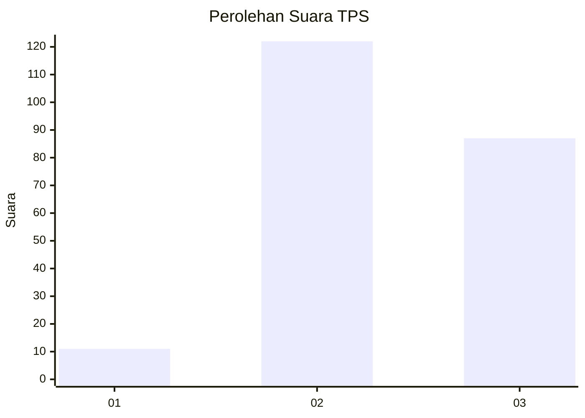
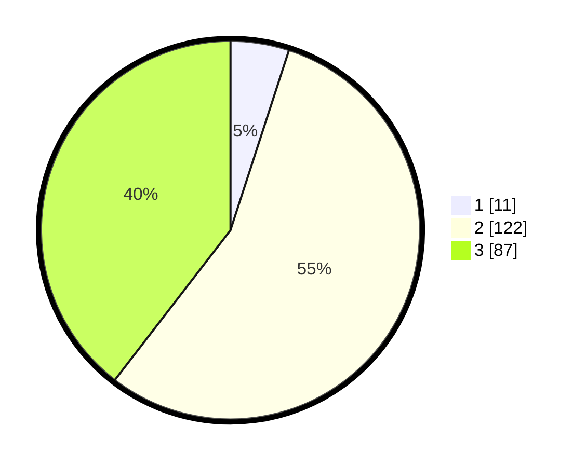

# Hasil

## Grafik

## Tabel

| No. | Nama Paslon    | Suara | Suara (raw) | Persentase |
|:--- |:-------------- | -----:| -----------:| ----------:|
| 1   | ANIES MUHAIMIN | 11    | [11][p-1]   | 5,00       |
| 2   | PRABOWO GIBRAN | 122   | [122][p-2]  | 55,45      |
| 3   | GANJAR MAHFUD  | 87    | [87][p-3]   | 39,55      |

[p-1]: https://github.com/gigit-pemilu/pemilu-2024-33-jawa-tengah/blob/main/pilpres/hitung-suara/sub/33-jawa-tengah/sub/21-demak/sub/12-bonang/sub/2001-jatimulyo/sub/003-tps/sub/paslon-1.txt
[p-2]: https://github.com/gigit-pemilu/pemilu-2024-33-jawa-tengah/blob/main/pilpres/hitung-suara/sub/33-jawa-tengah/sub/21-demak/sub/12-bonang/sub/2001-jatimulyo/sub/003-tps/sub/paslon-2.txt
[p-3]: https://github.com/gigit-pemilu/pemilu-2024-33-jawa-tengah/blob/main/pilpres/hitung-suara/sub/33-jawa-tengah/sub/21-demak/sub/12-bonang/sub/2001-jatimulyo/sub/003-tps/sub/paslon-3.txt

## Foto C Plano

https://sirekap-obj-formc.kpu.go.id/f456/pemilu/ppwp/33/21/12/20/01/3321122001003-20240215-022531--26e14ee9-e7e5-47df-909d-e313556c1277.jpg

https://sirekap-obj-formc.kpu.go.id/f456/pemilu/ppwp/33/21/12/20/01/3321122001003-20240215-022828--ca318162-2ca0-48da-8c6c-c2e71ba53552.jpg

https://sirekap-obj-formc.kpu.go.id/f456/pemilu/ppwp/33/21/12/20/01/3321122001003-20240215-022935--e16cd137-083e-4ec1-a7f9-59c73ec5c868.jpg

## Metadata

| Key        | Value               |
| ---------- | ------------------- |
| Time Stamp | 2024-02-15 21:30:27 |

