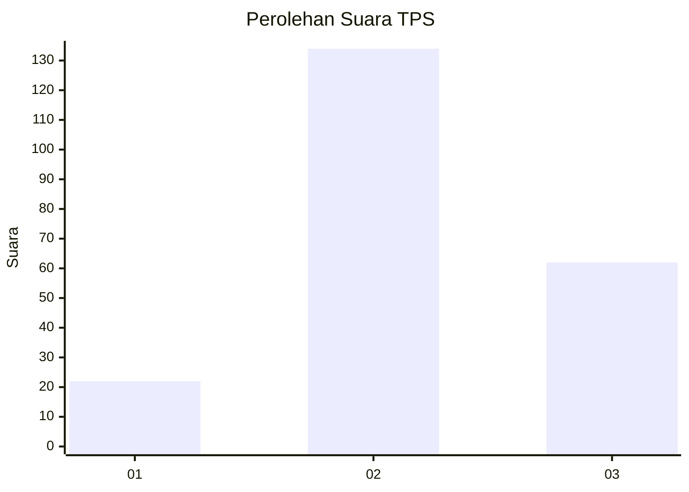
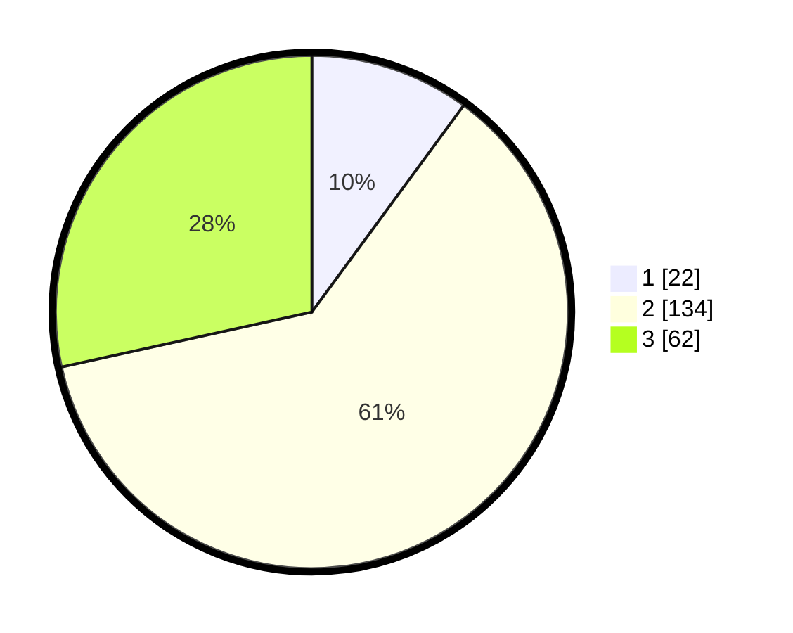

# Hasil

## Grafik

## Tabel

| No. | Nama Paslon    | Suara | Suara (raw) | Persentase |
|:--- |:-------------- | -----:| -----------:| ----------:|
| 1   | ANIES MUHAIMIN | 22    | [22][p-1]   | 10,09      |
| 2   | PRABOWO GIBRAN | 134   | [134][p-2]  | 61,47      |
| 3   | GANJAR MAHFUD  | 62    | [62][p-3]   | 28,44      |

[p-1]: https://github.com/gigit-pemilu/pemilu-2024-33-jawa-tengah/blob/main/pilpres/hitung-suara/sub/33-jawa-tengah/sub/21-demak/sub/12-bonang/sub/2001-jatimulyo/sub/004-tps/sub/paslon-1.txt
[p-2]: https://github.com/gigit-pemilu/pemilu-2024-33-jawa-tengah/blob/main/pilpres/hitung-suara/sub/33-jawa-tengah/sub/21-demak/sub/12-bonang/sub/2001-jatimulyo/sub/004-tps/sub/paslon-2.txt
[p-3]: https://github.com/gigit-pemilu/pemilu-2024-33-jawa-tengah/blob/main/pilpres/hitung-suara/sub/33-jawa-tengah/sub/21-demak/sub/12-bonang/sub/2001-jatimulyo/sub/004-tps/sub/paslon-3.txt

## Foto C Plano

https://sirekap-obj-formc.kpu.go.id/b1b7/pemilu/ppwp/33/21/12/20/01/3321122001004-20240215-002728--40328b37-6f4c-4be5-b0f6-ba089e6c0ade.jpg

https://sirekap-obj-formc.kpu.go.id/b1b7/pemilu/ppwp/33/21/12/20/01/3321122001004-20240215-002851--60f02d2d-ba33-4b44-aaf7-fc7509a86381.jpg

https://sirekap-obj-formc.kpu.go.id/b1b7/pemilu/ppwp/33/21/12/20/01/3321122001004-20240215-002937--e482bc37-62cf-49f9-9774-c6105f3aebb0.jpg

## Metadata

| Key        | Value               |
| ---------- | ------------------- |
| Time Stamp | 2024-02-15 21:30:27 |

