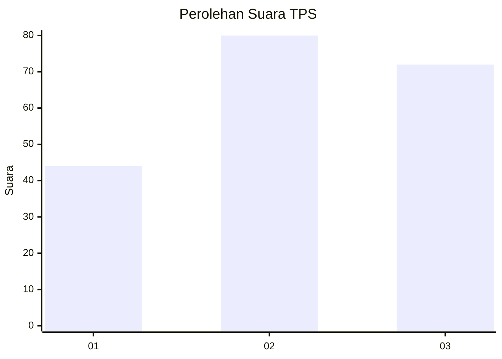
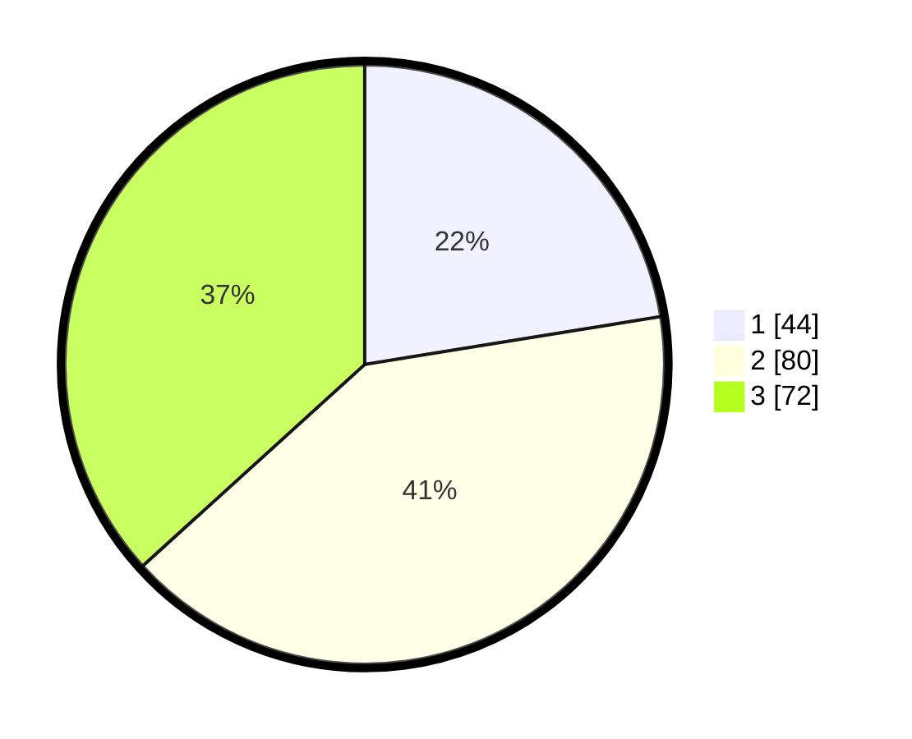

# Hasil

## Grafik

## Tabel

| No. | Nama Paslon    | Suara | Suara (raw) | Persentase |
|:--- |:-------------- | -----:| -----------:| ----------:|
| 1   | ANIES MUHAIMIN | 44    | [44][p-1]   | 22,45      |
| 2   | PRABOWO GIBRAN | 80    | [80][p-2]   | 40,82      |
| 3   | GANJAR MAHFUD  | 72    | [72][p-3]   | 36,73      |

[p-1]: https://github.com/gigit-pemilu/pemilu-2024/blob/main/pilpres/hitung-suara/sub/33-jawa-tengah/sub/21-demak/sub/12-bonang/sub/2012-betahwalang/sub/014-tps/sub/paslon-1.txt
[p-2]: https://github.com/gigit-pemilu/pemilu-2024/blob/main/pilpres/hitung-suara/sub/33-jawa-tengah/sub/21-demak/sub/12-bonang/sub/2012-betahwalang/sub/014-tps/sub/paslon-2.txt
[p-3]: https://github.com/gigit-pemilu/pemilu-2024/blob/main/pilpres/hitung-suara/sub/33-jawa-tengah/sub/21-demak/sub/12-bonang/sub/2012-betahwalang/sub/014-tps/sub/paslon-3.txt

## Foto C Plano

https://sirekap-obj-formc.kpu.go.id/2de0/pemilu/ppwp/33/21/12/20/12/3321122012014-20240214-231244--68494f6a-328e-420d-8188-f4175c790762.jpg

https://sirekap-obj-formc.kpu.go.id/2de0/pemilu/ppwp/33/21/12/20/12/3321122012014-20240214-231332--44e0c351-2f6c-43cb-a710-a7ce240dea0a.jpg

https://sirekap-obj-formc.kpu.go.id/2de0/pemilu/ppwp/33/21/12/20/12/3321122012014-20240214-231401--ad0c5e4e-136d-4c24-9d01-319e6ce31b07.jpg

## Metadata

| Key        | Value               |
| ---------- | ------------------- |
| Time Stamp | 2024-02-21 23:00:00 |

## DATA PEMILIH TETAP

Jumlah pemilih dalam DPT: **332**.
 * L: **522**.
 * P: **339**.

## DATA PENGGUNA HAK PILIH

Jumlah pengguna hak pilih dalam DPT: **296**.
 * L: **893**.
 * P: **897**.

Jumlah pengguna hak pilih dalam DPTb: **8**.
 * L: **800**.
 * P: **80**.

Jumlah pengguna hak pilih dalam DPK: **802**.
 * L: **6**.
 * P: **80**.

Jumlah pengguna hak pilih: **293**.
 * L: **495**.
 * P: **898**.

## JUMLAH SUARA SAH DAN TIDAK SAH

JUMLAH SELURUH SUARA SAH: **196**.

JUMLAH SUARA TIDAK SAH: **7**.

JUMLAH SELURUH SUARA SAH DAN SUARA TIDAK SAH: **203**.

