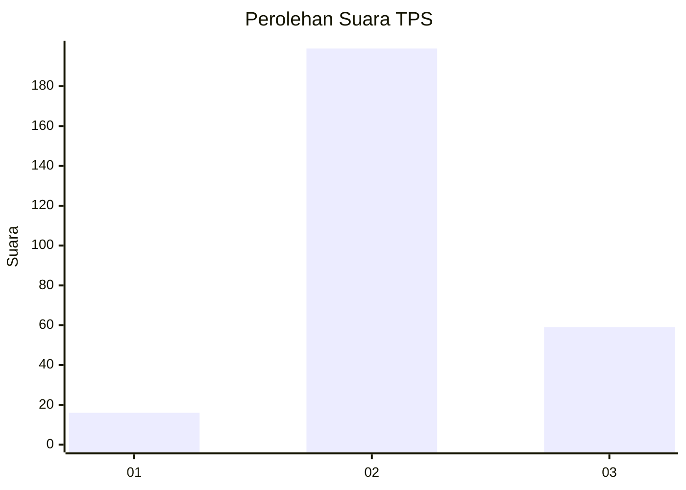

# Hasil

## Grafik

## Tabel

| No. | Nama Paslon    | Suara | Suara (raw) | Persentase |
|:--- |:-------------- | -----:| -----------:| ----------:|
| 1   | ANIES MUHAIMIN | 16    | [16][p-1]   | 5,84       |
| 2   | PRABOWO GIBRAN | 199   | [199][p-2]  | 72,63      |
| 3   | GANJAR MAHFUD  | 59    | [59][p-3]   | 21,53      |

[p-1]: https://github.com/gigit-pemilu/pemilu-2024/blob/main/pilpres/hitung-suara/sub/33-jawa-tengah/sub/21-demak/sub/13-wedung/sub/2001-wedung/sub/001-tps/sub/paslon-1.txt
[p-2]: https://github.com/gigit-pemilu/pemilu-2024/blob/main/pilpres/hitung-suara/sub/33-jawa-tengah/sub/21-demak/sub/13-wedung/sub/2001-wedung/sub/001-tps/sub/paslon-2.txt
[p-3]: https://github.com/gigit-pemilu/pemilu-2024/blob/main/pilpres/hitung-suara/sub/33-jawa-tengah/sub/21-demak/sub/13-wedung/sub/2001-wedung/sub/001-tps/sub/paslon-3.txt

## Foto C Plano

https://sirekap-obj-formc.kpu.go.id/aad7/pemilu/ppwp/33/21/13/20/01/3321132001001-20240216-164807--a9813fde-d5bc-4b39-b67e-d42bb95f6762.jpg

https://sirekap-obj-formc.kpu.go.id/aad7/pemilu/ppwp/33/21/13/20/01/3321132001001-20240216-165144--f28e5d9d-c5fa-4fed-9a4f-650fa3c2b292.jpg

https://sirekap-obj-formc.kpu.go.id/aad7/pemilu/ppwp/33/21/13/20/01/3321132001001-20240216-165502--40d3840d-f206-478d-9a81-c815d6b8af69.jpg

## Metadata

| Key        | Value               |
| ---------- | ------------------- |
| Time Stamp | 2024-02-25 12:00:00 |

