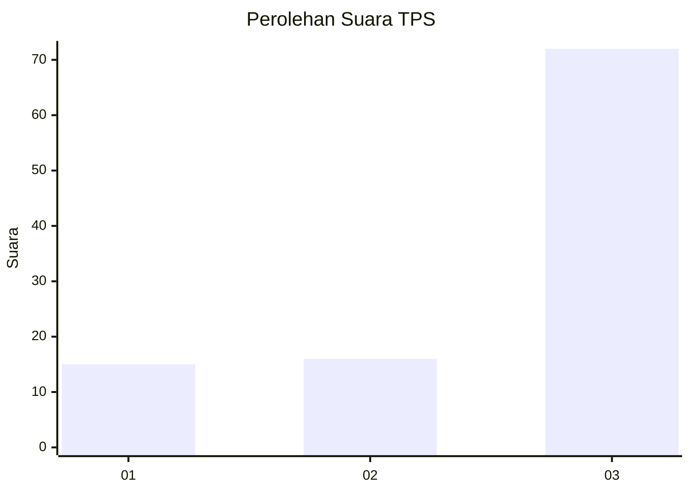
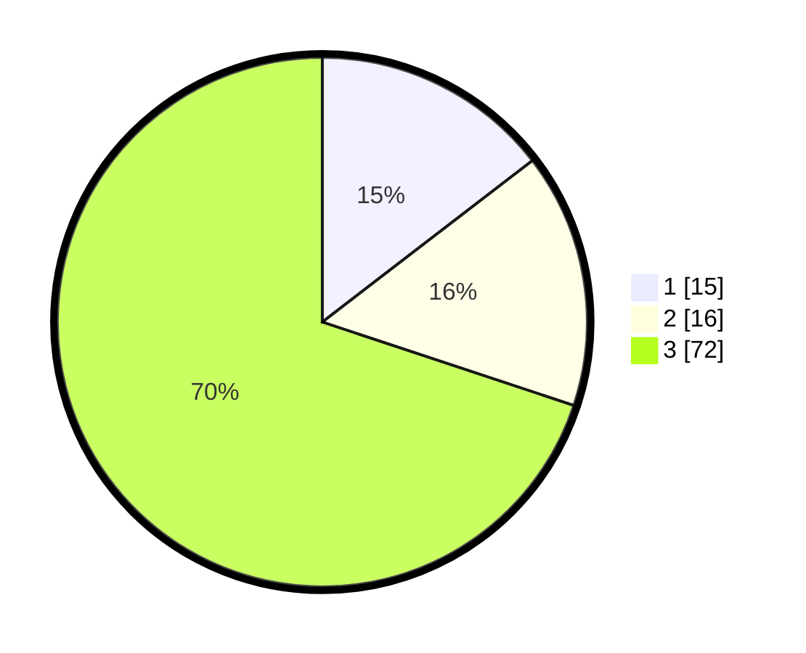

# Hasil

## Grafik

## Tabel

| No. | Nama Paslon    | Suara | Suara (raw) | Persentase |
|:--- |:-------------- | -----:| -----------:| ----------:|
| 1   | ANIES MUHAIMIN | 15    | [15][p-1]   | 14,56      |
| 2   | PRABOWO GIBRAN | 16    | [16][p-2]   | 15,53      |
| 3   | GANJAR MAHFUD  | 72    | [72][p-3]   | 69,90      |

[p-1]: https://github.com/gigit-pemilu/pemilu-2024-33-jawa-tengah/blob/main/pilpres/hitung-suara/sub/33-jawa-tengah/sub/21-demak/sub/13-wedung/sub/2008-berahan-wetan/sub/003-tps/sub/paslon-1.txt
[p-2]: https://github.com/gigit-pemilu/pemilu-2024-33-jawa-tengah/blob/main/pilpres/hitung-suara/sub/33-jawa-tengah/sub/21-demak/sub/13-wedung/sub/2008-berahan-wetan/sub/003-tps/sub/paslon-2.txt
[p-3]: https://github.com/gigit-pemilu/pemilu-2024-33-jawa-tengah/blob/main/pilpres/hitung-suara/sub/33-jawa-tengah/sub/21-demak/sub/13-wedung/sub/2008-berahan-wetan/sub/003-tps/sub/paslon-3.txt

## Foto C Plano

https://sirekap-obj-formc.kpu.go.id/c02d/pemilu/ppwp/33/21/13/20/08/3321132008003-20240218-113050--d1089a2c-eb8a-4255-8da3-03cf8531cc3c.jpg

https://sirekap-obj-formc.kpu.go.id/c02d/pemilu/ppwp/33/21/13/20/08/3321132008003-20240218-113139--06cecf0a-bc28-42dc-9683-85646ce1d483.jpg

https://sirekap-obj-formc.kpu.go.id/c02d/pemilu/ppwp/33/21/13/20/08/3321132008003-20240218-113243--4d8d5db6-6b3b-43a0-bbe1-b22511639535.jpg

## Metadata

| Key        | Value               |
| ---------- | ------------------- |
| Time Stamp | 2024-02-24 22:31:28 |

