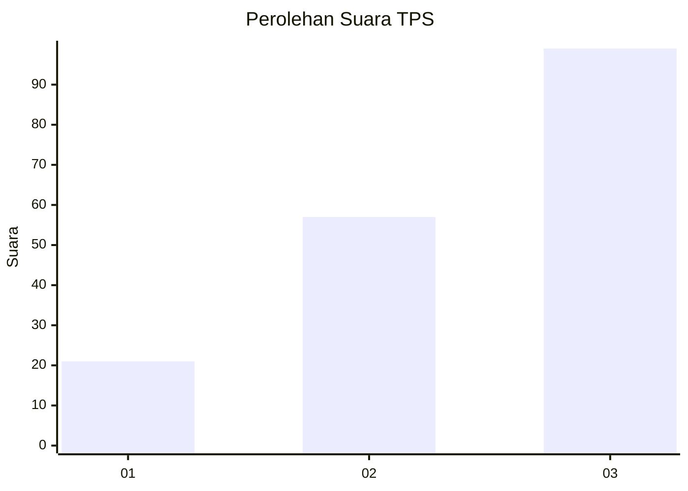
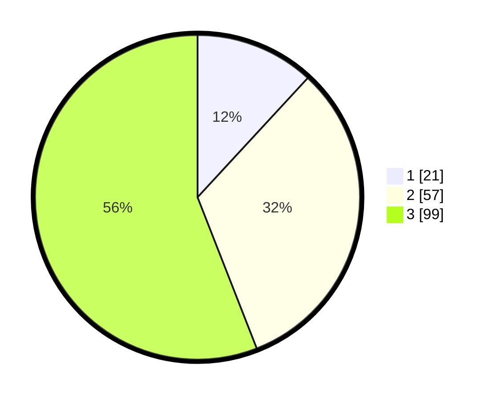

# Hasil

## Grafik

## Tabel

| No. | Nama Paslon    | Suara | Suara (raw) | Persentase |
|:--- |:-------------- | -----:| -----------:| ----------:|
| 1   | ANIES MUHAIMIN | 21    | [21][p-1]   | 11,86      |
| 2   | PRABOWO GIBRAN | 57    | [57][p-2]   | 32,20      |
| 3   | GANJAR MAHFUD  | 99    | [99][p-3]   | 55,93      |

[p-1]: https://github.com/gigit-pemilu/pemilu-2024/blob/main/pilpres/hitung-suara/sub/33-jawa-tengah/sub/22-semarang/sub/01-getasan/sub/2001-tajuk/sub/002-tps/sub/paslon-1.txt
[p-2]: https://github.com/gigit-pemilu/pemilu-2024/blob/main/pilpres/hitung-suara/sub/33-jawa-tengah/sub/22-semarang/sub/01-getasan/sub/2001-tajuk/sub/002-tps/sub/paslon-2.txt
[p-3]: https://github.com/gigit-pemilu/pemilu-2024/blob/main/pilpres/hitung-suara/sub/33-jawa-tengah/sub/22-semarang/sub/01-getasan/sub/2001-tajuk/sub/002-tps/sub/paslon-3.txt

## Foto C Plano

https://sirekap-obj-formc.kpu.go.id/2094/pemilu/ppwp/33/22/01/20/01/3322012001002-20240216-120828--4e80ea24-52ed-4cda-8c27-dcaf4d7663d2.jpg

https://sirekap-obj-formc.kpu.go.id/2094/pemilu/ppwp/33/22/01/20/01/3322012001002-20240216-120830--b43cd49b-c7d1-4e9e-b641-7e5484bd6f73.jpg

https://sirekap-obj-formc.kpu.go.id/2094/pemilu/ppwp/33/22/01/20/01/3322012001002-20240216-134852--54ff0a1a-5d42-4ab5-97c2-d1741a03203a.jpg

## Metadata

| Key        | Value               |
| ---------- | ------------------- |
| Time Stamp | 2024-02-16 21:01:00 |

## DATA PEMILIH TETAP

Jumlah pemilih dalam DPT: **190**.
 * L: **91**.
 * P: **99**.

## DATA PENGGUNA HAK PILIH

Jumlah pengguna hak pilih dalam DPT: **183**.
 * L: **86**.
 * P: **97**.

Jumlah pengguna hak pilih dalam DPTb: **0**.
 * L: **0**.
 * P: **0**.

Jumlah pengguna hak pilih dalam DPK: **0**.
 * L: **0**.
 * P: **0**.

Jumlah pengguna hak pilih: **183**.
 * L: **86**.
 * P: **97**.

## JUMLAH SUARA SAH DAN TIDAK SAH

JUMLAH SELURUH SUARA SAH: **177**.

JUMLAH SUARA TIDAK SAH: **6**.

JUMLAH SELURUH SUARA SAH DAN SUARA TIDAK SAH: **183**.

