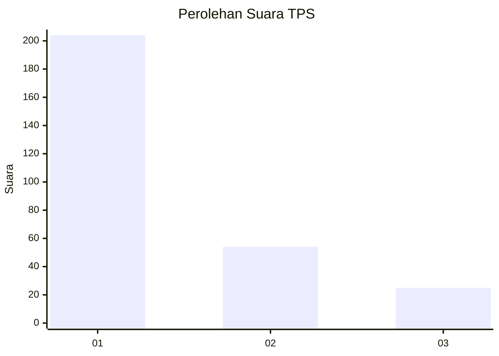
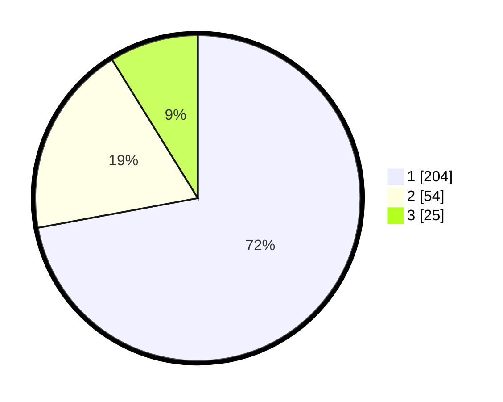

# Hasil

## Grafik

## Tabel

| No. | Nama Paslon    | Suara | Suara (raw) | Persentase |
|:--- |:-------------- | -----:| -----------:| ----------:|
| 1   | ANIES MUHAIMIN | 204   | [204][p-1]  | 72,08      |
| 2   | PRABOWO GIBRAN | 54    | [54][p-2]   | 19,08      |
| 3   | GANJAR MAHFUD  | 25    | [25][p-3]   | 8,83       |

[p-1]: https://github.com/gigit-pemilu/pemilu-2024/blob/main/pilpres/hitung-suara/sub/33-jawa-tengah/sub/22-semarang/sub/02-tengaran/sub/2010-butuh/sub/010-tps/sub/paslon-1.txt
[p-2]: https://github.com/gigit-pemilu/pemilu-2024/blob/main/pilpres/hitung-suara/sub/33-jawa-tengah/sub/22-semarang/sub/02-tengaran/sub/2010-butuh/sub/010-tps/sub/paslon-2.txt
[p-3]: https://github.com/gigit-pemilu/pemilu-2024/blob/main/pilpres/hitung-suara/sub/33-jawa-tengah/sub/22-semarang/sub/02-tengaran/sub/2010-butuh/sub/010-tps/sub/paslon-3.txt

## Foto C Plano

https://sirekap-obj-formc.kpu.go.id/b5c8/pemilu/ppwp/33/22/02/20/10/3322022010010-20240216-134414--316bdb25-3c4e-42c8-afe2-974faaf11055.jpg

https://sirekap-obj-formc.kpu.go.id/b5c8/pemilu/ppwp/33/22/02/20/10/3322022010010-20240216-131559--e3b86e56-4dd2-4a03-b4eb-b55d4d3fbfe3.jpg

## Metadata

| Key        | Value               |
| ---------- | ------------------- |
| Time Stamp | 2024-02-24 22:31:28 |

