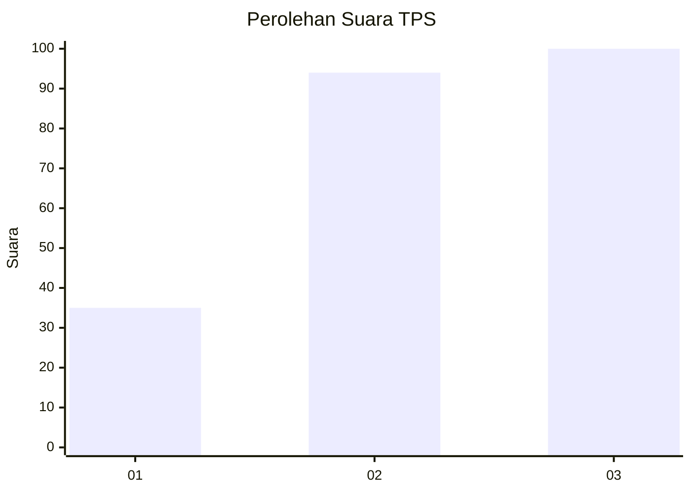
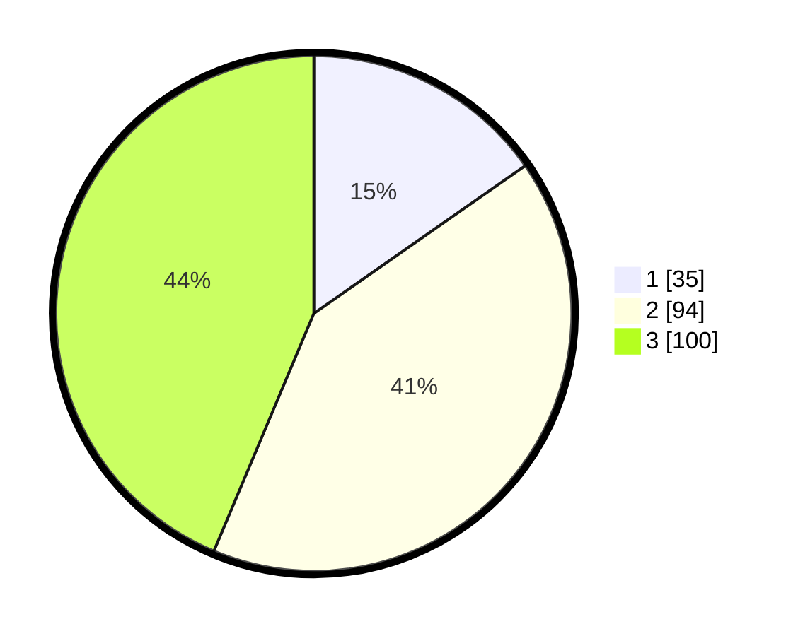

# Hasil

## Grafik

## Tabel

| No. | Nama Paslon    | Suara | Suara (raw) | Persentase |
|:--- |:-------------- | -----:| -----------:| ----------:|
| 1   | ANIES MUHAIMIN | 35    | [35][p-1]   | 15,28      |
| 2   | PRABOWO GIBRAN | 94    | [94][p-2]   | 41,05      |
| 3   | GANJAR MAHFUD  | 100   | [100][p-3]  | 43,67      |

[p-1]: https://github.com/gigit-pemilu/pemilu-2024/blob/main/pilpres/hitung-suara/sub/33-jawa-tengah/sub/22-semarang/sub/03-susukan/sub/2001-badran/sub/001-tps/sub/paslon-1.txt
[p-2]: https://github.com/gigit-pemilu/pemilu-2024/blob/main/pilpres/hitung-suara/sub/33-jawa-tengah/sub/22-semarang/sub/03-susukan/sub/2001-badran/sub/001-tps/sub/paslon-2.txt
[p-3]: https://github.com/gigit-pemilu/pemilu-2024/blob/main/pilpres/hitung-suara/sub/33-jawa-tengah/sub/22-semarang/sub/03-susukan/sub/2001-badran/sub/001-tps/sub/paslon-3.txt

## Foto C Plano

https://sirekap-obj-formc.kpu.go.id/48f2/pemilu/ppwp/33/22/03/20/01/3322032001001-20240218-130003--dd88fcad-9500-43f0-a7ed-2a7e6aca8b97.jpg

https://sirekap-obj-formc.kpu.go.id/48f2/pemilu/ppwp/33/22/03/20/01/3322032001001-20240218-130029--eed612b5-1655-40bc-9420-5b66965a675f.jpg

https://sirekap-obj-formc.kpu.go.id/48f2/pemilu/ppwp/33/22/03/20/01/3322032001001-20240218-130232--fa434869-af80-40ac-92b5-9b5bde11d0dc.jpg

## Metadata

| Key        | Value               |
| ---------- | ------------------- |
| Time Stamp | 2024-02-19 06:16:00 |

