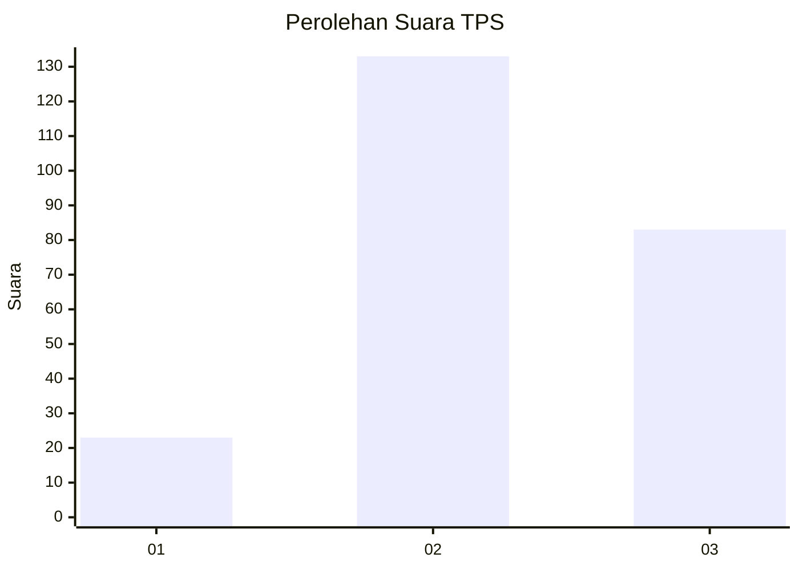
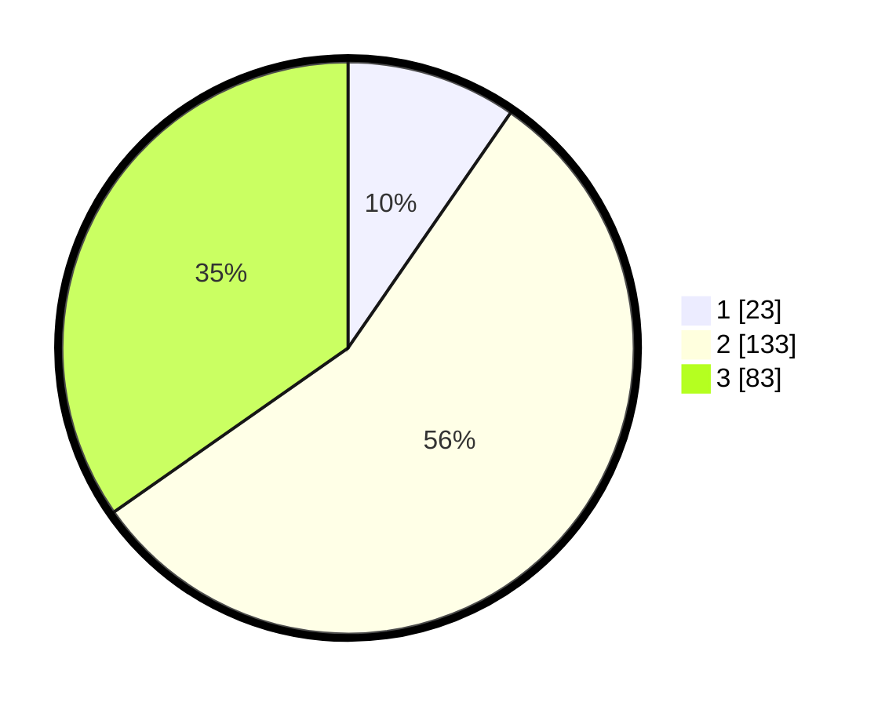

# Hasil

## Grafik

## Tabel

| No. | Nama Paslon    | Suara | Suara (raw) | Persentase |
|:--- |:-------------- | -----:| -----------:| ----------:|
| 1   | ANIES MUHAIMIN | 23    | [23][p-1]   | 9,62       |
| 2   | PRABOWO GIBRAN | 133   | [133][p-2]  | 55,65      |
| 3   | GANJAR MAHFUD  | 83    | [83][p-3]   | 34,73      |

[p-1]: https://github.com/gigit-pemilu/pemilu-2024/blob/main/pilpres/hitung-suara/sub/33-jawa-tengah/sub/22-semarang/sub/05-pabelan/sub/2002-ujung-ujung/sub/003-tps/sub/paslon-1.txt
[p-2]: https://github.com/gigit-pemilu/pemilu-2024/blob/main/pilpres/hitung-suara/sub/33-jawa-tengah/sub/22-semarang/sub/05-pabelan/sub/2002-ujung-ujung/sub/003-tps/sub/paslon-2.txt
[p-3]: https://github.com/gigit-pemilu/pemilu-2024/blob/main/pilpres/hitung-suara/sub/33-jawa-tengah/sub/22-semarang/sub/05-pabelan/sub/2002-ujung-ujung/sub/003-tps/sub/paslon-3.txt

## Foto C Plano

https://sirekap-obj-formc.kpu.go.id/1788/pemilu/ppwp/33/22/05/20/02/3322052002003-20240214-141303--8e634b25-f097-4812-99f9-5975c6599553.jpg

https://sirekap-obj-formc.kpu.go.id/1788/pemilu/ppwp/33/22/05/20/02/3322052002003-20240214-141356--199c0d77-cac8-458b-8004-2aa5cb5f0969.jpg

https://sirekap-obj-formc.kpu.go.id/1788/pemilu/ppwp/33/22/05/20/02/3322052002003-20240214-141824--0d7e5ae8-dbb7-4beb-b82f-807dc653332f.jpg

## Metadata

| Key        | Value               |
| ---------- | ------------------- |
| Time Stamp | 2024-02-14 21:46:01 |

