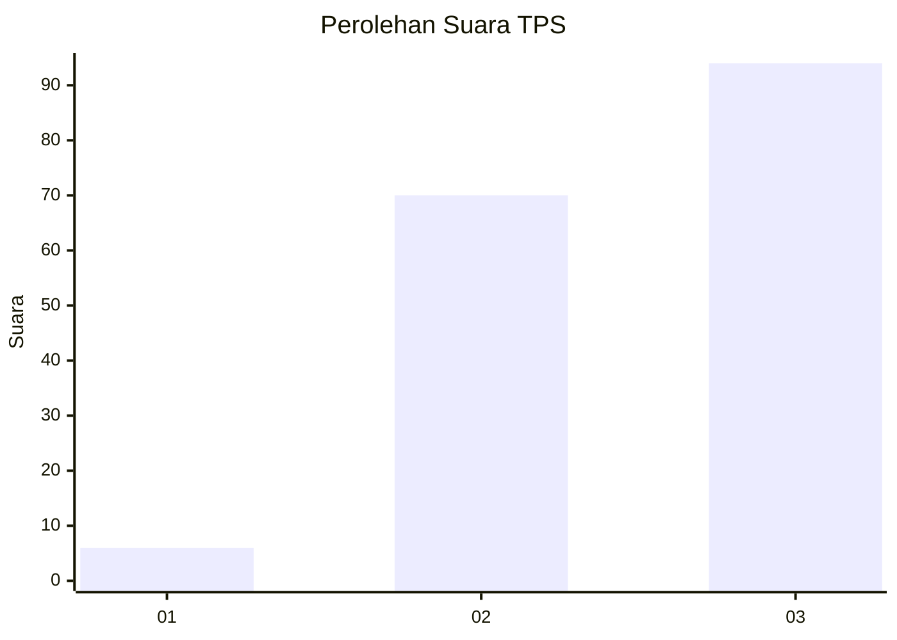
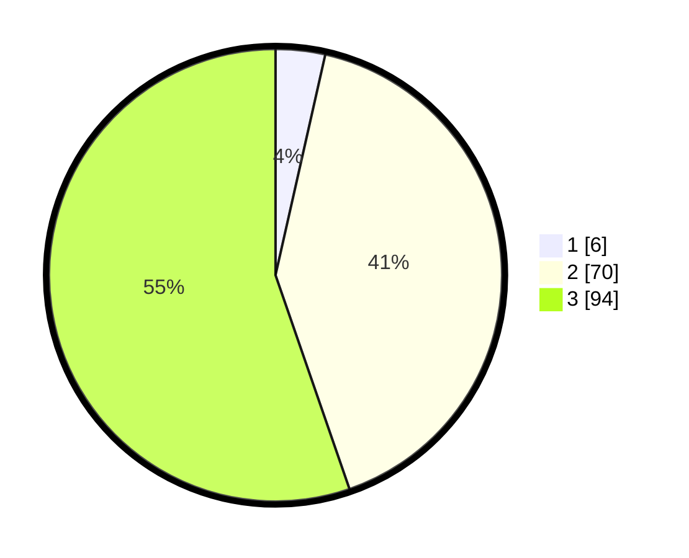

# Hasil

## Grafik

## Tabel

| No. | Nama Paslon    | Suara | Suara (raw) | Persentase |
|:--- |:-------------- | -----:| -----------:| ----------:|
| 1   | ANIES MUHAIMIN | 6     | [6][p-1]    | 3,53       |
| 2   | PRABOWO GIBRAN | 70    | [70][p-2]   | 41,18      |
| 3   | GANJAR MAHFUD  | 94    | [94][p-3]   | 55,29      |

[p-1]: https://github.com/gigit-pemilu/pemilu-2024/blob/main/pilpres/hitung-suara/sub/33-jawa-tengah/sub/22-semarang/sub/05-pabelan/sub/2016-giling/sub/003-tps/sub/paslon-1.txt
[p-2]: https://github.com/gigit-pemilu/pemilu-2024/blob/main/pilpres/hitung-suara/sub/33-jawa-tengah/sub/22-semarang/sub/05-pabelan/sub/2016-giling/sub/003-tps/sub/paslon-2.txt
[p-3]: https://github.com/gigit-pemilu/pemilu-2024/blob/main/pilpres/hitung-suara/sub/33-jawa-tengah/sub/22-semarang/sub/05-pabelan/sub/2016-giling/sub/003-tps/sub/paslon-3.txt

## Foto C Plano

https://sirekap-obj-formc.kpu.go.id/49a5/pemilu/ppwp/33/22/05/20/16/3322052016003-20240215-012502--70e00ef7-1107-4819-a2fa-470a705c3742.jpg

https://sirekap-obj-formc.kpu.go.id/49a5/pemilu/ppwp/33/22/05/20/16/3322052016003-20240215-012629--12f47960-151f-481f-940a-58f1775c4c5c.jpg

https://sirekap-obj-formc.kpu.go.id/49a5/pemilu/ppwp/33/22/05/20/16/3322052016003-20240214-141302--26d9baf3-d4e6-4dac-985c-1182446fabc4.jpg

## Metadata

| Key        | Value               |
| ---------- | ------------------- |
| Time Stamp | 2024-02-15 09:00:24 |

