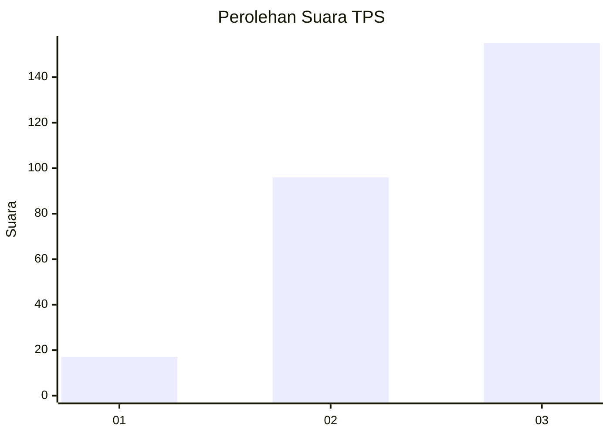
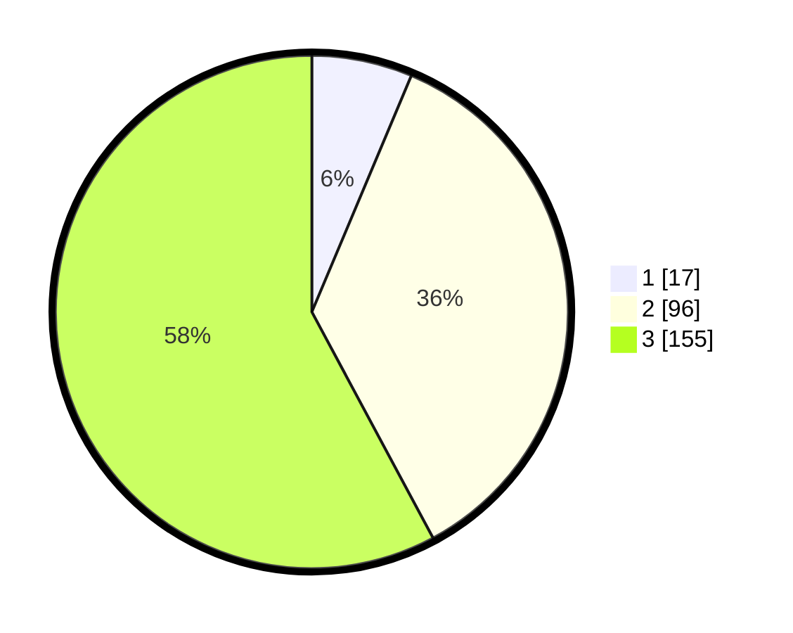

# Hasil

## Grafik

## Tabel

| No. | Nama Paslon    | Suara | Suara (raw) | Persentase |
|:--- |:-------------- | -----:| -----------:| ----------:|
| 1   | ANIES MUHAIMIN | 17    | [17][p-1]   | 6,34       |
| 2   | PRABOWO GIBRAN | 96    | [96][p-2]   | 35,82      |
| 3   | GANJAR MAHFUD  | 155   | [155][p-3]  | 57,84      |

[p-1]: https://github.com/gigit-pemilu/pemilu-2024-33-jawa-tengah/blob/main/pilpres/hitung-suara/sub/33-jawa-tengah/sub/22-semarang/sub/06-tuntang/sub/2002-kalibeji/sub/005-tps/sub/paslon-1.txt
[p-2]: https://github.com/gigit-pemilu/pemilu-2024-33-jawa-tengah/blob/main/pilpres/hitung-suara/sub/33-jawa-tengah/sub/22-semarang/sub/06-tuntang/sub/2002-kalibeji/sub/005-tps/sub/paslon-2.txt
[p-3]: https://github.com/gigit-pemilu/pemilu-2024-33-jawa-tengah/blob/main/pilpres/hitung-suara/sub/33-jawa-tengah/sub/22-semarang/sub/06-tuntang/sub/2002-kalibeji/sub/005-tps/sub/paslon-3.txt

## Foto C Plano

https://sirekap-obj-formc.kpu.go.id/15c9/pemilu/ppwp/33/22/06/20/02/3322062002005-20240216-214218--cfab30f1-3258-4631-bcc5-f5406e0d849b.jpg

https://sirekap-obj-formc.kpu.go.id/15c9/pemilu/ppwp/33/22/06/20/02/3322062002005-20240214-221957--c54c241b-0875-4291-afd8-90af8f8f22b2.jpg

https://sirekap-obj-formc.kpu.go.id/15c9/pemilu/ppwp/33/22/06/20/02/3322062002005-20240214-222049--867b9750-e938-4509-844f-ed015157e4f9.jpg

## Metadata

| Key        | Value               |
| ---------- | ------------------- |
| Time Stamp | 2024-02-16 22:01:00 |

