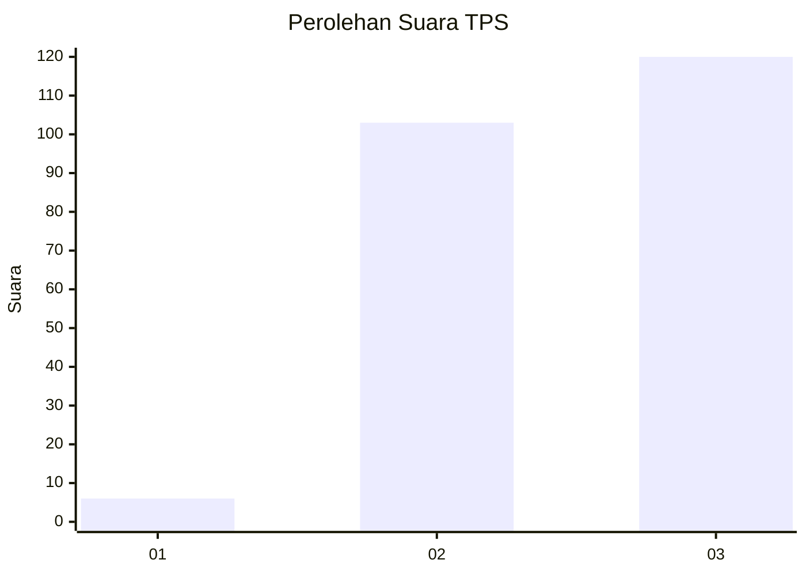
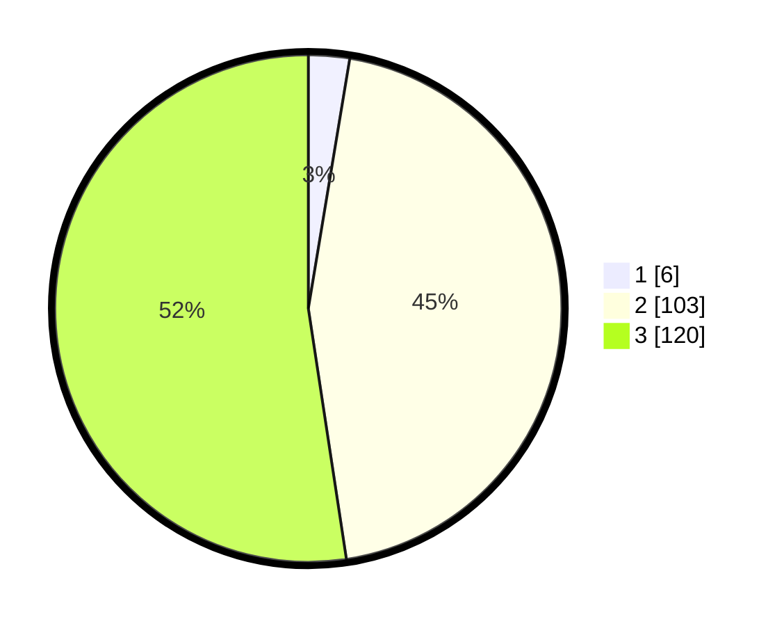

# Hasil

## Grafik

## Tabel

| No. | Nama Paslon    | Suara | Suara (raw) | Persentase |
|:--- |:-------------- | -----:| -----------:| ----------:|
| 1   | ANIES MUHAIMIN | 6     | [6][p-1]    | 2,62       |
| 2   | PRABOWO GIBRAN | 103   | [103][p-2]  | 44,98      |
| 3   | GANJAR MAHFUD  | 120   | [120][p-3]  | 52,40      |

[p-1]: https://github.com/gigit-pemilu/pemilu-2024/blob/main/pilpres/hitung-suara/sub/33-jawa-tengah/sub/22-semarang/sub/06-tuntang/sub/2015-tlompakan/sub/001-tps/sub/paslon-1.txt
[p-2]: https://github.com/gigit-pemilu/pemilu-2024/blob/main/pilpres/hitung-suara/sub/33-jawa-tengah/sub/22-semarang/sub/06-tuntang/sub/2015-tlompakan/sub/001-tps/sub/paslon-2.txt
[p-3]: https://github.com/gigit-pemilu/pemilu-2024/blob/main/pilpres/hitung-suara/sub/33-jawa-tengah/sub/22-semarang/sub/06-tuntang/sub/2015-tlompakan/sub/001-tps/sub/paslon-3.txt

## Foto C Plano

https://sirekap-obj-formc.kpu.go.id/5b35/pemilu/ppwp/33/22/06/20/15/3322062015001-20240219-010439--354a29a4-4bc5-4c23-b51e-86bfb045f4e3.jpg

https://sirekap-obj-formc.kpu.go.id/5b35/pemilu/ppwp/33/22/06/20/15/3322062015001-20240219-010156--9fae4075-86a0-4008-b17a-fa2e3774f6b5.jpg

https://sirekap-obj-formc.kpu.go.id/5b35/pemilu/ppwp/33/22/06/20/15/3322062015001-20240219-002736--e997a4c9-5690-461b-8899-14139cc4b0da.jpg

## Metadata

| Key        | Value               |
| ---------- | ------------------- |
| Time Stamp | 2024-02-19 20:00:00 |

