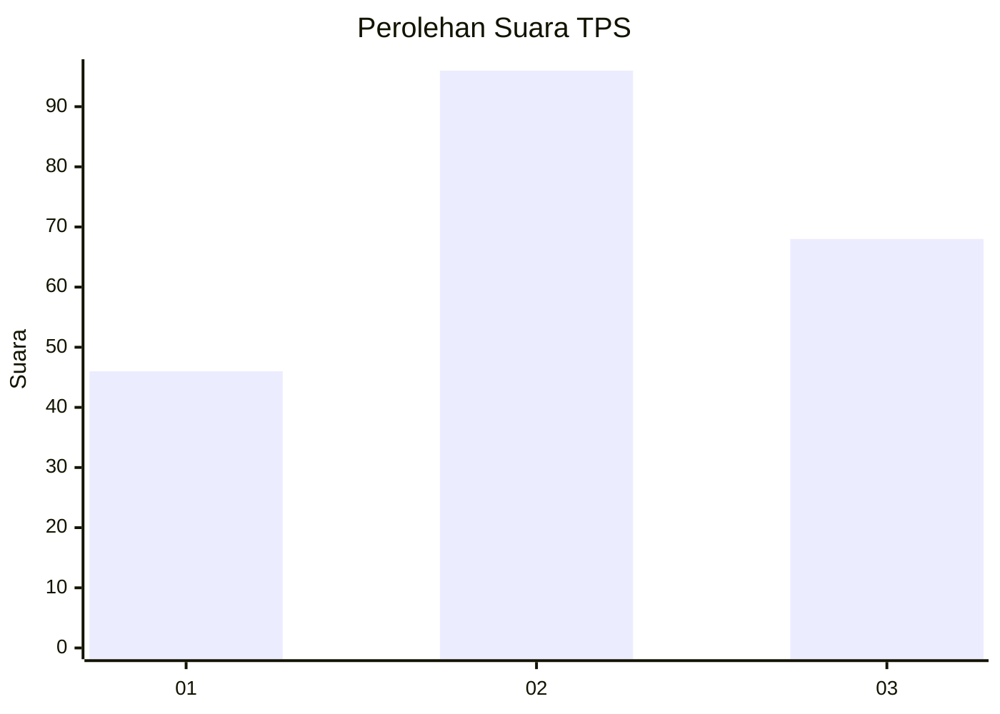
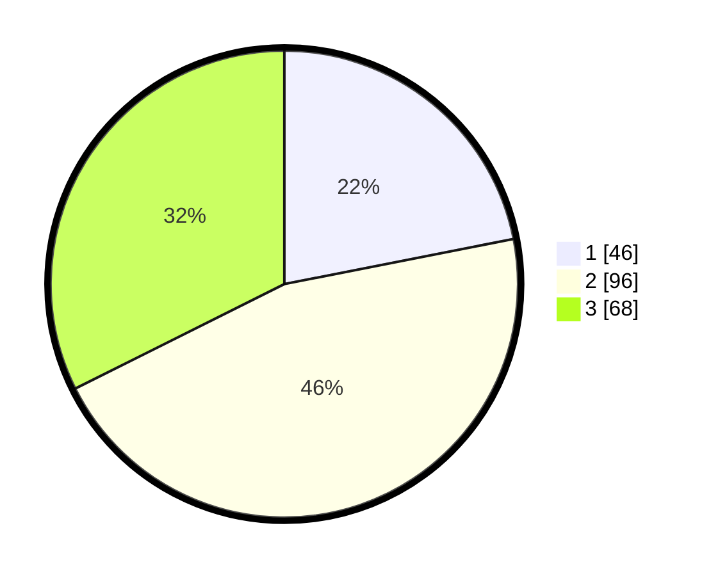

# Hasil

## Grafik

## Tabel

| No. | Nama Paslon    | Suara | Suara (raw) | Persentase |
|:--- |:-------------- | -----:| -----------:| ----------:|
| 1   | ANIES MUHAIMIN | 46    | [46][p-1]   | 21,90      |
| 2   | PRABOWO GIBRAN | 96    | [96][p-2]   | 45,71      |
| 3   | GANJAR MAHFUD  | 68    | [68][p-3]   | 32,38      |

[p-1]: https://github.com/gigit-pemilu/pemilu-2024-33-jawa-tengah/blob/main/pilpres/hitung-suara/sub/33-jawa-tengah/sub/22-semarang/sub/07-banyubiru/sub/2002-kebumen/sub/006-tps/sub/paslon-1.txt
[p-2]: https://github.com/gigit-pemilu/pemilu-2024-33-jawa-tengah/blob/main/pilpres/hitung-suara/sub/33-jawa-tengah/sub/22-semarang/sub/07-banyubiru/sub/2002-kebumen/sub/006-tps/sub/paslon-2.txt
[p-3]: https://github.com/gigit-pemilu/pemilu-2024-33-jawa-tengah/blob/main/pilpres/hitung-suara/sub/33-jawa-tengah/sub/22-semarang/sub/07-banyubiru/sub/2002-kebumen/sub/006-tps/sub/paslon-3.txt

## Foto C Plano

https://sirekap-obj-formc.kpu.go.id/f1fb/pemilu/ppwp/33/22/07/20/02/3322072002006-20240214-190202--c4b7450d-b33a-41f3-b4be-cd299233306e.jpg

https://sirekap-obj-formc.kpu.go.id/f1fb/pemilu/ppwp/33/22/07/20/02/3322072002006-20240214-190211--d2cfeada-1920-4dbd-8a2a-70c6e8007780.jpg

https://sirekap-obj-formc.kpu.go.id/f1fb/pemilu/ppwp/33/22/07/20/02/3322072002006-20240214-140949--f1c374c6-7080-40ab-9969-bacbaf8d557f.jpg

## Metadata

| Key        | Value               |
| ---------- | ------------------- |
| Time Stamp | 2024-02-15 00:41:44 |

