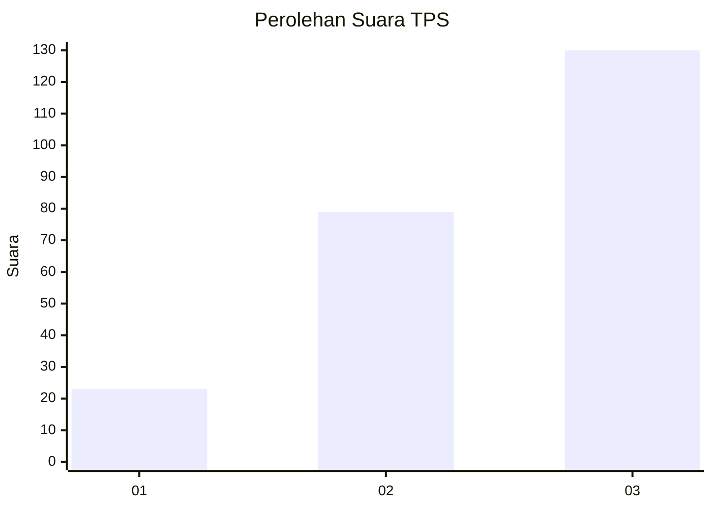
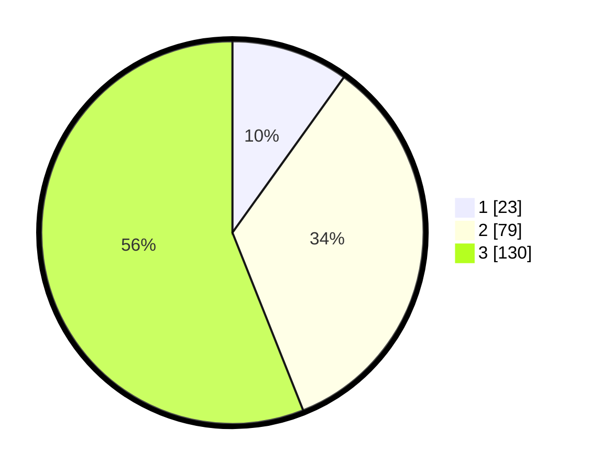

# Hasil

## Grafik

## Tabel

| No. | Nama Paslon    | Suara | Suara (raw) | Persentase |
|:--- |:-------------- | -----:| -----------:| ----------:|
| 1   | ANIES MUHAIMIN | 23    | [23][p-1]   | 9,91       |
| 2   | PRABOWO GIBRAN | 79    | [79][p-2]   | 34,05      |
| 3   | GANJAR MAHFUD  | 130   | [130][p-3]  | 56,03      |

[p-1]: https://github.com/gigit-pemilu/pemilu-2024/blob/main/pilpres/hitung-suara/sub/33-jawa-tengah/sub/22-semarang/sub/07-banyubiru/sub/2007-rowoboni/sub/006-tps/sub/paslon-1.txt
[p-2]: https://github.com/gigit-pemilu/pemilu-2024/blob/main/pilpres/hitung-suara/sub/33-jawa-tengah/sub/22-semarang/sub/07-banyubiru/sub/2007-rowoboni/sub/006-tps/sub/paslon-2.txt
[p-3]: https://github.com/gigit-pemilu/pemilu-2024/blob/main/pilpres/hitung-suara/sub/33-jawa-tengah/sub/22-semarang/sub/07-banyubiru/sub/2007-rowoboni/sub/006-tps/sub/paslon-3.txt

## Foto C Plano

https://sirekap-obj-formc.kpu.go.id/6623/pemilu/ppwp/33/22/07/20/07/3322072007006-20240215-083240--6e8d113c-86f1-4bdb-bddc-66ac17990d6d.jpg

https://sirekap-obj-formc.kpu.go.id/6623/pemilu/ppwp/33/22/07/20/07/3322072007006-20240215-083250--f08d61c0-b84e-42d1-a4d2-4a86496bd8d2.jpg

https://sirekap-obj-formc.kpu.go.id/6623/pemilu/ppwp/33/22/07/20/07/3322072007006-20240216-185214--a19b2c5f-1771-4cea-a25e-269876c810ea.jpg

## Metadata

| Key        | Value               |
| ---------- | ------------------- |
| Time Stamp | 2024-02-16 21:01:00 |

