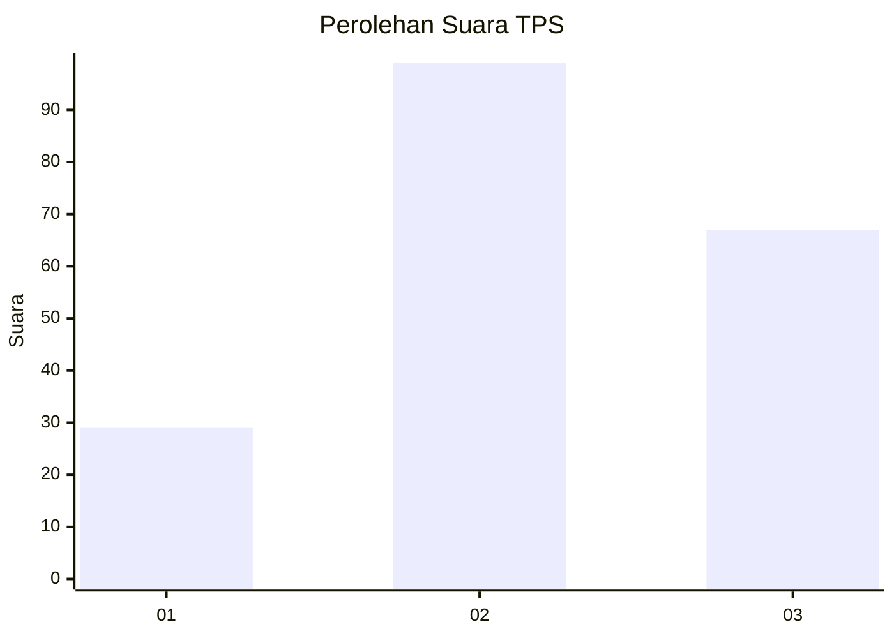
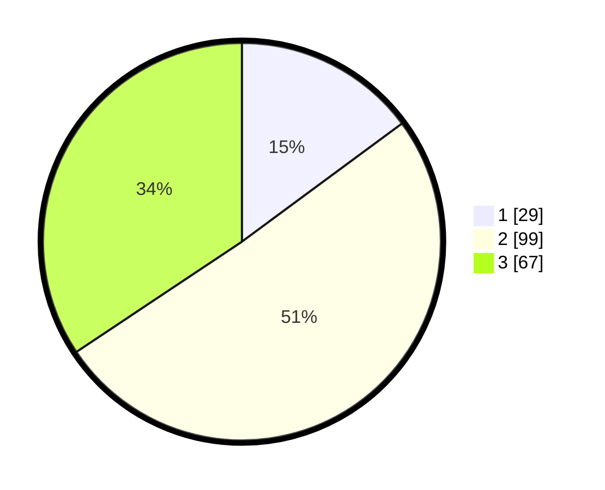

# Hasil

## Grafik

## Tabel

| No. | Nama Paslon    | Suara | Suara (raw) | Persentase |
|:--- |:-------------- | -----:| -----------:| ----------:|
| 1   | ANIES MUHAIMIN | 29    | [29][p-1]   | 14,87      |
| 2   | PRABOWO GIBRAN | 99    | [99][p-2]   | 50,77      |
| 3   | GANJAR MAHFUD  | 67    | [67][p-3]   | 34,36      |

[p-1]: https://github.com/gigit-pemilu/pemilu-2024-33-jawa-tengah/blob/main/pilpres/hitung-suara/sub/33-jawa-tengah/sub/22-semarang/sub/08-jambu/sub/1006-gondoriyo/sub/005-tps/sub/paslon-1.txt
[p-2]: https://github.com/gigit-pemilu/pemilu-2024-33-jawa-tengah/blob/main/pilpres/hitung-suara/sub/33-jawa-tengah/sub/22-semarang/sub/08-jambu/sub/1006-gondoriyo/sub/005-tps/sub/paslon-2.txt
[p-3]: https://github.com/gigit-pemilu/pemilu-2024-33-jawa-tengah/blob/main/pilpres/hitung-suara/sub/33-jawa-tengah/sub/22-semarang/sub/08-jambu/sub/1006-gondoriyo/sub/005-tps/sub/paslon-3.txt

## Foto C Plano

https://sirekap-obj-formc.kpu.go.id/187c/pemilu/ppwp/33/22/08/10/06/3322081006005-20240219-194604--c44201a7-5c07-4ba0-bb45-bcb47aca5622.jpg

https://sirekap-obj-formc.kpu.go.id/187c/pemilu/ppwp/33/22/08/10/06/3322081006005-20240219-195117--bd782147-dcfb-4e7d-aa08-001a79b4c608.jpg

https://sirekap-obj-formc.kpu.go.id/187c/pemilu/ppwp/33/22/08/10/06/3322081006005-20240219-194248--82c3b017-547d-4921-9a99-0811f4097b94.jpg

## Metadata

| Key        | Value               |
| ---------- | ------------------- |
| Time Stamp | 2024-02-24 22:31:28 |

