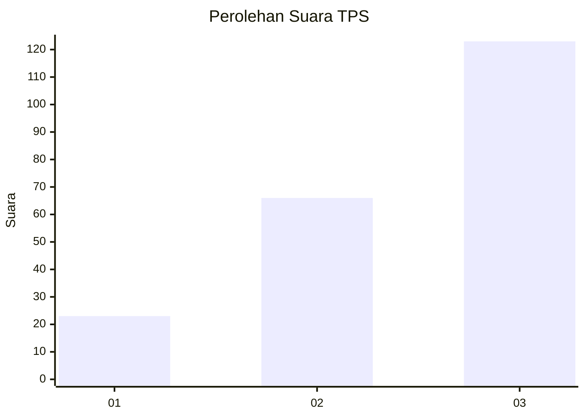
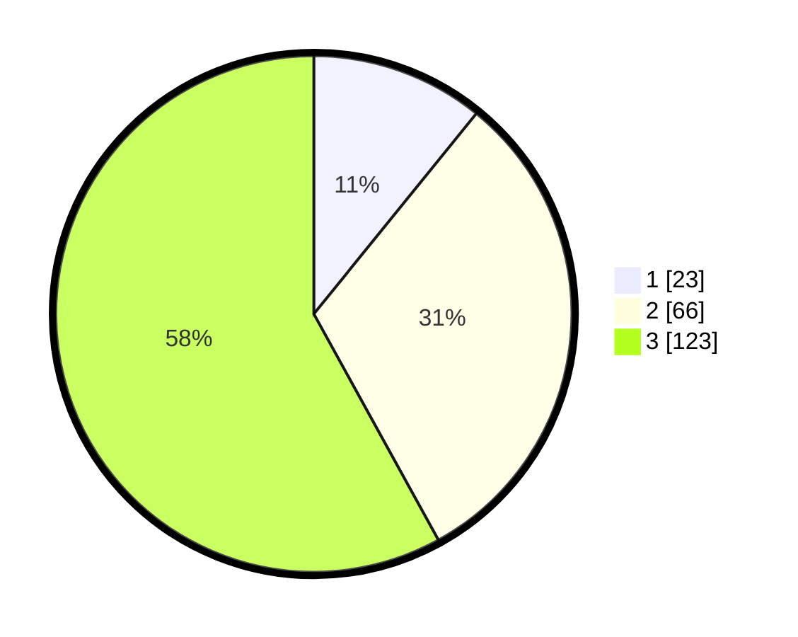

# Hasil

## Grafik

## Tabel

| No. | Nama Paslon    | Suara | Suara (raw) | Persentase |
|:--- |:-------------- | -----:| -----------:| ----------:|
| 1   | ANIES MUHAIMIN | 23    | [23][p-1]   | 10,85      |
| 2   | PRABOWO GIBRAN | 66    | [66][p-2]   | 31,13      |
| 3   | GANJAR MAHFUD  | 123   | [123][p-3]  | 58,02      |

[p-1]: https://github.com/gigit-pemilu/pemilu-2024-33-jawa-tengah/blob/main/pilpres/hitung-suara/sub/33-jawa-tengah/sub/22-semarang/sub/08-jambu/sub/2001-gemawang/sub/012-tps/sub/paslon-1.txt
[p-2]: https://github.com/gigit-pemilu/pemilu-2024-33-jawa-tengah/blob/main/pilpres/hitung-suara/sub/33-jawa-tengah/sub/22-semarang/sub/08-jambu/sub/2001-gemawang/sub/012-tps/sub/paslon-2.txt
[p-3]: https://github.com/gigit-pemilu/pemilu-2024-33-jawa-tengah/blob/main/pilpres/hitung-suara/sub/33-jawa-tengah/sub/22-semarang/sub/08-jambu/sub/2001-gemawang/sub/012-tps/sub/paslon-3.txt

## Foto C Plano

https://sirekap-obj-formc.kpu.go.id/1604/pemilu/ppwp/33/22/08/20/01/3322082001012-20240216-221023--af6980cb-94dc-4e3e-921b-68dcf46fc7c1.jpg

https://sirekap-obj-formc.kpu.go.id/1604/pemilu/ppwp/33/22/08/20/01/3322082001012-20240216-221140--6493d7dc-448a-4dae-a5c9-d0931833910f.jpg

https://sirekap-obj-formc.kpu.go.id/1604/pemilu/ppwp/33/22/08/20/01/3322082001012-20240216-221433--d52c15ae-01b9-4375-906a-4f7dde800d12.jpg

## Metadata

| Key        | Value               |
| ---------- | ------------------- |
| Time Stamp | 2024-02-16 23:30:00 |

