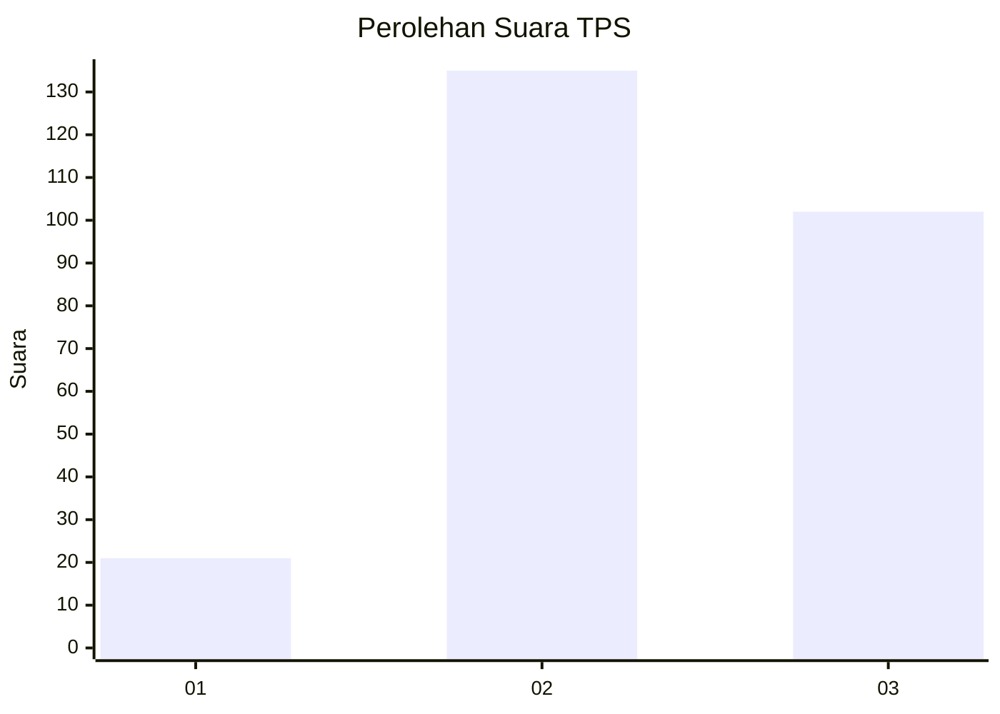
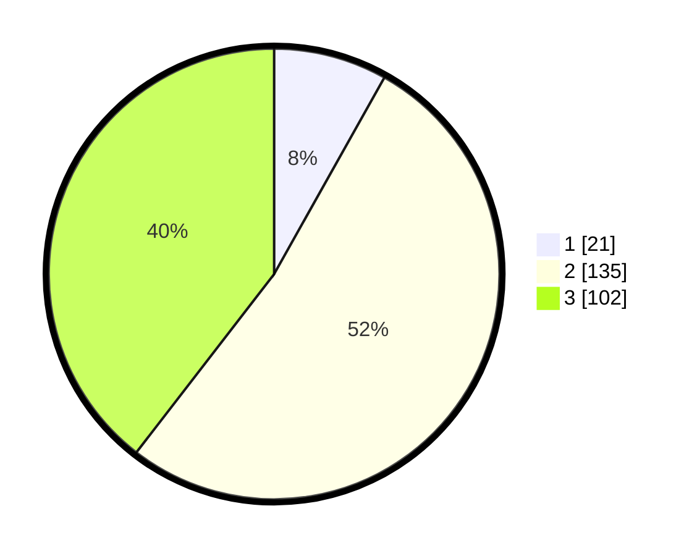

# Hasil

## Grafik

## Tabel

| No. | Nama Paslon    | Suara | Suara (raw) | Persentase |
|:--- |:-------------- | -----:| -----------:| ----------:|
| 1   | ANIES MUHAIMIN | 21    | [21][p-1]   | 8,14       |
| 2   | PRABOWO GIBRAN | 135   | [135][p-2]  | 52,33      |
| 3   | GANJAR MAHFUD  | 102   | [102][p-3]  | 39,53      |

[p-1]: https://github.com/gigit-pemilu/pemilu-2024-33-jawa-tengah/blob/main/pilpres/hitung-suara/sub/33-jawa-tengah/sub/22-semarang/sub/08-jambu/sub/2005-jambu/sub/013-tps/sub/paslon-1.txt
[p-2]: https://github.com/gigit-pemilu/pemilu-2024-33-jawa-tengah/blob/main/pilpres/hitung-suara/sub/33-jawa-tengah/sub/22-semarang/sub/08-jambu/sub/2005-jambu/sub/013-tps/sub/paslon-2.txt
[p-3]: https://github.com/gigit-pemilu/pemilu-2024-33-jawa-tengah/blob/main/pilpres/hitung-suara/sub/33-jawa-tengah/sub/22-semarang/sub/08-jambu/sub/2005-jambu/sub/013-tps/sub/paslon-3.txt

## Foto C Plano

https://sirekap-obj-formc.kpu.go.id/7595/pemilu/ppwp/33/22/08/20/05/3322082005013-20240216-191821--b7615353-3fdb-419f-8ad2-7968e9fca727.jpg

https://sirekap-obj-formc.kpu.go.id/7595/pemilu/ppwp/33/22/08/20/05/3322082005013-20240214-231200--cae166ac-484d-4267-8e02-7d89fe42bfc6.jpg

https://sirekap-obj-formc.kpu.go.id/7595/pemilu/ppwp/33/22/08/20/05/3322082005013-20240214-231217--453ccc39-9e26-44ce-8d19-45150ad923ef.jpg

## Metadata

| Key        | Value               |
| ---------- | ------------------- |
| Time Stamp | 2024-02-16 21:01:00 |

