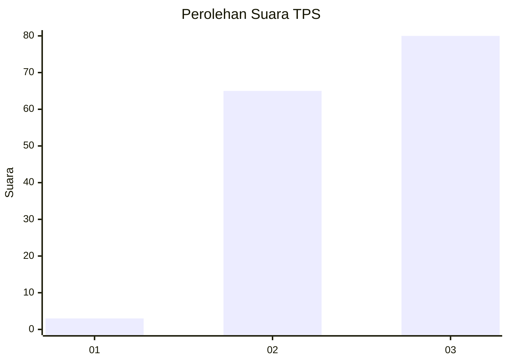
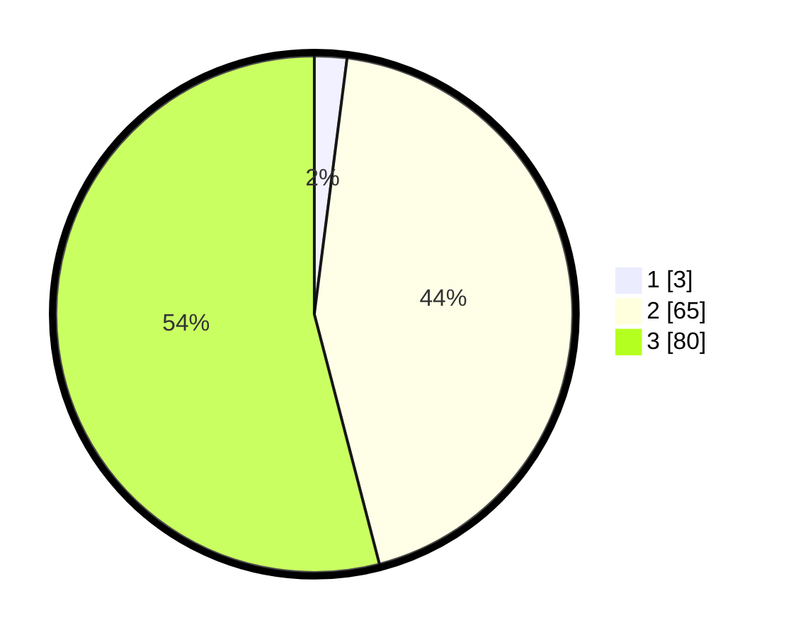

# Hasil

## Grafik

## Tabel

| No. | Nama Paslon    | Suara | Suara (raw) | Persentase |
|:--- |:-------------- | -----:| -----------:| ----------:|
| 1   | ANIES MUHAIMIN | 3     | [3][p-1]    | 2,03       |
| 2   | PRABOWO GIBRAN | 65    | [65][p-2]   | 43,92      |
| 3   | GANJAR MAHFUD  | 80    | [80][p-3]   | 54,05      |

[p-1]: https://github.com/gigit-pemilu/pemilu-2024/blob/main/pilpres/hitung-suara/sub/33-jawa-tengah/sub/22-semarang/sub/10-ambarawa/sub/1006-kupang/sub/023-tps/sub/paslon-1.txt
[p-2]: https://github.com/gigit-pemilu/pemilu-2024/blob/main/pilpres/hitung-suara/sub/33-jawa-tengah/sub/22-semarang/sub/10-ambarawa/sub/1006-kupang/sub/023-tps/sub/paslon-2.txt
[p-3]: https://github.com/gigit-pemilu/pemilu-2024/blob/main/pilpres/hitung-suara/sub/33-jawa-tengah/sub/22-semarang/sub/10-ambarawa/sub/1006-kupang/sub/023-tps/sub/paslon-3.txt

## Foto C Plano

https://sirekap-obj-formc.kpu.go.id/f5fd/pemilu/ppwp/33/22/10/10/06/3322101006023-20240219-205312--aada4fd3-a478-4638-b18f-54be6926245e.jpg

https://sirekap-obj-formc.kpu.go.id/f5fd/pemilu/ppwp/33/22/10/10/06/3322101006023-20240214-223733--ca60f044-84f0-4223-ac47-3d87377b44d0.jpg

https://sirekap-obj-formc.kpu.go.id/f5fd/pemilu/ppwp/33/22/10/10/06/3322101006023-20240214-223837--33274165-0fdb-4351-b4a8-8c13995472c2.jpg

## Metadata

| Key        | Value               |
| ---------- | ------------------- |
| Time Stamp | 2024-02-19 21:00:00 |

