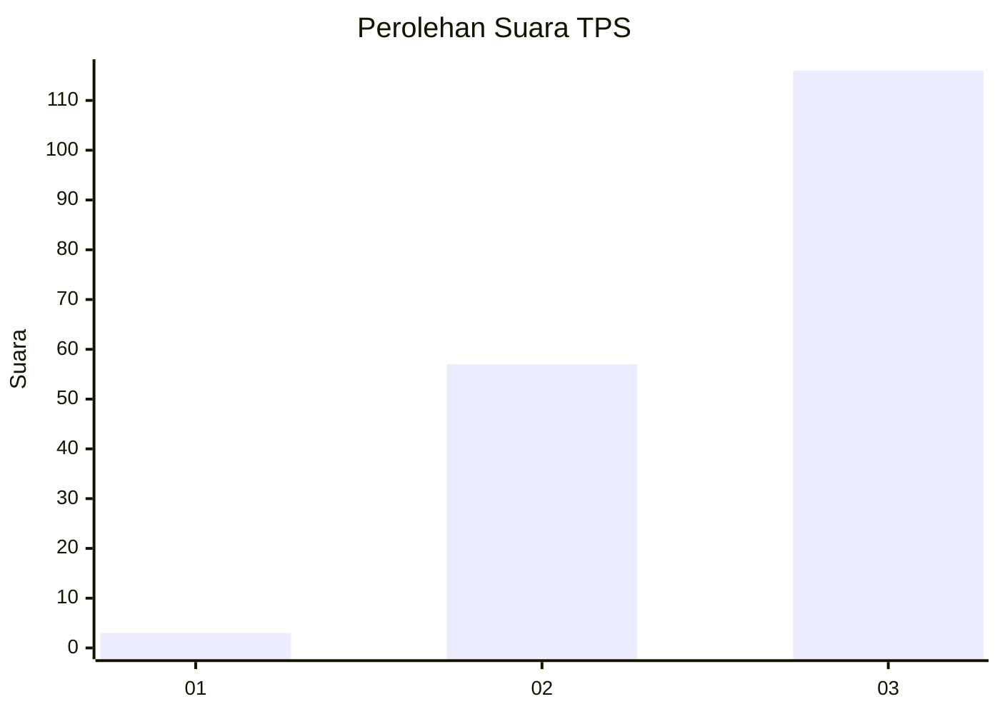
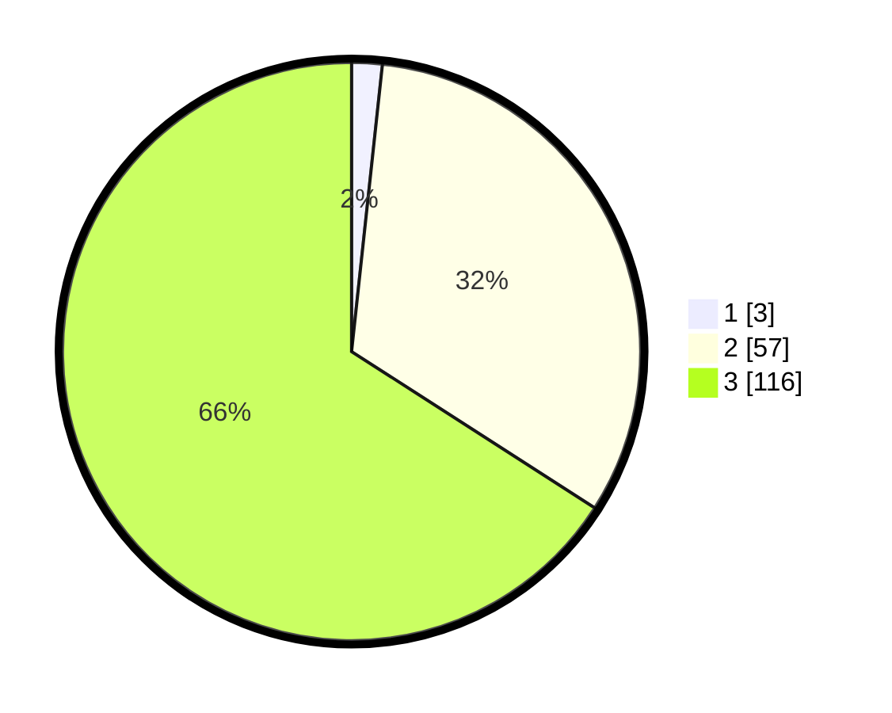

# Hasil

## Grafik

## Tabel

| No. | Nama Paslon    | Suara | Suara (raw) | Persentase |
|:--- |:-------------- | -----:| -----------:| ----------:|
| 1   | ANIES MUHAIMIN | 3     | [3][p-1]    | 1,70       |
| 2   | PRABOWO GIBRAN | 57    | [57][p-2]   | 32,39      |
| 3   | GANJAR MAHFUD  | 116   | [116][p-3]  | 65,91      |

[p-1]: https://github.com/gigit-pemilu/pemilu-2024/blob/main/pilpres/hitung-suara/sub/33-jawa-tengah/sub/22-semarang/sub/10-ambarawa/sub/2009-pasekan/sub/002-tps/sub/paslon-1.txt
[p-2]: https://github.com/gigit-pemilu/pemilu-2024/blob/main/pilpres/hitung-suara/sub/33-jawa-tengah/sub/22-semarang/sub/10-ambarawa/sub/2009-pasekan/sub/002-tps/sub/paslon-2.txt
[p-3]: https://github.com/gigit-pemilu/pemilu-2024/blob/main/pilpres/hitung-suara/sub/33-jawa-tengah/sub/22-semarang/sub/10-ambarawa/sub/2009-pasekan/sub/002-tps/sub/paslon-3.txt

## Foto C Plano

https://sirekap-obj-formc.kpu.go.id/08c6/pemilu/ppwp/33/22/10/20/09/3322102009002-20240214-141336--96010479-0ec8-4a36-94a7-192e458af894.jpg

https://sirekap-obj-formc.kpu.go.id/08c6/pemilu/ppwp/33/22/10/20/09/3322102009002-20240214-141441--7dead6d3-93ca-4d46-8d0d-86e94c86a21b.jpg

https://sirekap-obj-formc.kpu.go.id/08c6/pemilu/ppwp/33/22/10/20/09/3322102009002-20240214-141614--d349bf78-d9b5-42ca-bd2d-e024051ba4f5.jpg

## Metadata

| Key        | Value               |
| ---------- | ------------------- |
| Time Stamp | 2024-02-14 21:46:01 |

