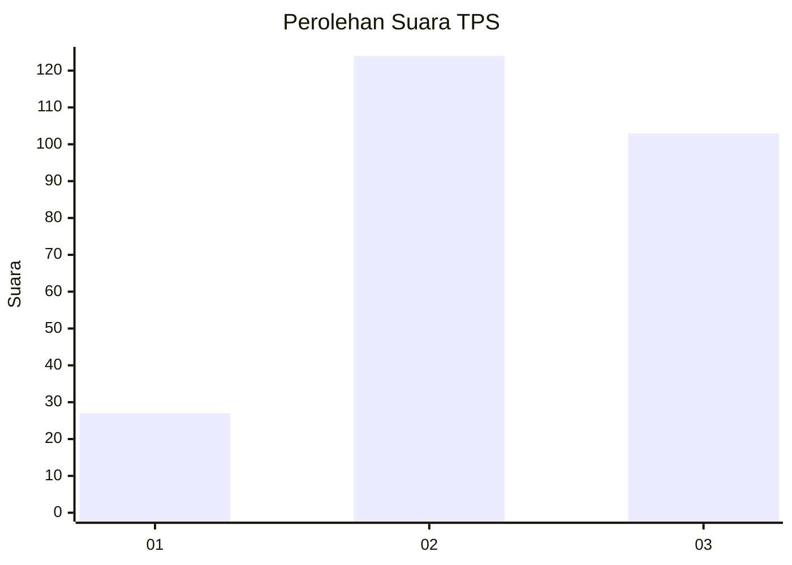
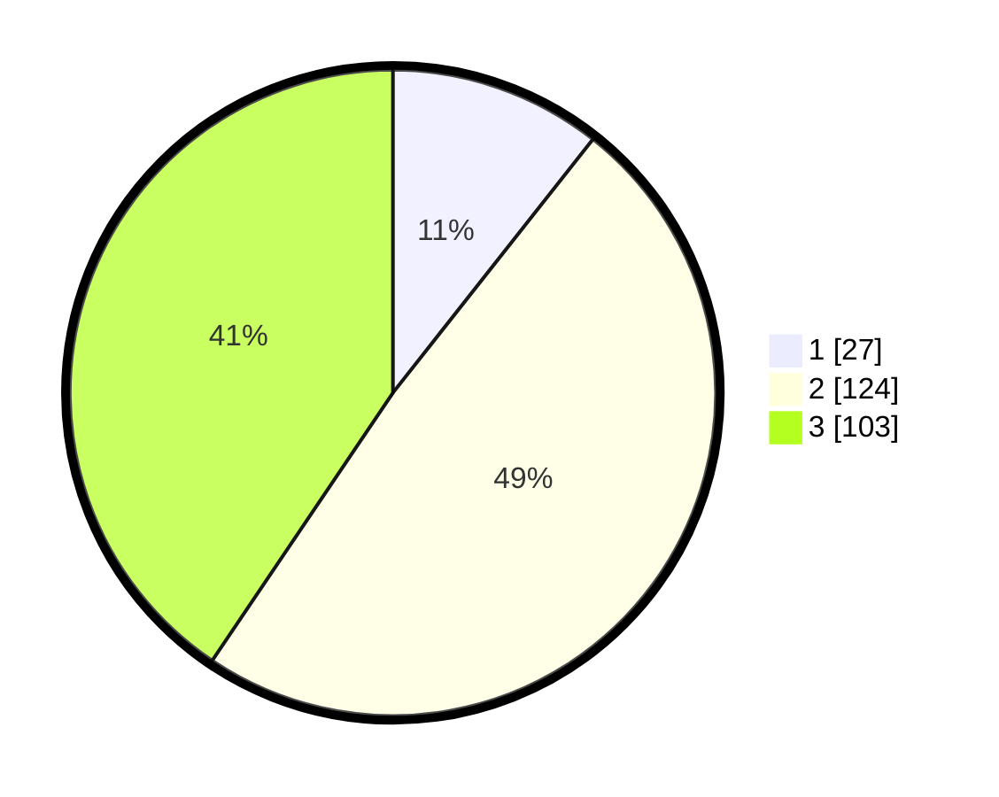

# Hasil

## Grafik

## Tabel

| No. | Nama Paslon    | Suara | Suara (raw) | Persentase |
|:--- |:-------------- | -----:| -----------:| ----------:|
| 1   | ANIES MUHAIMIN | 27    | [27][p-1]   | 10,63      |
| 2   | PRABOWO GIBRAN | 124   | [124][p-2]  | 48,82      |
| 3   | GANJAR MAHFUD  | 103   | [103][p-3]  | 40,55      |

[p-1]: https://github.com/gigit-pemilu/pemilu-2024-33-jawa-tengah/blob/main/pilpres/hitung-suara/sub/33-jawa-tengah/sub/22-semarang/sub/11-bawen/sub/2008-samban/sub/002-tps/sub/paslon-1.txt
[p-2]: https://github.com/gigit-pemilu/pemilu-2024-33-jawa-tengah/blob/main/pilpres/hitung-suara/sub/33-jawa-tengah/sub/22-semarang/sub/11-bawen/sub/2008-samban/sub/002-tps/sub/paslon-2.txt
[p-3]: https://github.com/gigit-pemilu/pemilu-2024-33-jawa-tengah/blob/main/pilpres/hitung-suara/sub/33-jawa-tengah/sub/22-semarang/sub/11-bawen/sub/2008-samban/sub/002-tps/sub/paslon-3.txt

## Foto C Plano

https://sirekap-obj-formc.kpu.go.id/58ba/pemilu/ppwp/33/22/11/20/08/3322112008002-20240217-112850--c066d1f2-b391-4f44-860e-0a163307e2a6.jpg

https://sirekap-obj-formc.kpu.go.id/58ba/pemilu/ppwp/33/22/11/20/08/3322112008002-20240217-113000--0469ae56-8c05-4ff4-b350-23ae399cb761.jpg

https://sirekap-obj-formc.kpu.go.id/58ba/pemilu/ppwp/33/22/11/20/08/3322112008002-20240217-113050--47e5f71b-5cf3-45ea-81bf-eb356379bb6f.jpg

## Metadata

| Key        | Value               |
| ---------- | ------------------- |
| Time Stamp | 2024-02-19 06:16:00 |

