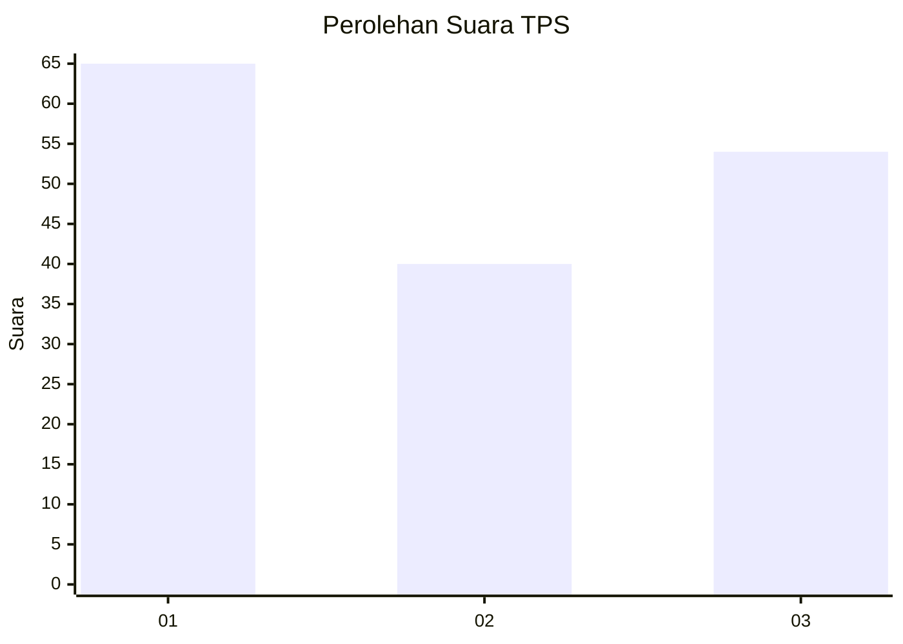
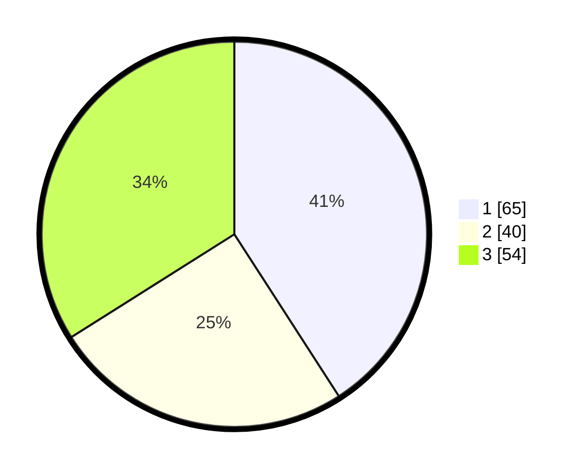

# Hasil

## Grafik

## Tabel

| No. | Nama Paslon    | Suara | Suara (raw) | Persentase |
|:--- |:-------------- | -----:| -----------:| ----------:|
| 1   | ANIES MUHAIMIN | 65    | [65][p-1]   | 40,88      |
| 2   | PRABOWO GIBRAN | 40    | [40][p-2]   | 25,16      |
| 3   | GANJAR MAHFUD  | 54    | [54][p-3]   | 33,96      |

[p-1]: https://github.com/gigit-pemilu/pemilu-2024/blob/main/pilpres/hitung-suara/sub/33-jawa-tengah/sub/22-semarang/sub/12-bringin/sub/2003-pakis/sub/012-tps/sub/paslon-1.txt
[p-2]: https://github.com/gigit-pemilu/pemilu-2024/blob/main/pilpres/hitung-suara/sub/33-jawa-tengah/sub/22-semarang/sub/12-bringin/sub/2003-pakis/sub/012-tps/sub/paslon-2.txt
[p-3]: https://github.com/gigit-pemilu/pemilu-2024/blob/main/pilpres/hitung-suara/sub/33-jawa-tengah/sub/22-semarang/sub/12-bringin/sub/2003-pakis/sub/012-tps/sub/paslon-3.txt

## Foto C Plano

https://sirekap-obj-formc.kpu.go.id/0cbc/pemilu/ppwp/33/22/12/20/03/3322122003012-20240214-221701--b12ed747-3c4e-4233-8252-83bf1e3913bd.jpg

https://sirekap-obj-formc.kpu.go.id/0cbc/pemilu/ppwp/33/22/12/20/03/3322122003012-20240214-221819--f19e7fd2-238c-4cca-8ff3-860a157ffd40.jpg

https://sirekap-obj-formc.kpu.go.id/0cbc/pemilu/ppwp/33/22/12/20/03/3322122003012-20240215-001355--54197637-3fd6-4ebc-8988-dad373f81381.jpg

## Metadata

| Key        | Value               |
| ---------- | ------------------- |
| Time Stamp | 2024-02-16 22:01:00 |

