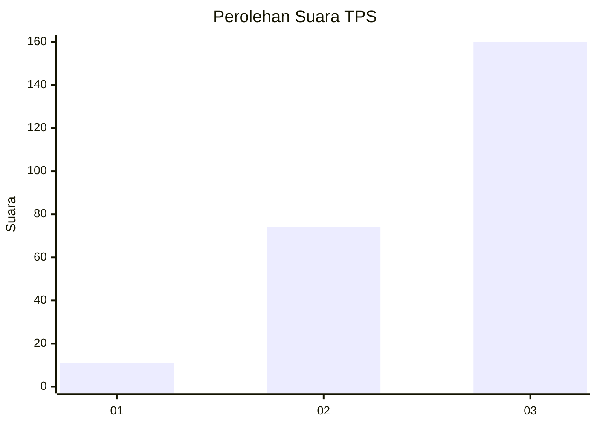
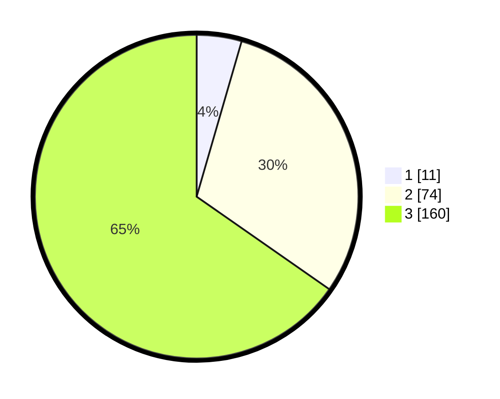

# Hasil

## Grafik

## Tabel

| No. | Nama Paslon    | Suara | Suara (raw) | Persentase |
|:--- |:-------------- | -----:| -----------:| ----------:|
| 1   | ANIES MUHAIMIN | 11    | [11][p-1]   | 4,49       |
| 2   | PRABOWO GIBRAN | 74    | [74][p-2]   | 30,20      |
| 3   | GANJAR MAHFUD  | 160   | [160][p-3]  | 65,31      |

[p-1]: https://github.com/gigit-pemilu/pemilu-2024-33-jawa-tengah/blob/main/pilpres/hitung-suara/sub/33-jawa-tengah/sub/22-semarang/sub/13-bergas/sub/2010-bergas-kidul/sub/009-tps/sub/paslon-1.txt
[p-2]: https://github.com/gigit-pemilu/pemilu-2024-33-jawa-tengah/blob/main/pilpres/hitung-suara/sub/33-jawa-tengah/sub/22-semarang/sub/13-bergas/sub/2010-bergas-kidul/sub/009-tps/sub/paslon-2.txt
[p-3]: https://github.com/gigit-pemilu/pemilu-2024-33-jawa-tengah/blob/main/pilpres/hitung-suara/sub/33-jawa-tengah/sub/22-semarang/sub/13-bergas/sub/2010-bergas-kidul/sub/009-tps/sub/paslon-3.txt

## Foto C Plano

https://sirekap-obj-formc.kpu.go.id/37de/pemilu/ppwp/33/22/13/20/10/3322132010009-20240214-141448--f11098f1-4fb5-4736-b748-f1f917429e38.jpg

https://sirekap-obj-formc.kpu.go.id/37de/pemilu/ppwp/33/22/13/20/10/3322132010009-20240214-141558--014f05f7-7f29-4a39-a995-6d832190452f.jpg

https://sirekap-obj-formc.kpu.go.id/37de/pemilu/ppwp/33/22/13/20/10/3322132010009-20240214-141742--ad5f5fc0-6ada-4fb9-ab0a-b0456704ae23.jpg

## Metadata

| Key        | Value               |
| ---------- | ------------------- |
| Time Stamp | 2024-02-16 22:01:00 |

