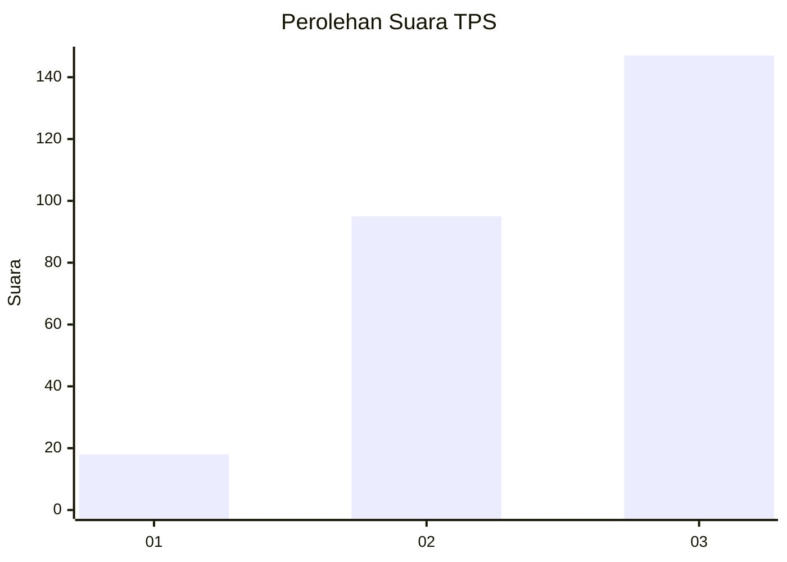
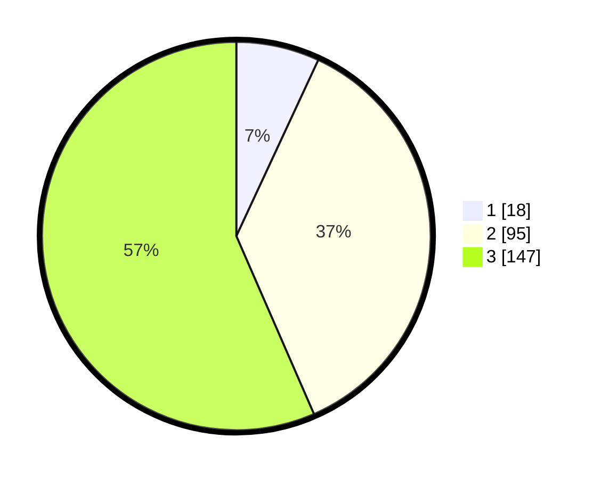

# Hasil

## Grafik

## Tabel

| No. | Nama Paslon    | Suara | Suara (raw) | Persentase |
|:--- |:-------------- | -----:| -----------:| ----------:|
| 1   | ANIES MUHAIMIN | 18    | [18][p-1]   | 6,92       |
| 2   | PRABOWO GIBRAN | 95    | [95][p-2]   | 36,54      |
| 3   | GANJAR MAHFUD  | 147   | [147][p-3]  | 56,54      |

[p-1]: https://github.com/gigit-pemilu/pemilu-2024/blob/main/pilpres/hitung-suara/sub/33-jawa-tengah/sub/22-semarang/sub/13-bergas/sub/2010-bergas-kidul/sub/015-tps/sub/paslon-1.txt
[p-2]: https://github.com/gigit-pemilu/pemilu-2024/blob/main/pilpres/hitung-suara/sub/33-jawa-tengah/sub/22-semarang/sub/13-bergas/sub/2010-bergas-kidul/sub/015-tps/sub/paslon-2.txt
[p-3]: https://github.com/gigit-pemilu/pemilu-2024/blob/main/pilpres/hitung-suara/sub/33-jawa-tengah/sub/22-semarang/sub/13-bergas/sub/2010-bergas-kidul/sub/015-tps/sub/paslon-3.txt

## Foto C Plano

https://sirekap-obj-formc.kpu.go.id/f45d/pemilu/ppwp/33/22/13/20/10/3322132010015-20240220-061722--e5d643a3-c5f2-4c00-bd1e-6c746b4be8f8.jpg

https://sirekap-obj-formc.kpu.go.id/f45d/pemilu/ppwp/33/22/13/20/10/3322132010015-20240214-191737--564da7e7-ccd1-4c8e-86fc-a9940bfab527.jpg

https://sirekap-obj-formc.kpu.go.id/f45d/pemilu/ppwp/33/22/13/20/10/3322132010015-20240220-061918--85738747-7bc6-4988-b70c-5503b0bbc123.jpg

## Metadata

| Key        | Value               |
| ---------- | ------------------- |
| Time Stamp | 2024-02-20 07:00:00 |

