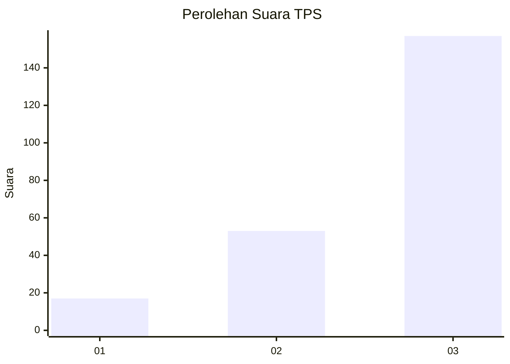
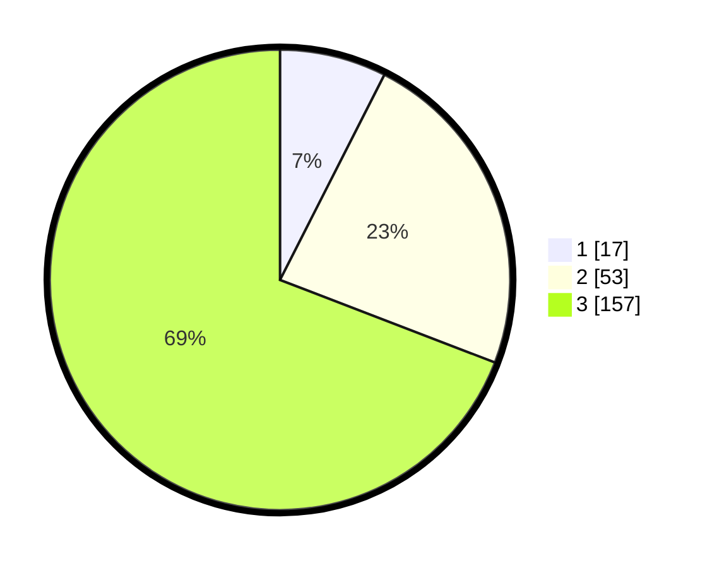

# Hasil

## Grafik

## Tabel

| No. | Nama Paslon    | Suara | Suara (raw) | Persentase |
|:--- |:-------------- | -----:| -----------:| ----------:|
| 1   | ANIES MUHAIMIN | 17    | [17][p-1]   | 7,49       |
| 2   | PRABOWO GIBRAN | 53    | [53][p-2]   | 23,35      |
| 3   | GANJAR MAHFUD  | 157   | [157][p-3]  | 69,16      |

[p-1]: https://github.com/gigit-pemilu/pemilu-2024/blob/main/pilpres/hitung-suara/sub/33-jawa-tengah/sub/22-semarang/sub/16-bancak/sub/2008-pucung/sub/008-tps/sub/paslon-1.txt
[p-2]: https://github.com/gigit-pemilu/pemilu-2024/blob/main/pilpres/hitung-suara/sub/33-jawa-tengah/sub/22-semarang/sub/16-bancak/sub/2008-pucung/sub/008-tps/sub/paslon-2.txt
[p-3]: https://github.com/gigit-pemilu/pemilu-2024/blob/main/pilpres/hitung-suara/sub/33-jawa-tengah/sub/22-semarang/sub/16-bancak/sub/2008-pucung/sub/008-tps/sub/paslon-3.txt

## Foto C Plano

https://sirekap-obj-formc.kpu.go.id/914b/pemilu/ppwp/33/22/16/20/08/3322162008008-20240217-210557--ef48f624-253a-4214-a3c1-3ac84608cdca.jpg

https://sirekap-obj-formc.kpu.go.id/914b/pemilu/ppwp/33/22/16/20/08/3322162008008-20240214-195609--fca2c9c2-8cee-4dd2-80d5-758bf2a86360.jpg

https://sirekap-obj-formc.kpu.go.id/914b/pemilu/ppwp/33/22/16/20/08/3322162008008-20240214-195615--f0f65acd-1309-41ee-81e0-3aa2bd610aaa.jpg

## Metadata

| Key        | Value               |
| ---------- | ------------------- |
| Time Stamp | 2024-02-19 06:16:00 |

