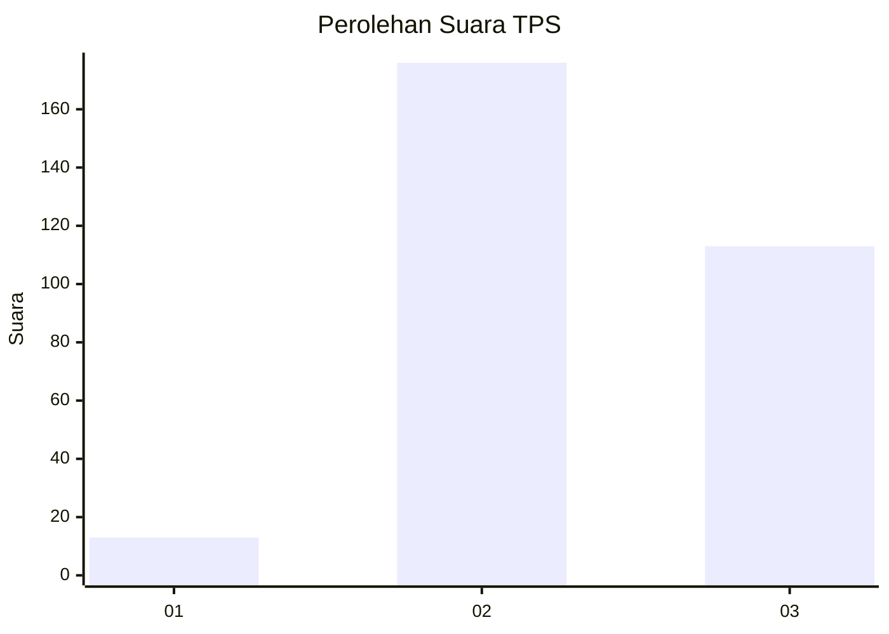
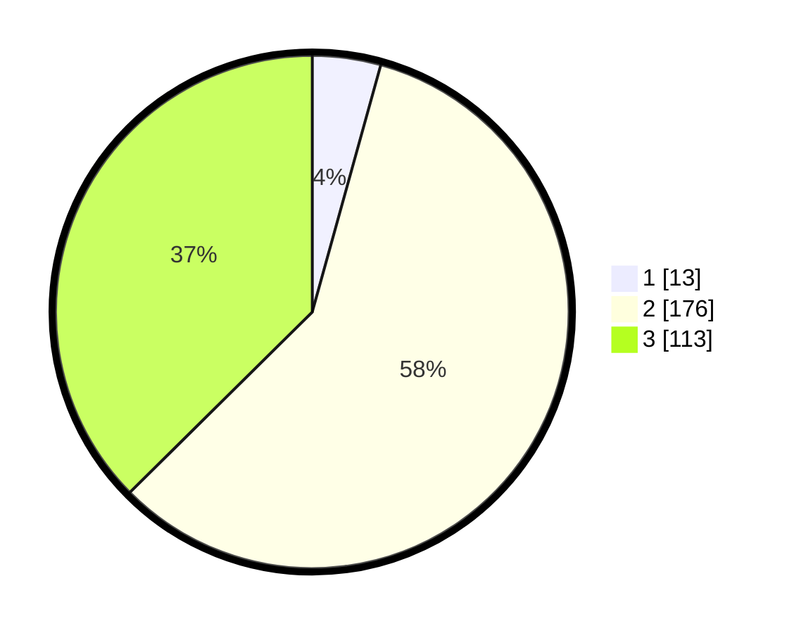

# Hasil

## Grafik

## Tabel

| No. | Nama Paslon    | Suara | Suara (raw) | Persentase |
|:--- |:-------------- | -----:| -----------:| ----------:|
| 1   | ANIES MUHAIMIN | 13    | [13][p-1]   | 4,30       |
| 2   | PRABOWO GIBRAN | 176   | [176][p-2]  | 58,28      |
| 3   | GANJAR MAHFUD  | 113   | [113][p-3]  | 37,42      |

[p-1]: https://github.com/gigit-pemilu/pemilu-2024-33-jawa-tengah/blob/main/pilpres/hitung-suara/sub/33-jawa-tengah/sub/22-semarang/sub/19-ungaran-timur/sub/2010-kalongan/sub/020-tps/sub/paslon-1.txt
[p-2]: https://github.com/gigit-pemilu/pemilu-2024-33-jawa-tengah/blob/main/pilpres/hitung-suara/sub/33-jawa-tengah/sub/22-semarang/sub/19-ungaran-timur/sub/2010-kalongan/sub/020-tps/sub/paslon-2.txt
[p-3]: https://github.com/gigit-pemilu/pemilu-2024-33-jawa-tengah/blob/main/pilpres/hitung-suara/sub/33-jawa-tengah/sub/22-semarang/sub/19-ungaran-timur/sub/2010-kalongan/sub/020-tps/sub/paslon-3.txt

## Foto C Plano

https://sirekap-obj-formc.kpu.go.id/15af/pemilu/ppwp/33/22/19/20/10/3322192010020-20240214-215328--334a5c27-9a2c-4856-a951-d64f6eca2860.jpg

https://sirekap-obj-formc.kpu.go.id/15af/pemilu/ppwp/33/22/19/20/10/3322192010020-20240214-215456--0ec61a01-fd97-4069-bf40-620b8c0b47db.jpg

https://sirekap-obj-formc.kpu.go.id/15af/pemilu/ppwp/33/22/19/20/10/3322192010020-20240214-215601--3c11d50b-7ea5-4772-915a-c2d2d4be5e2e.jpg

## Metadata

| Key        | Value               |
| ---------- | ------------------- |
| Time Stamp | 2024-02-16 23:30:00 |

