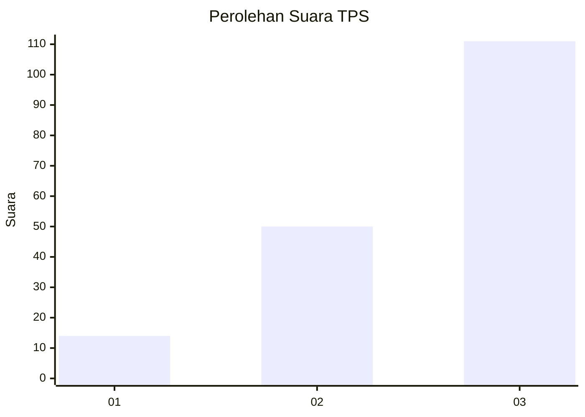
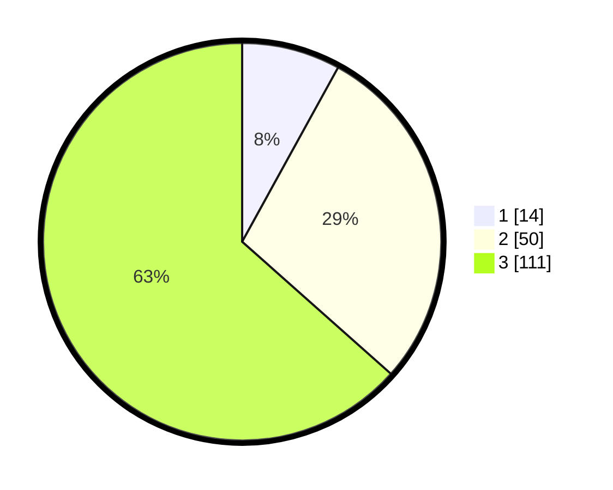

# Hasil

## Grafik

## Tabel

| No. | Nama Paslon    | Suara | Suara (raw) | Persentase |
|:--- |:-------------- | -----:| -----------:| ----------:|
| 1   | ANIES MUHAIMIN | 14    | [14][p-1]   | 8,00       |
| 2   | PRABOWO GIBRAN | 50    | [50][p-2]   | 28,57      |
| 3   | GANJAR MAHFUD  | 111   | [111][p-3]  | 63,43      |

[p-1]: https://github.com/gigit-pemilu/pemilu-2024/blob/main/pilpres/hitung-suara/sub/33-jawa-tengah/sub/22-semarang/sub/20-bandungan/sub/2005-candi/sub/017-tps/sub/paslon-1.txt
[p-2]: https://github.com/gigit-pemilu/pemilu-2024/blob/main/pilpres/hitung-suara/sub/33-jawa-tengah/sub/22-semarang/sub/20-bandungan/sub/2005-candi/sub/017-tps/sub/paslon-2.txt
[p-3]: https://github.com/gigit-pemilu/pemilu-2024/blob/main/pilpres/hitung-suara/sub/33-jawa-tengah/sub/22-semarang/sub/20-bandungan/sub/2005-candi/sub/017-tps/sub/paslon-3.txt

## Foto C Plano

https://sirekap-obj-formc.kpu.go.id/9593/pemilu/ppwp/33/22/20/20/05/3322202005017-20240214-141331--3804207a-47c8-44b1-94c4-912d9872b675.jpg

https://sirekap-obj-formc.kpu.go.id/9593/pemilu/ppwp/33/22/20/20/05/3322202005017-20240214-141835--71e1f56f-429b-4679-b880-539d85fc9bb7.jpg

https://sirekap-obj-formc.kpu.go.id/9593/pemilu/ppwp/33/22/20/20/05/3322202005017-20240214-141507--0d34ea3c-5147-439a-8f5f-faf57170ddb8.jpg

## Metadata

| Key        | Value               |
| ---------- | ------------------- |
| Time Stamp | 2024-02-15 02:10:27 |

