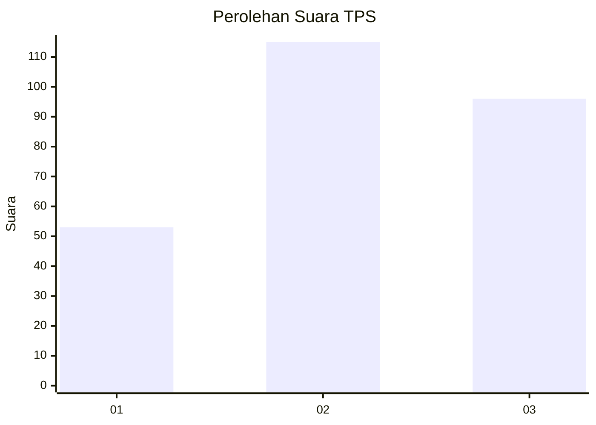
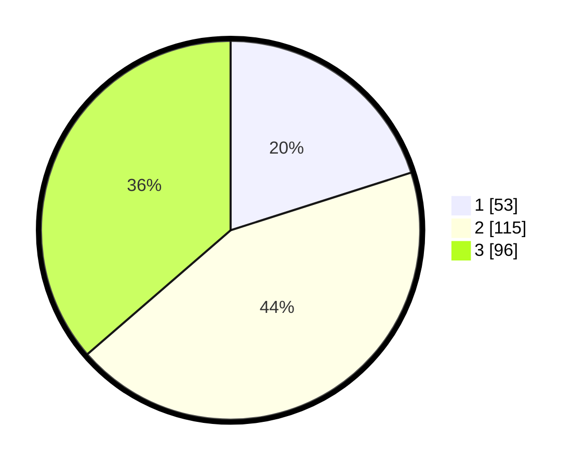

# Hasil

## Grafik

## Tabel

| No. | Nama Paslon    | Suara | Suara (raw) | Persentase |
|:--- |:-------------- | -----:| -----------:| ----------:|
| 1   | ANIES MUHAIMIN | 53    | [53][p-1]   | 20,08      |
| 2   | PRABOWO GIBRAN | 115   | [115][p-2]  | 43,56      |
| 3   | GANJAR MAHFUD  | 96    | [96][p-3]   | 36,36      |

[p-1]: https://github.com/gigit-pemilu/pemilu-2024/blob/main/pilpres/hitung-suara/sub/33-jawa-tengah/sub/23-temanggung/sub/01-bulu/sub/2001-bulu/sub/006-tps/sub/paslon-1.txt
[p-2]: https://github.com/gigit-pemilu/pemilu-2024/blob/main/pilpres/hitung-suara/sub/33-jawa-tengah/sub/23-temanggung/sub/01-bulu/sub/2001-bulu/sub/006-tps/sub/paslon-2.txt
[p-3]: https://github.com/gigit-pemilu/pemilu-2024/blob/main/pilpres/hitung-suara/sub/33-jawa-tengah/sub/23-temanggung/sub/01-bulu/sub/2001-bulu/sub/006-tps/sub/paslon-3.txt

## Foto C Plano

https://sirekap-obj-formc.kpu.go.id/843a/pemilu/ppwp/33/23/01/20/01/3323012001006-20240216-124650--2c6d91dd-d805-4f1f-b2f9-0e463f1287e8.jpg

https://sirekap-obj-formc.kpu.go.id/843a/pemilu/ppwp/33/23/01/20/01/3323012001006-20240221-180540--648fb395-1e44-409c-bf9b-8d91867bd492.jpg

https://sirekap-obj-formc.kpu.go.id/843a/pemilu/ppwp/33/23/01/20/01/3323012001006-20240216-125041--f05adbe5-d6ca-42cd-918f-7f5fc317693b.jpg

## Metadata

| Key        | Value               |
| ---------- | ------------------- |
| Time Stamp | 2024-02-22 11:00:00 |

