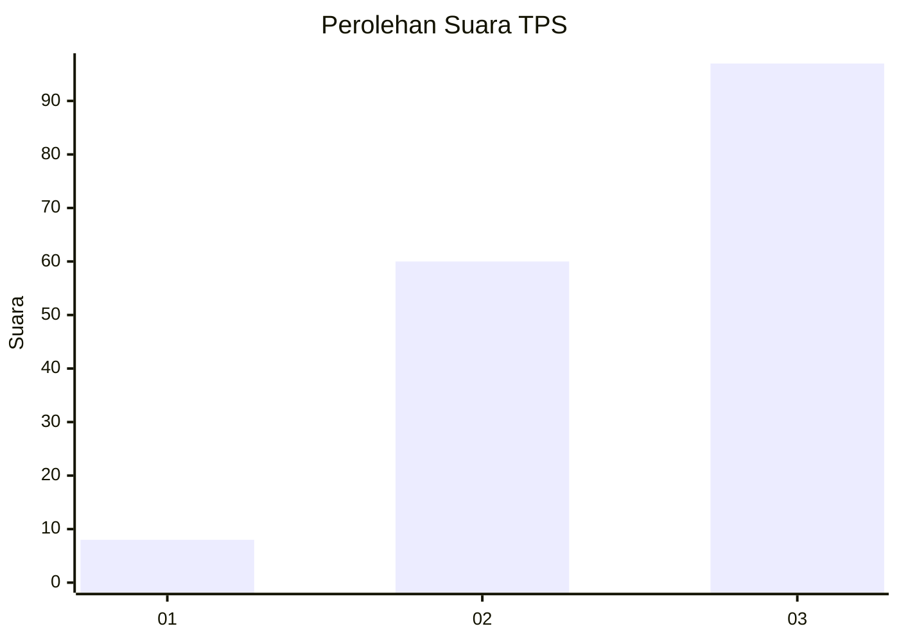
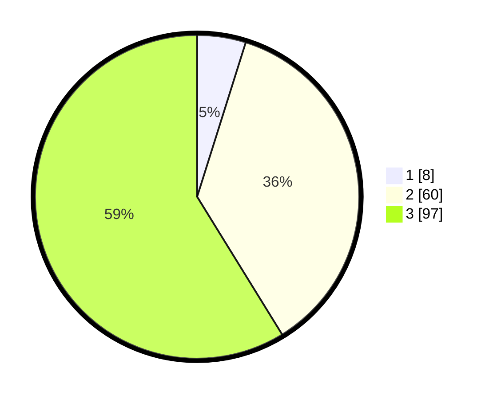

# Hasil

## Grafik

## Tabel

| No. | Nama Paslon    | Suara | Suara (raw) | Persentase |
|:--- |:-------------- | -----:| -----------:| ----------:|
| 1   | ANIES MUHAIMIN | 8     | [8][p-1]    | 4,85       |
| 2   | PRABOWO GIBRAN | 60    | [60][p-2]   | 36,36      |
| 3   | GANJAR MAHFUD  | 97    | [97][p-3]   | 58,79      |

[p-1]: https://github.com/gigit-pemilu/pemilu-2024-33-jawa-tengah/blob/main/pilpres/hitung-suara/sub/33-jawa-tengah/sub/23-temanggung/sub/03-temanggung/sub/1001-temanggung-i/sub/003-tps/sub/paslon-1.txt
[p-2]: https://github.com/gigit-pemilu/pemilu-2024-33-jawa-tengah/blob/main/pilpres/hitung-suara/sub/33-jawa-tengah/sub/23-temanggung/sub/03-temanggung/sub/1001-temanggung-i/sub/003-tps/sub/paslon-2.txt
[p-3]: https://github.com/gigit-pemilu/pemilu-2024-33-jawa-tengah/blob/main/pilpres/hitung-suara/sub/33-jawa-tengah/sub/23-temanggung/sub/03-temanggung/sub/1001-temanggung-i/sub/003-tps/sub/paslon-3.txt

## Foto C Plano

https://sirekap-obj-formc.kpu.go.id/eedc/pemilu/ppwp/33/23/03/10/01/3323031001003-20240214-233800--093722ed-d09b-4bad-952c-29c2496715b7.jpg

https://sirekap-obj-formc.kpu.go.id/eedc/pemilu/ppwp/33/23/03/10/01/3323031001003-20240215-132846--6a8aef4b-6f79-4a71-894a-318a6a87756b.jpg

https://sirekap-obj-formc.kpu.go.id/eedc/pemilu/ppwp/33/23/03/10/01/3323031001003-20240215-132945--320fdfc4-eb9f-4234-990a-e9cd681c7330.jpg

## Metadata

| Key        | Value               |
| ---------- | ------------------- |
| Time Stamp | 2024-02-15 17:00:25 |

