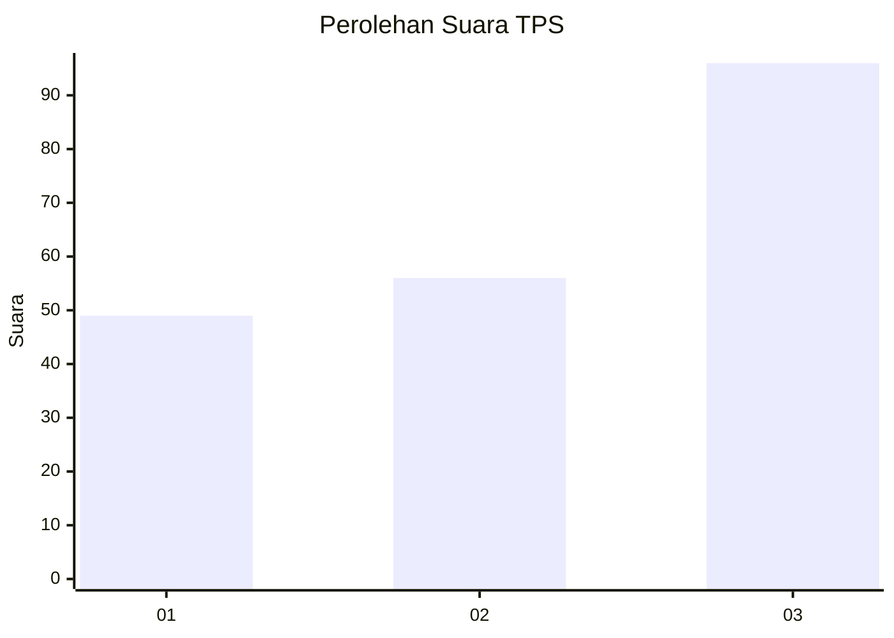
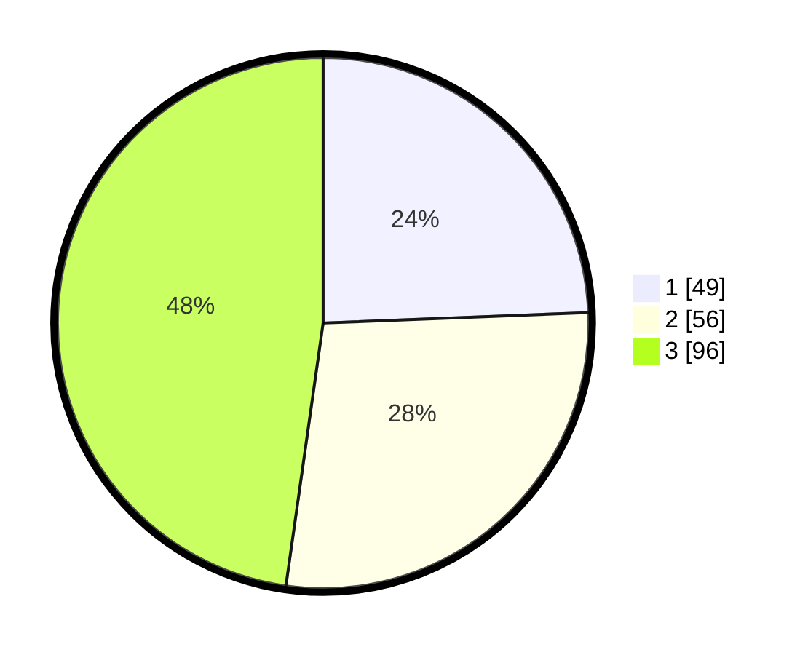

# Hasil

## Grafik

## Tabel

| No. | Nama Paslon    | Suara | Suara (raw) | Persentase |
|:--- |:-------------- | -----:| -----------:| ----------:|
| 1   | ANIES MUHAIMIN | 49    | [49][p-1]   | 24,38      |
| 2   | PRABOWO GIBRAN | 56    | [56][p-2]   | 27,86      |
| 3   | GANJAR MAHFUD  | 96    | [96][p-3]   | 47,76      |

[p-1]: https://github.com/gigit-pemilu/pemilu-2024-33-jawa-tengah/blob/main/pilpres/hitung-suara/sub/33-jawa-tengah/sub/23-temanggung/sub/03-temanggung/sub/1004-jampiroso/sub/001-tps/sub/paslon-1.txt
[p-2]: https://github.com/gigit-pemilu/pemilu-2024-33-jawa-tengah/blob/main/pilpres/hitung-suara/sub/33-jawa-tengah/sub/23-temanggung/sub/03-temanggung/sub/1004-jampiroso/sub/001-tps/sub/paslon-2.txt
[p-3]: https://github.com/gigit-pemilu/pemilu-2024-33-jawa-tengah/blob/main/pilpres/hitung-suara/sub/33-jawa-tengah/sub/23-temanggung/sub/03-temanggung/sub/1004-jampiroso/sub/001-tps/sub/paslon-3.txt

## Foto C Plano

https://sirekap-obj-formc.kpu.go.id/ccd8/pemilu/ppwp/33/23/03/10/04/3323031004001-20240214-204200--eace3986-6951-41f4-b956-cb7ec756b5c5.jpg

https://sirekap-obj-formc.kpu.go.id/ccd8/pemilu/ppwp/33/23/03/10/04/3323031004001-20240214-204254--b5999529-21a7-46b9-8694-bbda2606505b.jpg

https://sirekap-obj-formc.kpu.go.id/ccd8/pemilu/ppwp/33/23/03/10/04/3323031004001-20240214-204305--1a0b470d-1d9e-45bc-b759-6be2b53a9ed7.jpg

## Metadata

| Key        | Value               |
| ---------- | ------------------- |
| Time Stamp | 2024-02-16 14:30:33 |

