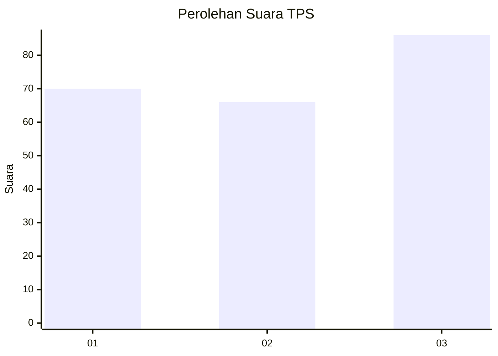
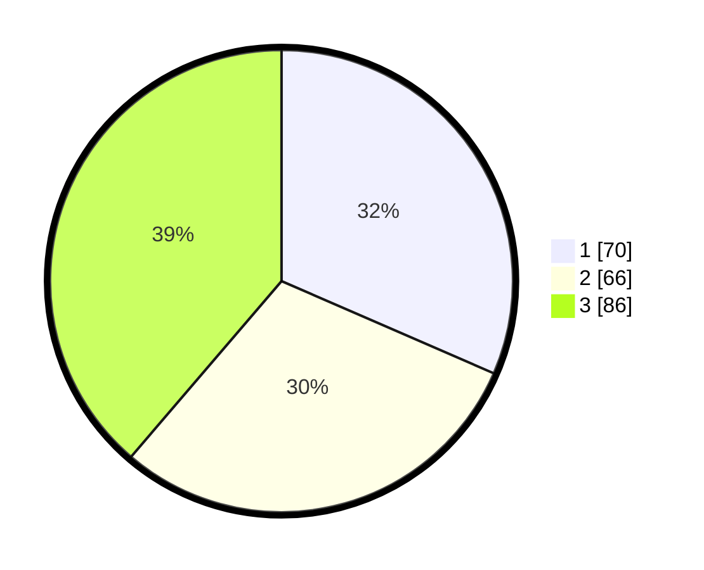

# Hasil

## Grafik

## Tabel

| No. | Nama Paslon    | Suara | Suara (raw) | Persentase |
|:--- |:-------------- | -----:| -----------:| ----------:|
| 1   | ANIES MUHAIMIN | 70    | [70][p-1]   | 31,53      |
| 2   | PRABOWO GIBRAN | 66    | [66][p-2]   | 29,73      |
| 3   | GANJAR MAHFUD  | 86    | [86][p-3]   | 38,74      |

[p-1]: https://github.com/gigit-pemilu/pemilu-2024/blob/main/pilpres/hitung-suara/sub/33-jawa-tengah/sub/23-temanggung/sub/03-temanggung/sub/2024-nampirejo/sub/002-tps/sub/paslon-1.txt
[p-2]: https://github.com/gigit-pemilu/pemilu-2024/blob/main/pilpres/hitung-suara/sub/33-jawa-tengah/sub/23-temanggung/sub/03-temanggung/sub/2024-nampirejo/sub/002-tps/sub/paslon-2.txt
[p-3]: https://github.com/gigit-pemilu/pemilu-2024/blob/main/pilpres/hitung-suara/sub/33-jawa-tengah/sub/23-temanggung/sub/03-temanggung/sub/2024-nampirejo/sub/002-tps/sub/paslon-3.txt

## Foto C Plano

https://sirekap-obj-formc.kpu.go.id/6704/pemilu/ppwp/33/23/03/20/24/3323032024002-20240214-192537--d0da0ec4-3dfb-48b5-9f2b-92bb451d908e.jpg

https://sirekap-obj-formc.kpu.go.id/6704/pemilu/ppwp/33/23/03/20/24/3323032024002-20240215-150327--6c560a2c-971e-489e-8309-a3417d787c79.jpg

https://sirekap-obj-formc.kpu.go.id/6704/pemilu/ppwp/33/23/03/20/24/3323032024002-20240215-150418--de45af37-ab32-4231-81f3-a4f7bcce50cf.jpg

## Metadata

| Key        | Value               |
| ---------- | ------------------- |
| Time Stamp | 2024-02-15 19:00:26 |

