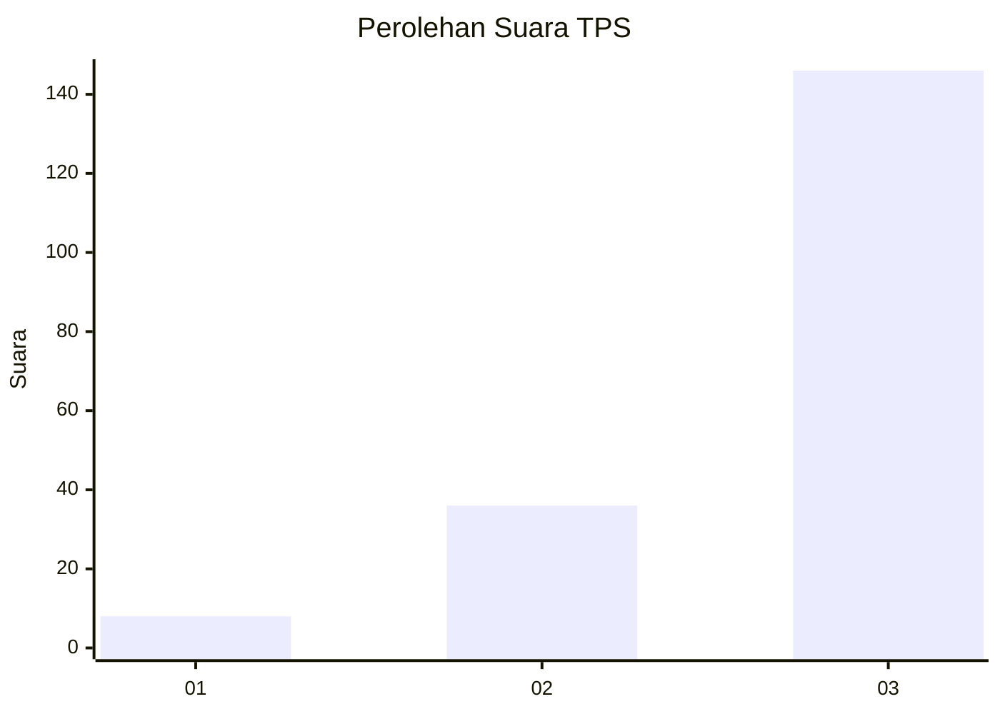
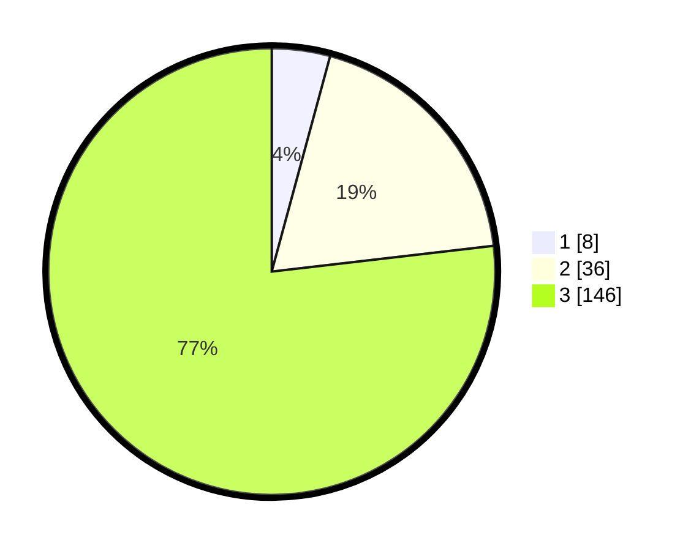

# Hasil

## Grafik

## Tabel

| No. | Nama Paslon    | Suara | Suara (raw) | Persentase |
|:--- |:-------------- | -----:| -----------:| ----------:|
| 1   | ANIES MUHAIMIN | 8     | [8][p-1]    | 4,21       |
| 2   | PRABOWO GIBRAN | 36    | [36][p-2]   | 18,95      |
| 3   | GANJAR MAHFUD  | 146   | [146][p-3]  | 76,84      |

[p-1]: https://github.com/gigit-pemilu/pemilu-2024/blob/main/pilpres/hitung-suara/sub/33-jawa-tengah/sub/23-temanggung/sub/05-kaloran/sub/2012-tepusen/sub/008-tps/sub/paslon-1.txt
[p-2]: https://github.com/gigit-pemilu/pemilu-2024/blob/main/pilpres/hitung-suara/sub/33-jawa-tengah/sub/23-temanggung/sub/05-kaloran/sub/2012-tepusen/sub/008-tps/sub/paslon-2.txt
[p-3]: https://github.com/gigit-pemilu/pemilu-2024/blob/main/pilpres/hitung-suara/sub/33-jawa-tengah/sub/23-temanggung/sub/05-kaloran/sub/2012-tepusen/sub/008-tps/sub/paslon-3.txt

## Foto C Plano

https://sirekap-obj-formc.kpu.go.id/d5e8/pemilu/ppwp/33/23/05/20/12/3323052012008-20240214-141427--43fc9189-ff0e-41b2-8f0b-b660db4ed8d2.jpg

https://sirekap-obj-formc.kpu.go.id/d5e8/pemilu/ppwp/33/23/05/20/12/3323052012008-20240214-141154--52c51b2f-adfa-43f1-9e92-f62c1986ef28.jpg

https://sirekap-obj-formc.kpu.go.id/d5e8/pemilu/ppwp/33/23/05/20/12/3323052012008-20240215-000050--26eb4d6a-2c4c-483e-9773-855ba55ade81.jpg

## Metadata

| Key        | Value               |
| ---------- | ------------------- |
| Time Stamp | 2024-02-15 00:41:44 |

