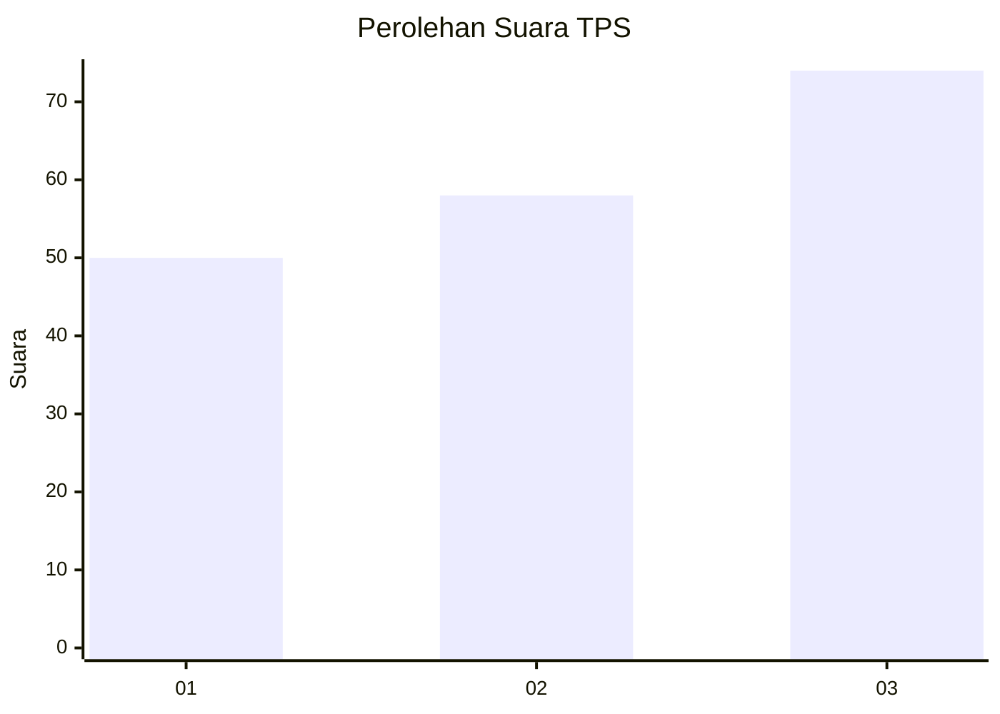
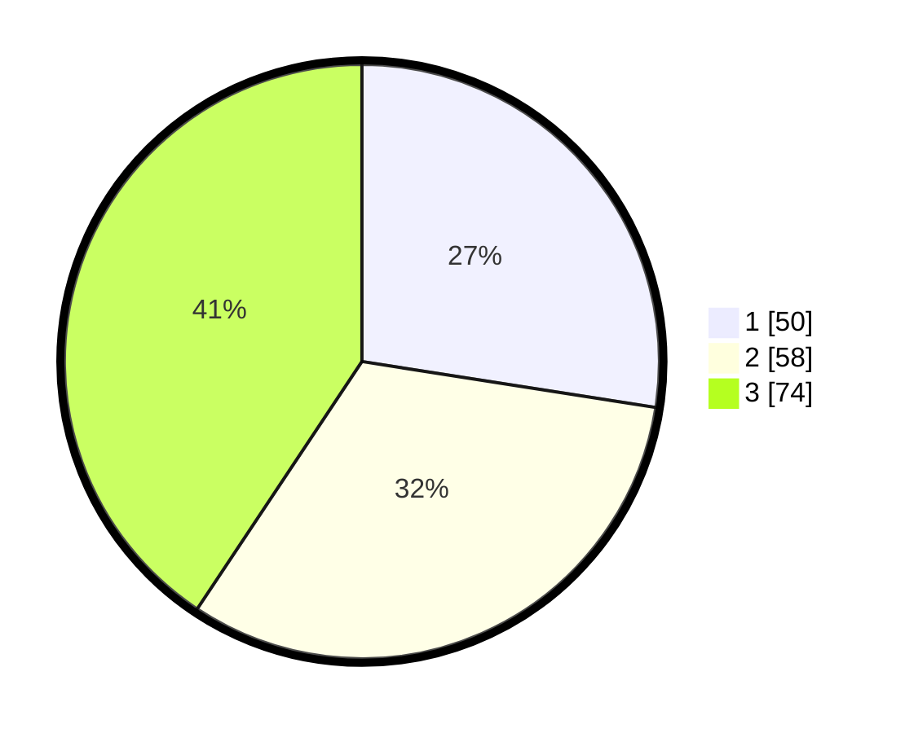

# Hasil

## Grafik

## Tabel

| No. | Nama Paslon    | Suara | Suara (raw) | Persentase |
|:--- |:-------------- | -----:| -----------:| ----------:|
| 1   | ANIES MUHAIMIN | 50    | [50][p-1]   | 27,47      |
| 2   | PRABOWO GIBRAN | 58    | [58][p-2]   | 31,87      |
| 3   | GANJAR MAHFUD  | 74    | [74][p-3]   | 40,66      |

[p-1]: https://github.com/gigit-pemilu/pemilu-2024/blob/main/pilpres/hitung-suara/sub/33-jawa-tengah/sub/23-temanggung/sub/07-kedu/sub/2006-karangtejo/sub/003-tps/sub/paslon-1.txt
[p-2]: https://github.com/gigit-pemilu/pemilu-2024/blob/main/pilpres/hitung-suara/sub/33-jawa-tengah/sub/23-temanggung/sub/07-kedu/sub/2006-karangtejo/sub/003-tps/sub/paslon-2.txt
[p-3]: https://github.com/gigit-pemilu/pemilu-2024/blob/main/pilpres/hitung-suara/sub/33-jawa-tengah/sub/23-temanggung/sub/07-kedu/sub/2006-karangtejo/sub/003-tps/sub/paslon-3.txt

## Foto C Plano

https://sirekap-obj-formc.kpu.go.id/c03c/pemilu/ppwp/33/23/07/20/06/3323072006003-20240214-214247--799687c3-b294-4b12-8ec3-d64d6e28913e.jpg

https://sirekap-obj-formc.kpu.go.id/c03c/pemilu/ppwp/33/23/07/20/06/3323072006003-20240214-214411--132ab32b-c53f-4826-bbc1-9342e05dcca8.jpg

https://sirekap-obj-formc.kpu.go.id/c03c/pemilu/ppwp/33/23/07/20/06/3323072006003-20240214-214536--a2912ab0-6e42-405f-9626-550d1b31c775.jpg

## Metadata

| Key        | Value               |
| ---------- | ------------------- |
| Time Stamp | 2024-02-16 16:25:10 |

