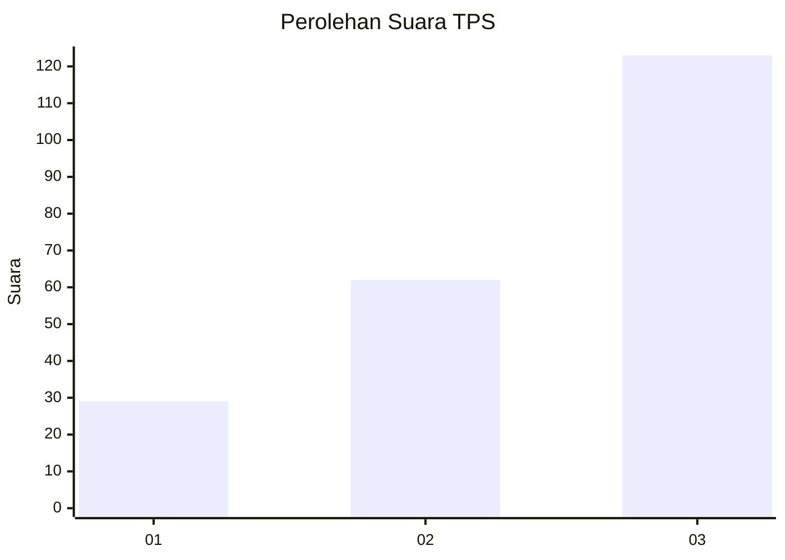
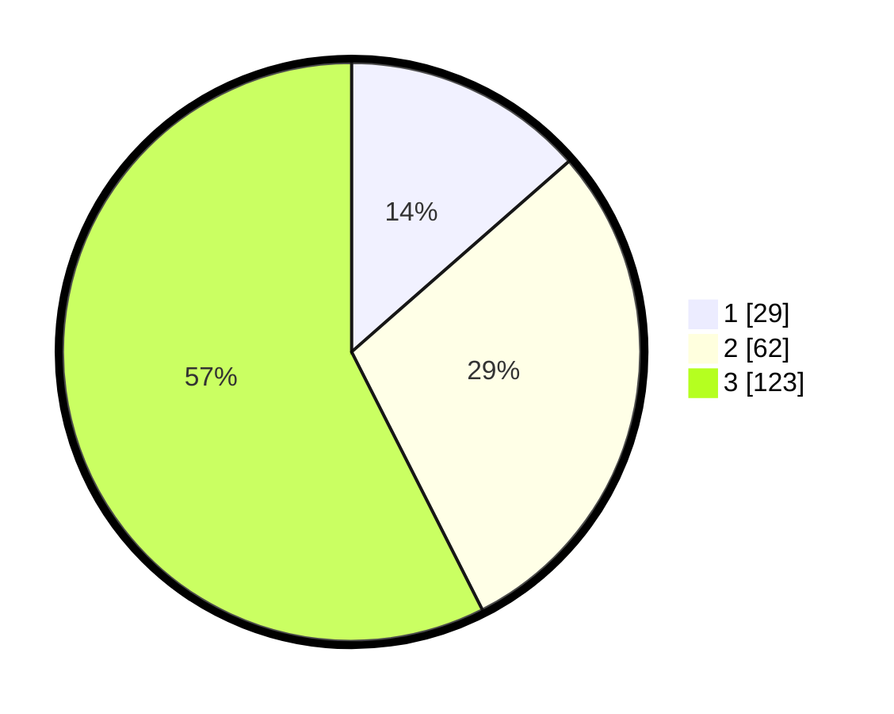

# Hasil

## Grafik

## Tabel

| No. | Nama Paslon    | Suara | Suara (raw) | Persentase |
|:--- |:-------------- | -----:| -----------:| ----------:|
| 1   | ANIES MUHAIMIN | 29    | [29][p-1]   | 13,55      |
| 2   | PRABOWO GIBRAN | 62    | [62][p-2]   | 28,97      |
| 3   | GANJAR MAHFUD  | 123   | [123][p-3]  | 57,48      |

[p-1]: https://github.com/gigit-pemilu/pemilu-2024/blob/main/pilpres/hitung-suara/sub/33-jawa-tengah/sub/23-temanggung/sub/07-kedu/sub/2009-kundisari/sub/001-tps/sub/paslon-1.txt
[p-2]: https://github.com/gigit-pemilu/pemilu-2024/blob/main/pilpres/hitung-suara/sub/33-jawa-tengah/sub/23-temanggung/sub/07-kedu/sub/2009-kundisari/sub/001-tps/sub/paslon-2.txt
[p-3]: https://github.com/gigit-pemilu/pemilu-2024/blob/main/pilpres/hitung-suara/sub/33-jawa-tengah/sub/23-temanggung/sub/07-kedu/sub/2009-kundisari/sub/001-tps/sub/paslon-3.txt

## Foto C Plano

https://sirekap-obj-formc.kpu.go.id/63c1/pemilu/ppwp/33/23/07/20/09/3323072009001-20240215-023149--63f76380-c86a-4255-85c2-f415418d5b41.jpg

https://sirekap-obj-formc.kpu.go.id/63c1/pemilu/ppwp/33/23/07/20/09/3323072009001-20240215-023304--fd23a856-29d5-4e7a-81e3-9ecdaeef0d68.jpg

https://sirekap-obj-formc.kpu.go.id/63c1/pemilu/ppwp/33/23/07/20/09/3323072009001-20240214-213451--2961973f-d468-455d-a93f-286d5c3d96d4.jpg

## Metadata

| Key        | Value               |
| ---------- | ------------------- |
| Time Stamp | 2024-02-16 16:25:10 |

