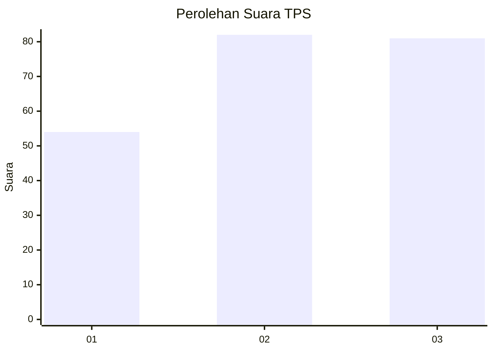
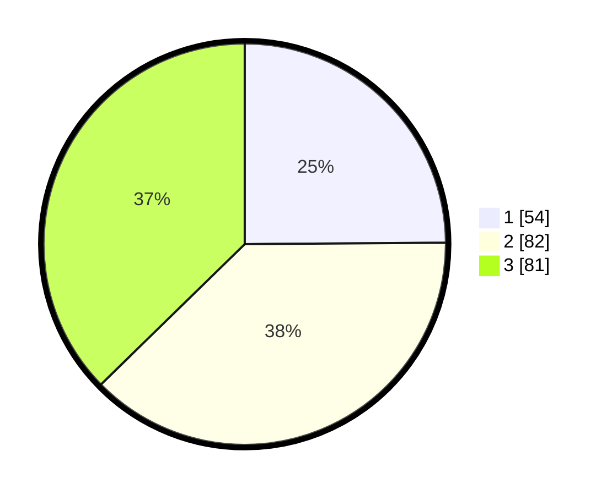

# Hasil

## Grafik

## Tabel

| No. | Nama Paslon    | Suara | Suara (raw) | Persentase |
|:--- |:-------------- | -----:| -----------:| ----------:|
| 1   | ANIES MUHAIMIN | 54    | [54][p-1]   | 24,88      |
| 2   | PRABOWO GIBRAN | 82    | [82][p-2]   | 37,79      |
| 3   | GANJAR MAHFUD  | 81    | [81][p-3]   | 37,33      |

[p-1]: https://github.com/gigit-pemilu/pemilu-2024-33-jawa-tengah/blob/main/pilpres/hitung-suara/sub/33-jawa-tengah/sub/23-temanggung/sub/08-parakan/sub/1001-parakan-wetan/sub/004-tps/sub/paslon-1.txt
[p-2]: https://github.com/gigit-pemilu/pemilu-2024-33-jawa-tengah/blob/main/pilpres/hitung-suara/sub/33-jawa-tengah/sub/23-temanggung/sub/08-parakan/sub/1001-parakan-wetan/sub/004-tps/sub/paslon-2.txt
[p-3]: https://github.com/gigit-pemilu/pemilu-2024-33-jawa-tengah/blob/main/pilpres/hitung-suara/sub/33-jawa-tengah/sub/23-temanggung/sub/08-parakan/sub/1001-parakan-wetan/sub/004-tps/sub/paslon-3.txt

## Foto C Plano

https://sirekap-obj-formc.kpu.go.id/a058/pemilu/ppwp/33/23/08/10/01/3323081001004-20240215-040823--385f8737-017b-450a-ba3a-c2bea6baad08.jpg

https://sirekap-obj-formc.kpu.go.id/a058/pemilu/ppwp/33/23/08/10/01/3323081001004-20240215-040716--be844a76-0efa-4bc5-b224-4c70bdb98ea4.jpg

https://sirekap-obj-formc.kpu.go.id/a058/pemilu/ppwp/33/23/08/10/01/3323081001004-20240215-040750--7f5e939e-6491-4395-93de-fa80ba539eb4.jpg

## Metadata

| Key        | Value               |
| ---------- | ------------------- |
| Time Stamp | 2024-02-15 15:00:29 |

