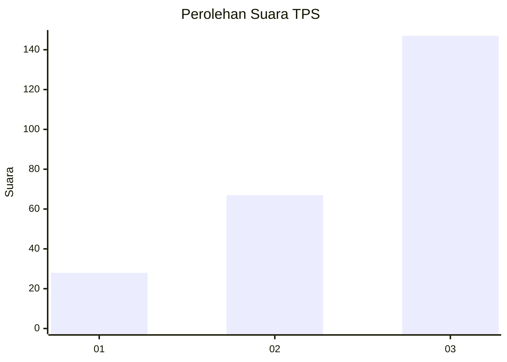
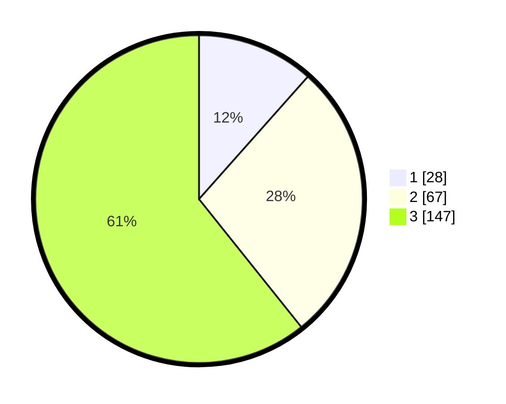

# Hasil

## Grafik

## Tabel

| No. | Nama Paslon    | Suara | Suara (raw) | Persentase |
|:--- |:-------------- | -----:| -----------:| ----------:|
| 1   | ANIES MUHAIMIN | 28    | [28][p-1]   | 11,57      |
| 2   | PRABOWO GIBRAN | 67    | [67][p-2]   | 27,69      |
| 3   | GANJAR MAHFUD  | 147   | [147][p-3]  | 60,74      |

[p-1]: https://github.com/gigit-pemilu/pemilu-2024-33-jawa-tengah/blob/main/pilpres/hitung-suara/sub/33-jawa-tengah/sub/23-temanggung/sub/09-ngadirejo/sub/2002-gondangwinangun/sub/006-tps/sub/paslon-1.txt
[p-2]: https://github.com/gigit-pemilu/pemilu-2024-33-jawa-tengah/blob/main/pilpres/hitung-suara/sub/33-jawa-tengah/sub/23-temanggung/sub/09-ngadirejo/sub/2002-gondangwinangun/sub/006-tps/sub/paslon-2.txt
[p-3]: https://github.com/gigit-pemilu/pemilu-2024-33-jawa-tengah/blob/main/pilpres/hitung-suara/sub/33-jawa-tengah/sub/23-temanggung/sub/09-ngadirejo/sub/2002-gondangwinangun/sub/006-tps/sub/paslon-3.txt

## Foto C Plano

https://sirekap-obj-formc.kpu.go.id/9723/pemilu/ppwp/33/23/09/20/02/3323092002006-20240214-200858--761be52c-4b94-4662-be32-330fc4fe0a7f.jpg

https://sirekap-obj-formc.kpu.go.id/9723/pemilu/ppwp/33/23/09/20/02/3323092002006-20240214-201258--c2740b3d-0d66-4a62-9dfd-8146da739c90.jpg

https://sirekap-obj-formc.kpu.go.id/9723/pemilu/ppwp/33/23/09/20/02/3323092002006-20240214-201404--0ea194b6-c5c5-4e59-bd9b-cd9378d638ba.jpg

## Metadata

| Key        | Value               |
| ---------- | ------------------- |
| Time Stamp | 2024-02-16 16:25:10 |

