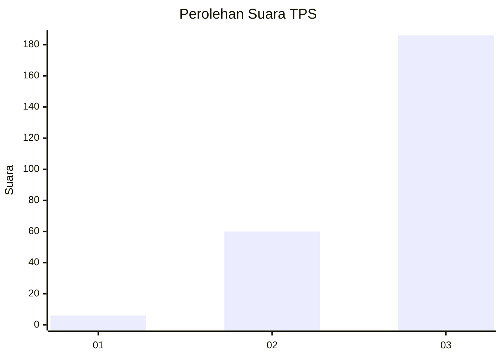
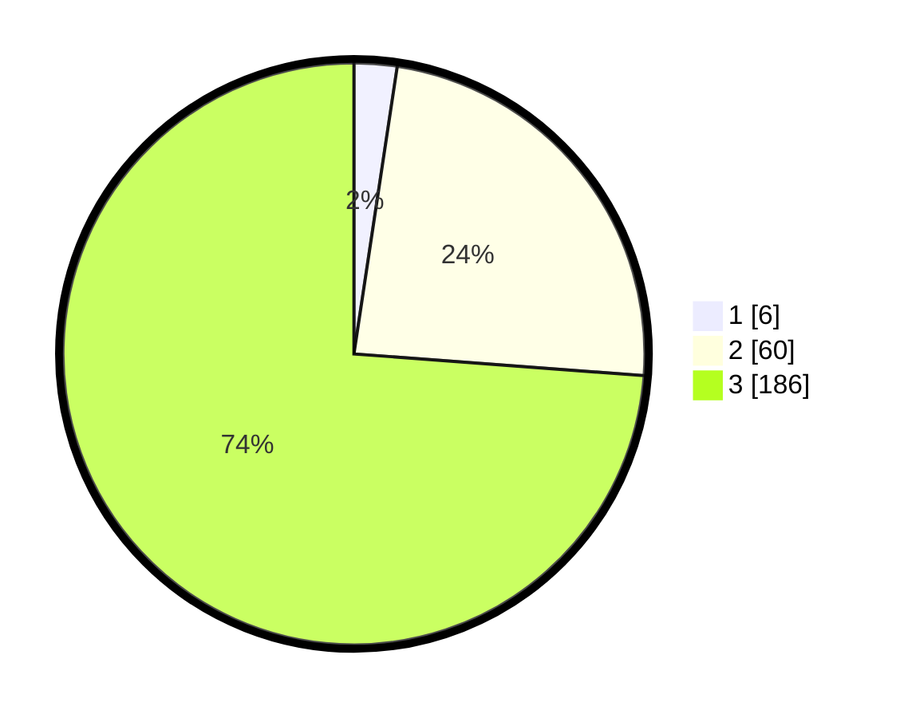

# Hasil

## Grafik

## Tabel

| No. | Nama Paslon    | Suara | Suara (raw) | Persentase |
|:--- |:-------------- | -----:| -----------:| ----------:|
| 1   | ANIES MUHAIMIN | 6     | [6][p-1]    | 2,38       |
| 2   | PRABOWO GIBRAN | 60    | [60][p-2]   | 23,81      |
| 3   | GANJAR MAHFUD  | 186   | [186][p-3]  | 73,81      |

[p-1]: https://github.com/gigit-pemilu/pemilu-2024-33-jawa-tengah/blob/main/pilpres/hitung-suara/sub/33-jawa-tengah/sub/23-temanggung/sub/09-ngadirejo/sub/2005-mangunsari/sub/005-tps/sub/paslon-1.txt
[p-2]: https://github.com/gigit-pemilu/pemilu-2024-33-jawa-tengah/blob/main/pilpres/hitung-suara/sub/33-jawa-tengah/sub/23-temanggung/sub/09-ngadirejo/sub/2005-mangunsari/sub/005-tps/sub/paslon-2.txt
[p-3]: https://github.com/gigit-pemilu/pemilu-2024-33-jawa-tengah/blob/main/pilpres/hitung-suara/sub/33-jawa-tengah/sub/23-temanggung/sub/09-ngadirejo/sub/2005-mangunsari/sub/005-tps/sub/paslon-3.txt

## Foto C Plano

https://sirekap-obj-formc.kpu.go.id/5cc9/pemilu/ppwp/33/23/09/20/05/3323092005005-20240214-193455--c7fe442f-c5b7-479d-a18b-adf9e1e9108b.jpg

https://sirekap-obj-formc.kpu.go.id/5cc9/pemilu/ppwp/33/23/09/20/05/3323092005005-20240214-194752--277f1c74-e015-427e-837c-9d5cbeead167.jpg

https://sirekap-obj-formc.kpu.go.id/5cc9/pemilu/ppwp/33/23/09/20/05/3323092005005-20240214-200322--a3d7275e-3a37-4726-b979-f1c264b813a3.jpg

## Metadata

| Key        | Value               |
| ---------- | ------------------- |
| Time Stamp | 2024-02-14 21:46:01 |

