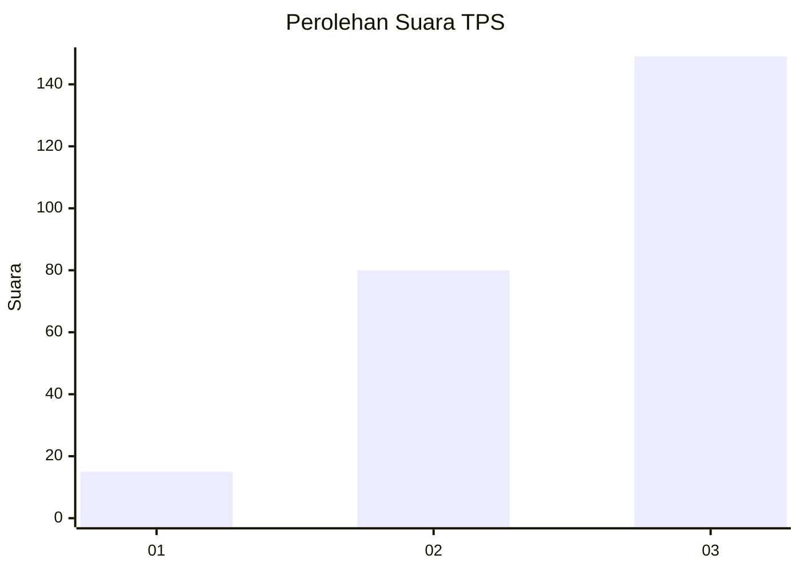
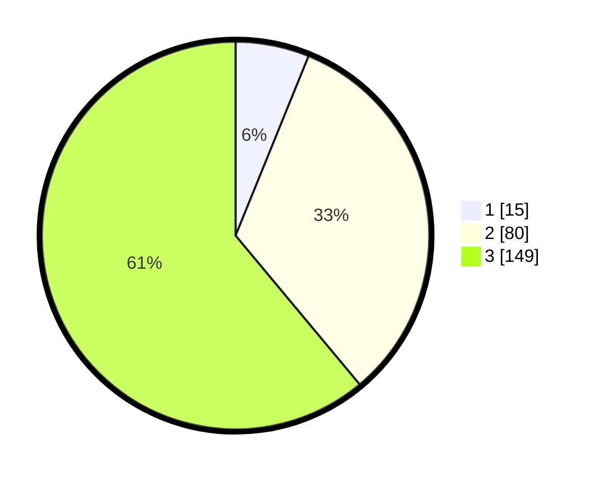

# Hasil

## Grafik

## Tabel

| No. | Nama Paslon    | Suara | Suara (raw) | Persentase |
|:--- |:-------------- | -----:| -----------:| ----------:|
| 1   | ANIES MUHAIMIN | 15    | [15][p-1]   | 6,15       |
| 2   | PRABOWO GIBRAN | 80    | [80][p-2]   | 32,79      |
| 3   | GANJAR MAHFUD  | 149   | [149][p-3]  | 61,07      |

[p-1]: https://github.com/gigit-pemilu/pemilu-2024-33-jawa-tengah/blob/main/pilpres/hitung-suara/sub/33-jawa-tengah/sub/23-temanggung/sub/09-ngadirejo/sub/2011-katekan/sub/001-tps/sub/paslon-1.txt
[p-2]: https://github.com/gigit-pemilu/pemilu-2024-33-jawa-tengah/blob/main/pilpres/hitung-suara/sub/33-jawa-tengah/sub/23-temanggung/sub/09-ngadirejo/sub/2011-katekan/sub/001-tps/sub/paslon-2.txt
[p-3]: https://github.com/gigit-pemilu/pemilu-2024-33-jawa-tengah/blob/main/pilpres/hitung-suara/sub/33-jawa-tengah/sub/23-temanggung/sub/09-ngadirejo/sub/2011-katekan/sub/001-tps/sub/paslon-3.txt

## Foto C Plano

https://sirekap-obj-formc.kpu.go.id/426d/pemilu/ppwp/33/23/09/20/11/3323092011001-20240214-221943--fe5e32ed-2f09-49bc-a170-a682e8742995.jpg

https://sirekap-obj-formc.kpu.go.id/426d/pemilu/ppwp/33/23/09/20/11/3323092011001-20240214-201026--aa2fdf25-edeb-4ef7-bd9a-0ebc8e491b3a.jpg

https://sirekap-obj-formc.kpu.go.id/426d/pemilu/ppwp/33/23/09/20/11/3323092011001-20240214-221715--bf0e046a-2227-43e4-a574-e5a7d9c27714.jpg

## Metadata

| Key        | Value               |
| ---------- | ------------------- |
| Time Stamp | 2024-02-16 21:01:00 |

