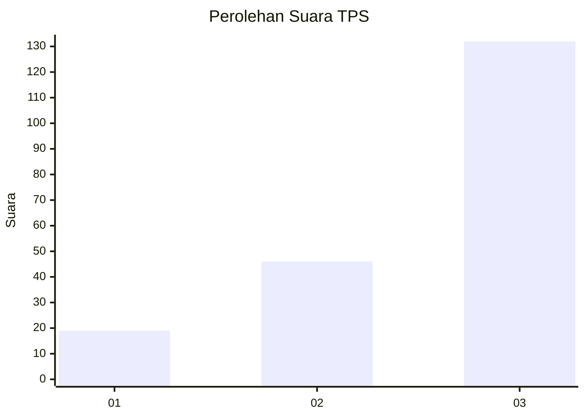
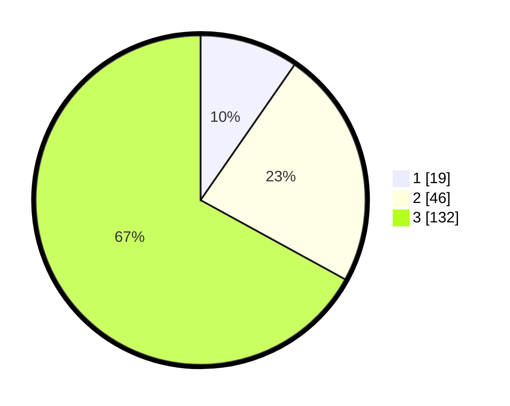

# Hasil

## Grafik

## Tabel

| No. | Nama Paslon    | Suara | Suara (raw) | Persentase |
|:--- |:-------------- | -----:| -----------:| ----------:|
| 1   | ANIES MUHAIMIN | 19    | [19][p-1]   | 9,64       |
| 2   | PRABOWO GIBRAN | 46    | [46][p-2]   | 23,35      |
| 3   | GANJAR MAHFUD  | 132   | [132][p-3]  | 67,01      |

[p-1]: https://github.com/gigit-pemilu/pemilu-2024/blob/main/pilpres/hitung-suara/sub/33-jawa-tengah/sub/23-temanggung/sub/09-ngadirejo/sub/2018-pringapus/sub/002-tps/sub/paslon-1.txt
[p-2]: https://github.com/gigit-pemilu/pemilu-2024/blob/main/pilpres/hitung-suara/sub/33-jawa-tengah/sub/23-temanggung/sub/09-ngadirejo/sub/2018-pringapus/sub/002-tps/sub/paslon-2.txt
[p-3]: https://github.com/gigit-pemilu/pemilu-2024/blob/main/pilpres/hitung-suara/sub/33-jawa-tengah/sub/23-temanggung/sub/09-ngadirejo/sub/2018-pringapus/sub/002-tps/sub/paslon-3.txt

## Foto C Plano

https://sirekap-obj-formc.kpu.go.id/89e9/pemilu/ppwp/33/23/09/20/18/3323092018002-20240214-155240--59afa8e7-95c0-4e81-8e4f-5474c3cbf7a7.jpg

https://sirekap-obj-formc.kpu.go.id/89e9/pemilu/ppwp/33/23/09/20/18/3323092018002-20240214-190027--e648fa12-6105-41bc-8f60-7f7777c2209e.jpg

https://sirekap-obj-formc.kpu.go.id/89e9/pemilu/ppwp/33/23/09/20/18/3323092018002-20240214-194912--30fb057a-9511-4a12-8089-37d48907e005.jpg

## Metadata

| Key        | Value               |
| ---------- | ------------------- |
| Time Stamp | 2024-02-14 21:46:01 |

