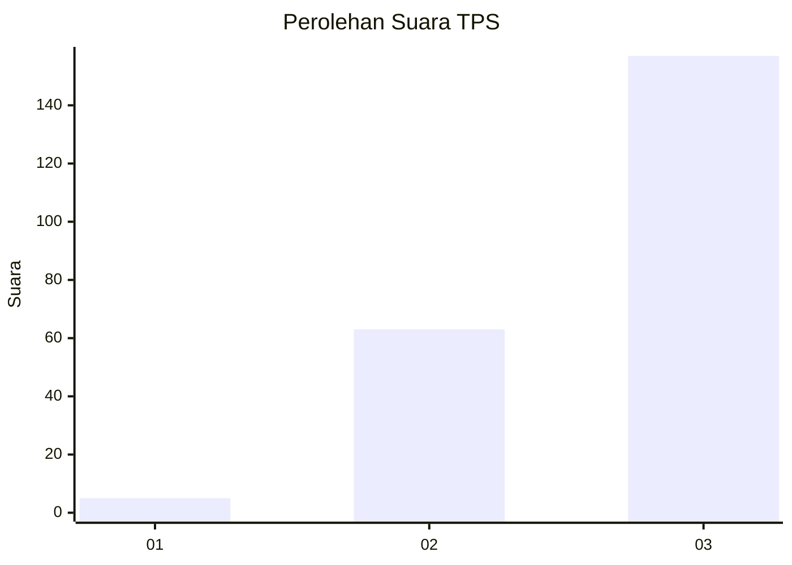
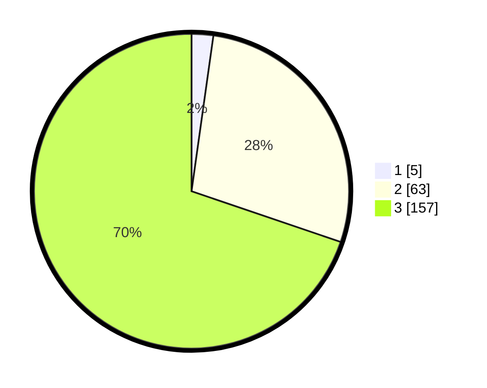

# Hasil

## Grafik

## Tabel

| No. | Nama Paslon    | Suara | Suara (raw) | Persentase |
|:--- |:-------------- | -----:| -----------:| ----------:|
| 1   | ANIES MUHAIMIN | 5     | [5][p-1]    | 2,22       |
| 2   | PRABOWO GIBRAN | 63    | [63][p-2]   | 28,00      |
| 3   | GANJAR MAHFUD  | 157   | [157][p-3]  | 69,78      |

[p-1]: https://github.com/gigit-pemilu/pemilu-2024-33-jawa-tengah/blob/main/pilpres/hitung-suara/sub/33-jawa-tengah/sub/23-temanggung/sub/10-jumo/sub/2004-giyono/sub/003-tps/sub/paslon-1.txt
[p-2]: https://github.com/gigit-pemilu/pemilu-2024-33-jawa-tengah/blob/main/pilpres/hitung-suara/sub/33-jawa-tengah/sub/23-temanggung/sub/10-jumo/sub/2004-giyono/sub/003-tps/sub/paslon-2.txt
[p-3]: https://github.com/gigit-pemilu/pemilu-2024-33-jawa-tengah/blob/main/pilpres/hitung-suara/sub/33-jawa-tengah/sub/23-temanggung/sub/10-jumo/sub/2004-giyono/sub/003-tps/sub/paslon-3.txt

## Foto C Plano

https://sirekap-obj-formc.kpu.go.id/a196/pemilu/ppwp/33/23/10/20/04/3323102004003-20240218-005800--6e209fd9-3e9d-4e8c-b223-4eabdc6b1739.jpg

https://sirekap-obj-formc.kpu.go.id/a196/pemilu/ppwp/33/23/10/20/04/3323102004003-20240218-005922--2d71e3e5-72f9-46bf-b042-31b05d9008dd.jpg

https://sirekap-obj-formc.kpu.go.id/a196/pemilu/ppwp/33/23/10/20/04/3323102004003-20240218-010028--46a18638-093d-4b58-9bb0-68f55d382eda.jpg

## Metadata

| Key        | Value               |
| ---------- | ------------------- |
| Time Stamp | 2024-02-19 06:16:00 |

