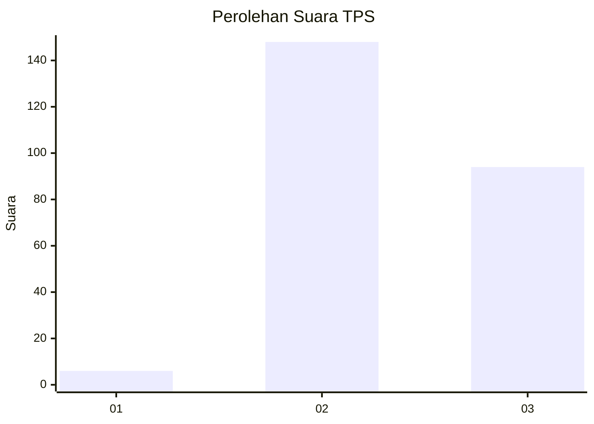
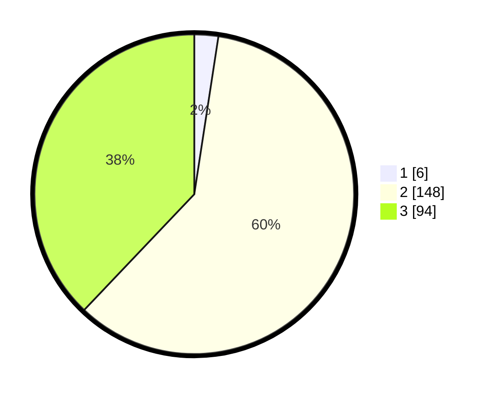

# Hasil

## Grafik

## Tabel

| No. | Nama Paslon    | Suara | Suara (raw) | Persentase |
|:--- |:-------------- | -----:| -----------:| ----------:|
| 1   | ANIES MUHAIMIN | 6     | [6][p-1]    | 2,42       |
| 2   | PRABOWO GIBRAN | 148   | [148][p-2]  | 59,68      |
| 3   | GANJAR MAHFUD  | 94    | [94][p-3]   | 37,90      |

[p-1]: https://github.com/gigit-pemilu/pemilu-2024/blob/main/pilpres/hitung-suara/sub/33-jawa-tengah/sub/23-temanggung/sub/11-tretep/sub/2006-tempelsari/sub/003-tps/sub/paslon-1.txt
[p-2]: https://github.com/gigit-pemilu/pemilu-2024/blob/main/pilpres/hitung-suara/sub/33-jawa-tengah/sub/23-temanggung/sub/11-tretep/sub/2006-tempelsari/sub/003-tps/sub/paslon-2.txt
[p-3]: https://github.com/gigit-pemilu/pemilu-2024/blob/main/pilpres/hitung-suara/sub/33-jawa-tengah/sub/23-temanggung/sub/11-tretep/sub/2006-tempelsari/sub/003-tps/sub/paslon-3.txt

## Foto C Plano

https://sirekap-obj-formc.kpu.go.id/fa9c/pemilu/ppwp/33/23/11/20/06/3323112006003-20240214-211337--5f4f85b5-7cef-4190-a004-156b614568d3.jpg

https://sirekap-obj-formc.kpu.go.id/fa9c/pemilu/ppwp/33/23/11/20/06/3323112006003-20240214-211626--aa67554e-441e-4ef4-ae26-d4b076ac9e83.jpg

https://sirekap-obj-formc.kpu.go.id/fa9c/pemilu/ppwp/33/23/11/20/06/3323112006003-20240214-211832--f5e0cea2-12a9-452b-8f1f-9414df36e834.jpg

## Metadata

| Key        | Value               |
| ---------- | ------------------- |
| Time Stamp | 2024-02-16 21:01:00 |

