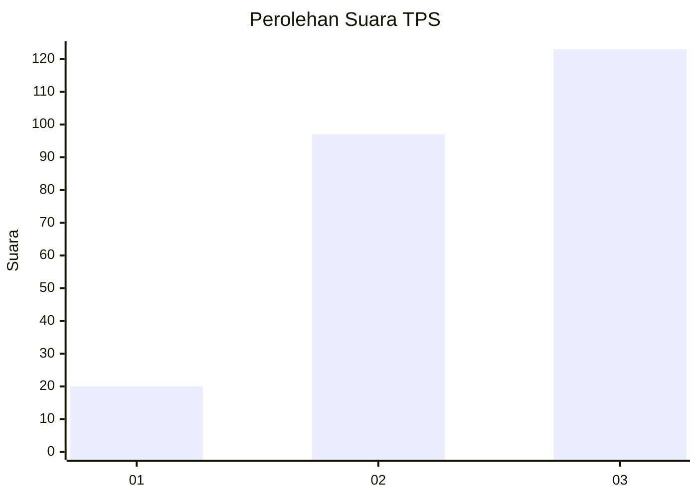
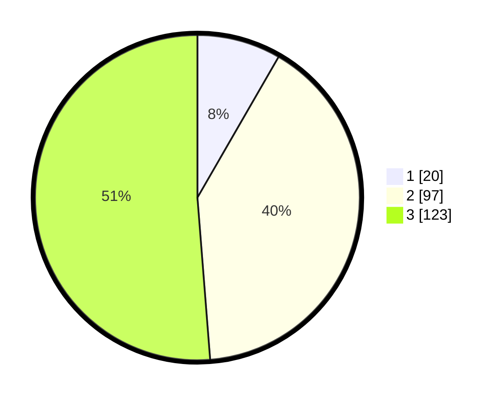

# Hasil

## Grafik

## Tabel

| No. | Nama Paslon    | Suara | Suara (raw) | Persentase |
|:--- |:-------------- | -----:| -----------:| ----------:|
| 1   | ANIES MUHAIMIN | 20    | [20][p-1]   | 8,33       |
| 2   | PRABOWO GIBRAN | 97    | [97][p-2]   | 40,42      |
| 3   | GANJAR MAHFUD  | 123   | [123][p-3]  | 51,25      |

[p-1]: https://github.com/gigit-pemilu/pemilu-2024/blob/main/pilpres/hitung-suara/sub/33-jawa-tengah/sub/23-temanggung/sub/13-kranggan/sub/2007-pendowo/sub/008-tps/sub/paslon-1.txt
[p-2]: https://github.com/gigit-pemilu/pemilu-2024/blob/main/pilpres/hitung-suara/sub/33-jawa-tengah/sub/23-temanggung/sub/13-kranggan/sub/2007-pendowo/sub/008-tps/sub/paslon-2.txt
[p-3]: https://github.com/gigit-pemilu/pemilu-2024/blob/main/pilpres/hitung-suara/sub/33-jawa-tengah/sub/23-temanggung/sub/13-kranggan/sub/2007-pendowo/sub/008-tps/sub/paslon-3.txt

## Foto C Plano

https://sirekap-obj-formc.kpu.go.id/e81d/pemilu/ppwp/33/23/13/20/07/3323132007008-20240215-052813--060c6468-68d3-44d1-9f0d-d0627f11f493.jpg

https://sirekap-obj-formc.kpu.go.id/e81d/pemilu/ppwp/33/23/13/20/07/3323132007008-20240215-052847--ed2e397d-2a07-4f8d-a383-dad544c323f6.jpg

https://sirekap-obj-formc.kpu.go.id/e81d/pemilu/ppwp/33/23/13/20/07/3323132007008-20240215-052740--874a94bb-1795-4a61-b7f5-0e89804ca70e.jpg

## Metadata

| Key        | Value               |
| ---------- | ------------------- |
| Time Stamp | 2024-02-16 21:01:00 |

