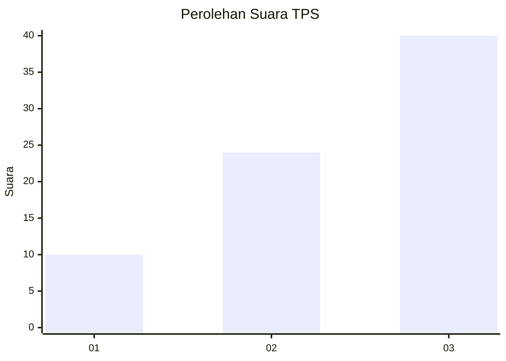
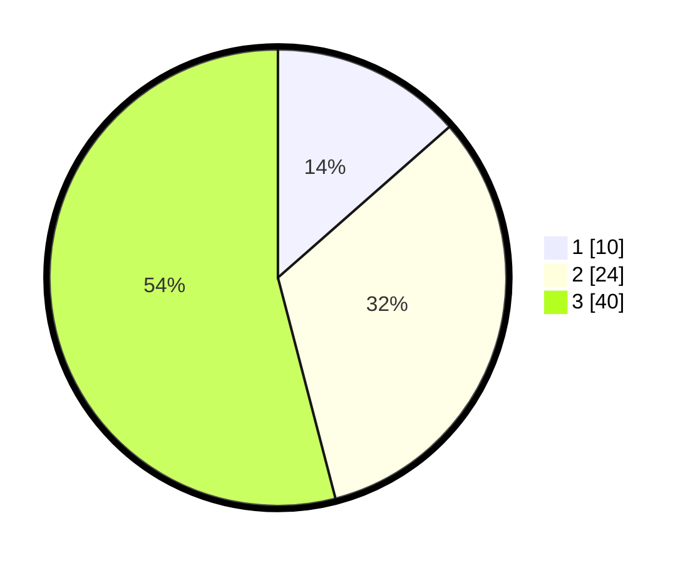

# Hasil

## Grafik

## Tabel

| No. | Nama Paslon    | Suara | Suara (raw) | Persentase |
|:--- |:-------------- | -----:| -----------:| ----------:|
| 1   | ANIES MUHAIMIN | 10    | [10][p-1]   | 13,51      |
| 2   | PRABOWO GIBRAN | 24    | [24][p-2]   | 32,43      |
| 3   | GANJAR MAHFUD  | 40    | [40][p-3]   | 54,05      |

[p-1]: https://github.com/gigit-pemilu/pemilu-2024-33-jawa-tengah/blob/main/pilpres/hitung-suara/sub/33-jawa-tengah/sub/23-temanggung/sub/13-kranggan/sub/2007-pendowo/sub/012-tps/sub/paslon-1.txt
[p-2]: https://github.com/gigit-pemilu/pemilu-2024-33-jawa-tengah/blob/main/pilpres/hitung-suara/sub/33-jawa-tengah/sub/23-temanggung/sub/13-kranggan/sub/2007-pendowo/sub/012-tps/sub/paslon-2.txt
[p-3]: https://github.com/gigit-pemilu/pemilu-2024-33-jawa-tengah/blob/main/pilpres/hitung-suara/sub/33-jawa-tengah/sub/23-temanggung/sub/13-kranggan/sub/2007-pendowo/sub/012-tps/sub/paslon-3.txt

## Foto C Plano

https://sirekap-obj-formc.kpu.go.id/0b38/pemilu/ppwp/33/23/13/20/07/3323132007012-20240215-031824--d69dcfdf-bfde-4325-b74c-5aa3c8691907.jpg

https://sirekap-obj-formc.kpu.go.id/0b38/pemilu/ppwp/33/23/13/20/07/3323132007012-20240215-033523--e32e5715-5081-4b81-8cd2-605c7ea46654.jpg

https://sirekap-obj-formc.kpu.go.id/0b38/pemilu/ppwp/33/23/13/20/07/3323132007012-20240215-033550--6b1a3ab0-57fc-4abb-9fba-19797b5b3374.jpg

## Metadata

| Key        | Value               |
| ---------- | ------------------- |
| Time Stamp | 2024-02-15 17:30:25 |

