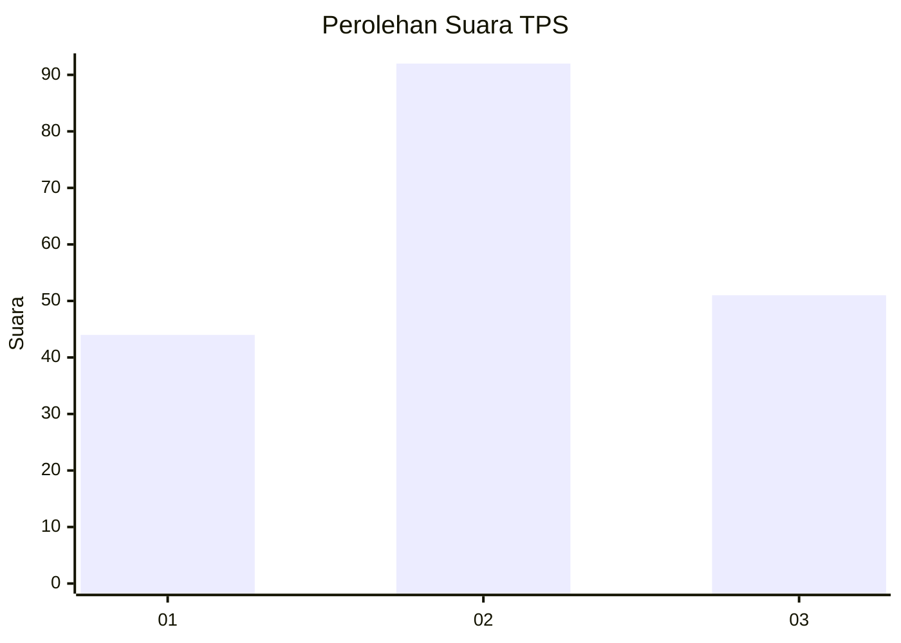
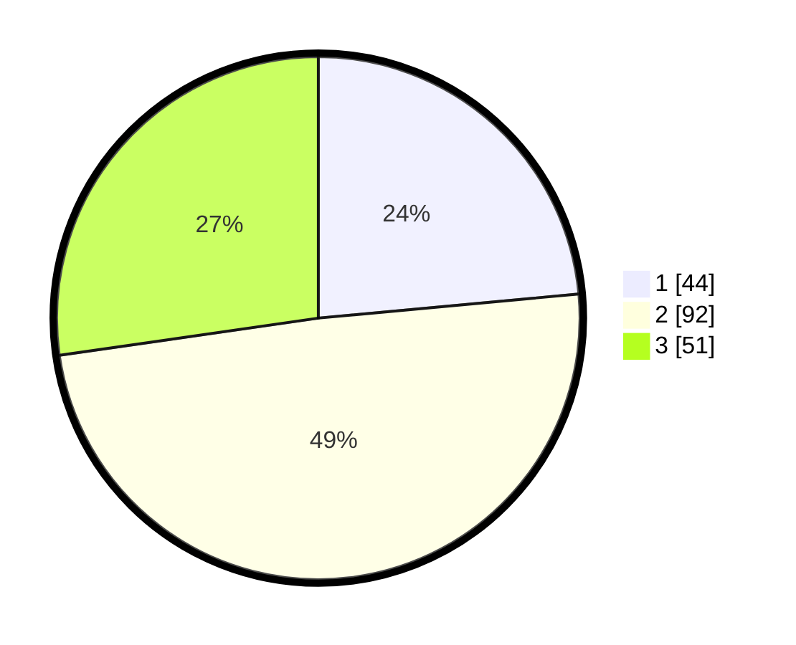

# Hasil

## Grafik

## Tabel

| No. | Nama Paslon    | Suara | Suara (raw) | Persentase |
|:--- |:-------------- | -----:| -----------:| ----------:|
| 1   | ANIES MUHAIMIN | 44    | [44][p-1]   | 23,53      |
| 2   | PRABOWO GIBRAN | 92    | [92][p-2]   | 49,20      |
| 3   | GANJAR MAHFUD  | 51    | [51][p-3]   | 27,27      |

[p-1]: https://github.com/gigit-pemilu/pemilu-2024/blob/main/pilpres/hitung-suara/sub/33-jawa-tengah/sub/23-temanggung/sub/20-gemawang/sub/2001-gemawang/sub/002-tps/sub/paslon-1.txt
[p-2]: https://github.com/gigit-pemilu/pemilu-2024/blob/main/pilpres/hitung-suara/sub/33-jawa-tengah/sub/23-temanggung/sub/20-gemawang/sub/2001-gemawang/sub/002-tps/sub/paslon-2.txt
[p-3]: https://github.com/gigit-pemilu/pemilu-2024/blob/main/pilpres/hitung-suara/sub/33-jawa-tengah/sub/23-temanggung/sub/20-gemawang/sub/2001-gemawang/sub/002-tps/sub/paslon-3.txt

## Foto C Plano

https://sirekap-obj-formc.kpu.go.id/7a50/pemilu/ppwp/33/23/20/20/01/3323202001002-20240214-215105--f717f121-4694-4a37-967a-cf4f4e28985a.jpg

https://sirekap-obj-formc.kpu.go.id/7a50/pemilu/ppwp/33/23/20/20/01/3323202001002-20240214-215247--3f1a71b0-c60f-4170-9251-e6f7bba79224.jpg

https://sirekap-obj-formc.kpu.go.id/7a50/pemilu/ppwp/33/23/20/20/01/3323202001002-20240214-215437--2608ffeb-7b20-476f-ae7e-a45a1cf5527a.jpg

## Metadata

| Key        | Value               |
| ---------- | ------------------- |
| Time Stamp | 2024-02-15 22:00:27 |

