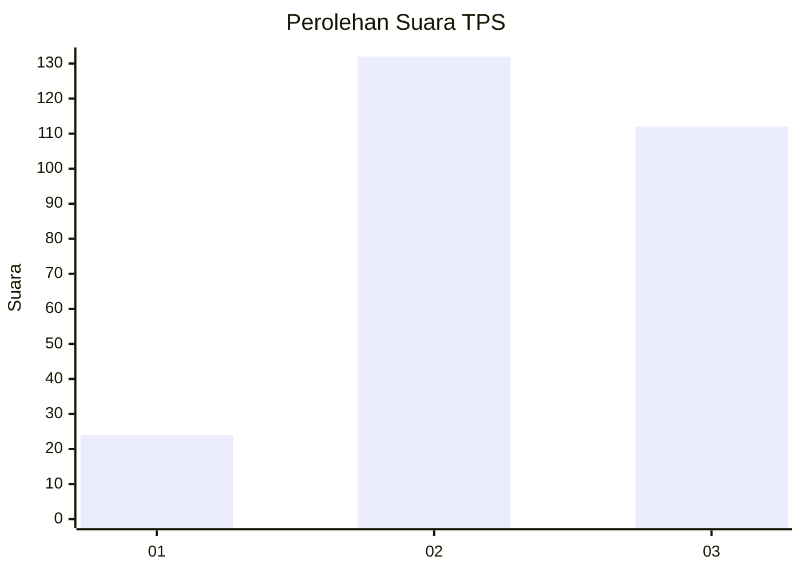
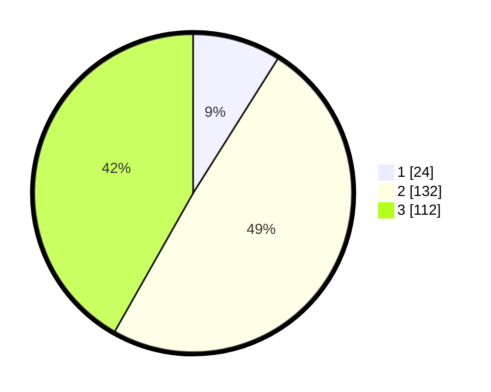

# Hasil

## Grafik

## Tabel

| No. | Nama Paslon    | Suara | Suara (raw) | Persentase |
|:--- |:-------------- | -----:| -----------:| ----------:|
| 1   | ANIES MUHAIMIN | 24    | [24][p-1]   | 8,96       |
| 2   | PRABOWO GIBRAN | 132   | [132][p-2]  | 49,25      |
| 3   | GANJAR MAHFUD  | 112   | [112][p-3]  | 41,79      |

[p-1]: https://github.com/gigit-pemilu/pemilu-2024/blob/main/pilpres/hitung-suara/sub/33-jawa-tengah/sub/23-temanggung/sub/20-gemawang/sub/2001-gemawang/sub/003-tps/sub/paslon-1.txt
[p-2]: https://github.com/gigit-pemilu/pemilu-2024/blob/main/pilpres/hitung-suara/sub/33-jawa-tengah/sub/23-temanggung/sub/20-gemawang/sub/2001-gemawang/sub/003-tps/sub/paslon-2.txt
[p-3]: https://github.com/gigit-pemilu/pemilu-2024/blob/main/pilpres/hitung-suara/sub/33-jawa-tengah/sub/23-temanggung/sub/20-gemawang/sub/2001-gemawang/sub/003-tps/sub/paslon-3.txt

## Foto C Plano

https://sirekap-obj-formc.kpu.go.id/c8b2/pemilu/ppwp/33/23/20/20/01/3323202001003-20240216-140524--cedeed46-6fbb-49f4-a2f3-ca09cb40906f.jpg

https://sirekap-obj-formc.kpu.go.id/c8b2/pemilu/ppwp/33/23/20/20/01/3323202001003-20240216-140525--5f3fe8c2-4be9-42ad-b6e2-00495500f379.jpg

https://sirekap-obj-formc.kpu.go.id/c8b2/pemilu/ppwp/33/23/20/20/01/3323202001003-20240216-140524--d24c3249-5ac9-4283-88bc-9d01fe9cfd32.jpg

## Metadata

| Key        | Value               |
| ---------- | ------------------- |
| Time Stamp | 2024-02-16 17:00:00 |

## DATA PEMILIH TETAP

Jumlah pemilih dalam DPT: **291**.
 * L: **142**.
 * P: **149**.

## DATA PENGGUNA HAK PILIH

Jumlah pengguna hak pilih dalam DPT: **280**.
 * L: **136**.
 * P: **144**.

Jumlah pengguna hak pilih dalam DPTb: **0**.
 * L: **0**.
 * P: **0**.

Jumlah pengguna hak pilih dalam DPK: **0**.
 * L: **0**.
 * P: **0**.

Jumlah pengguna hak pilih: **280**.
 * L: **136**.
 * P: **144**.

## JUMLAH SUARA SAH DAN TIDAK SAH

JUMLAH SELURUH SUARA SAH: **268**.

JUMLAH SUARA TIDAK SAH: **12**.

JUMLAH SELURUH SUARA SAH DAN SUARA TIDAK SAH: **280**.

