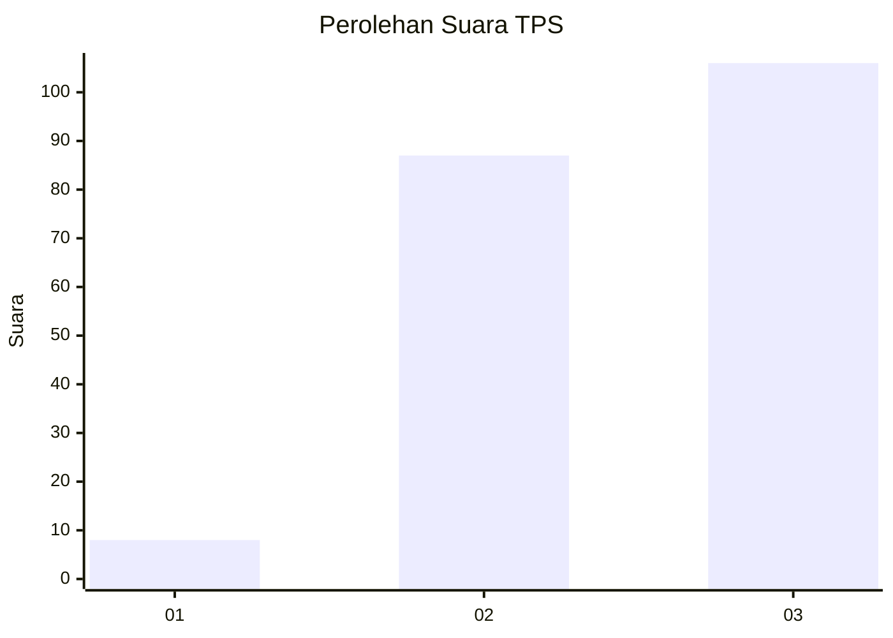
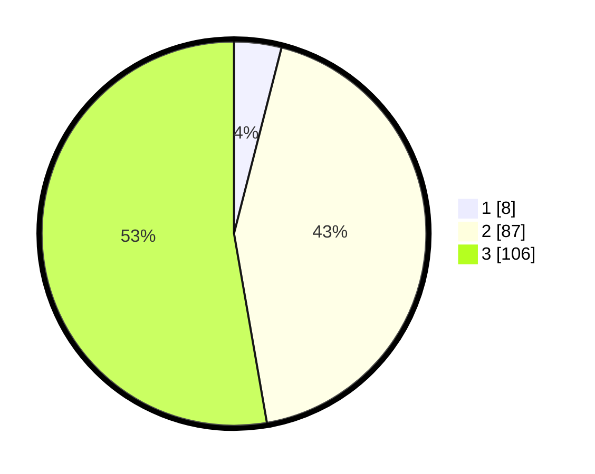

# Hasil

## Grafik

## Tabel

| No. | Nama Paslon    | Suara | Suara (raw) | Persentase |
|:--- |:-------------- | -----:| -----------:| ----------:|
| 1   | ANIES MUHAIMIN | 8     | [8][p-1]    | 3,98       |
| 2   | PRABOWO GIBRAN | 87    | [87][p-2]   | 43,28      |
| 3   | GANJAR MAHFUD  | 106   | [106][p-3]  | 52,74      |

[p-1]: https://github.com/gigit-pemilu/pemilu-2024-33-jawa-tengah/blob/main/pilpres/hitung-suara/sub/33-jawa-tengah/sub/23-temanggung/sub/20-gemawang/sub/2003-kemiriombo/sub/005-tps/sub/paslon-1.txt
[p-2]: https://github.com/gigit-pemilu/pemilu-2024-33-jawa-tengah/blob/main/pilpres/hitung-suara/sub/33-jawa-tengah/sub/23-temanggung/sub/20-gemawang/sub/2003-kemiriombo/sub/005-tps/sub/paslon-2.txt
[p-3]: https://github.com/gigit-pemilu/pemilu-2024-33-jawa-tengah/blob/main/pilpres/hitung-suara/sub/33-jawa-tengah/sub/23-temanggung/sub/20-gemawang/sub/2003-kemiriombo/sub/005-tps/sub/paslon-3.txt

## Foto C Plano

https://sirekap-obj-formc.kpu.go.id/7c25/pemilu/ppwp/33/23/20/20/03/3323202003005-20240216-184748--846ff3b4-6274-4f0b-a92c-12f9806e8bab.jpg

https://sirekap-obj-formc.kpu.go.id/7c25/pemilu/ppwp/33/23/20/20/03/3323202003005-20240215-005136--f841cd93-caa2-4a37-8e66-2734efcbab27.jpg

https://sirekap-obj-formc.kpu.go.id/7c25/pemilu/ppwp/33/23/20/20/03/3323202003005-20240215-005306--f83c788e-a933-4bf7-bce7-2f059083fe87.jpg

## Metadata

| Key        | Value               |
| ---------- | ------------------- |
| Time Stamp | 2024-02-16 21:01:00 |

