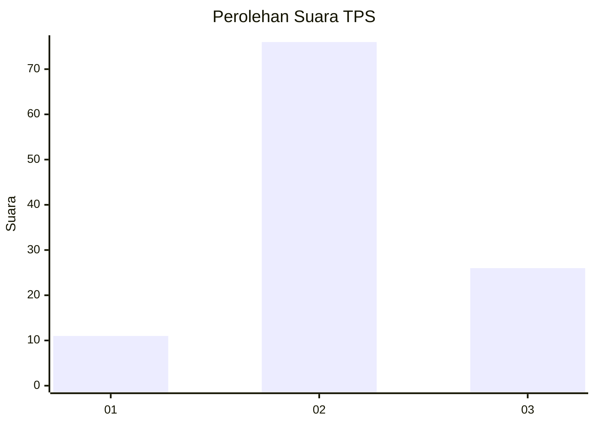
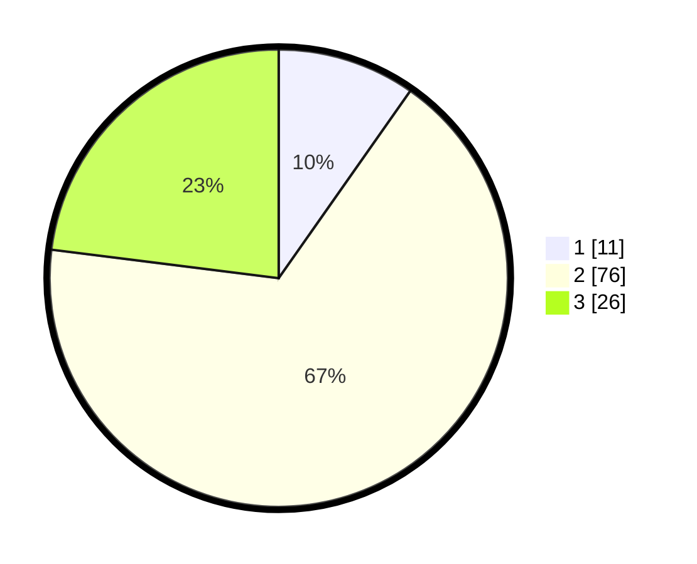

# Hasil

## Grafik

## Tabel

| No. | Nama Paslon    | Suara | Suara (raw) | Persentase |
|:--- |:-------------- | -----:| -----------:| ----------:|
| 1   | ANIES MUHAIMIN | 11    | [11][p-1]   | 9,73       |
| 2   | PRABOWO GIBRAN | 76    | [76][p-2]   | 67,26      |
| 3   | GANJAR MAHFUD  | 26    | [26][p-3]   | 23,01      |

[p-1]: https://github.com/gigit-pemilu/pemilu-2024/blob/main/pilpres/hitung-suara/sub/33-jawa-tengah/sub/24-kendal/sub/03-sukorejo/sub/2007-harjodowo/sub/006-tps/sub/paslon-1.txt
[p-2]: https://github.com/gigit-pemilu/pemilu-2024/blob/main/pilpres/hitung-suara/sub/33-jawa-tengah/sub/24-kendal/sub/03-sukorejo/sub/2007-harjodowo/sub/006-tps/sub/paslon-2.txt
[p-3]: https://github.com/gigit-pemilu/pemilu-2024/blob/main/pilpres/hitung-suara/sub/33-jawa-tengah/sub/24-kendal/sub/03-sukorejo/sub/2007-harjodowo/sub/006-tps/sub/paslon-3.txt

## Foto C Plano

https://sirekap-obj-formc.kpu.go.id/6082/pemilu/ppwp/33/24/03/20/07/3324032007006-20240214-202800--21d5c6a3-adcc-4784-a0d7-37dc8a2f42af.jpg

https://sirekap-obj-formc.kpu.go.id/6082/pemilu/ppwp/33/24/03/20/07/3324032007006-20240215-004915--4b90c025-f04f-4128-ac7a-9e907ceac201.jpg

https://sirekap-obj-formc.kpu.go.id/6082/pemilu/ppwp/33/24/03/20/07/3324032007006-20240215-164826--d69c519c-3860-4c1f-8862-e726b514d2bf.jpg

## Metadata

| Key        | Value               |
| ---------- | ------------------- |
| Time Stamp | 2024-02-15 18:30:25 |

