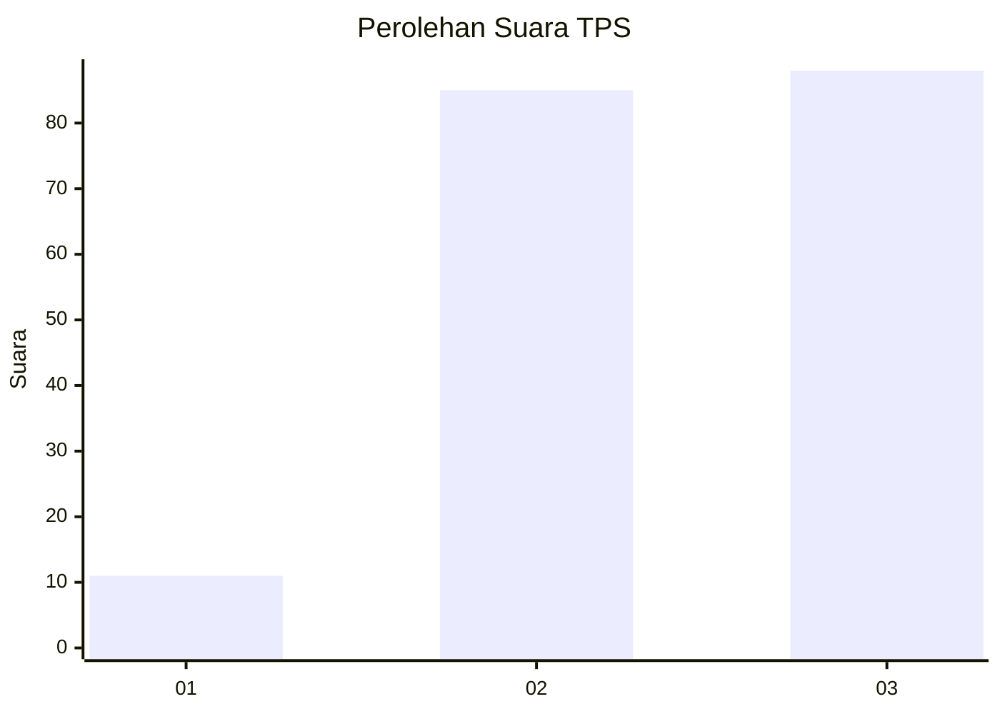
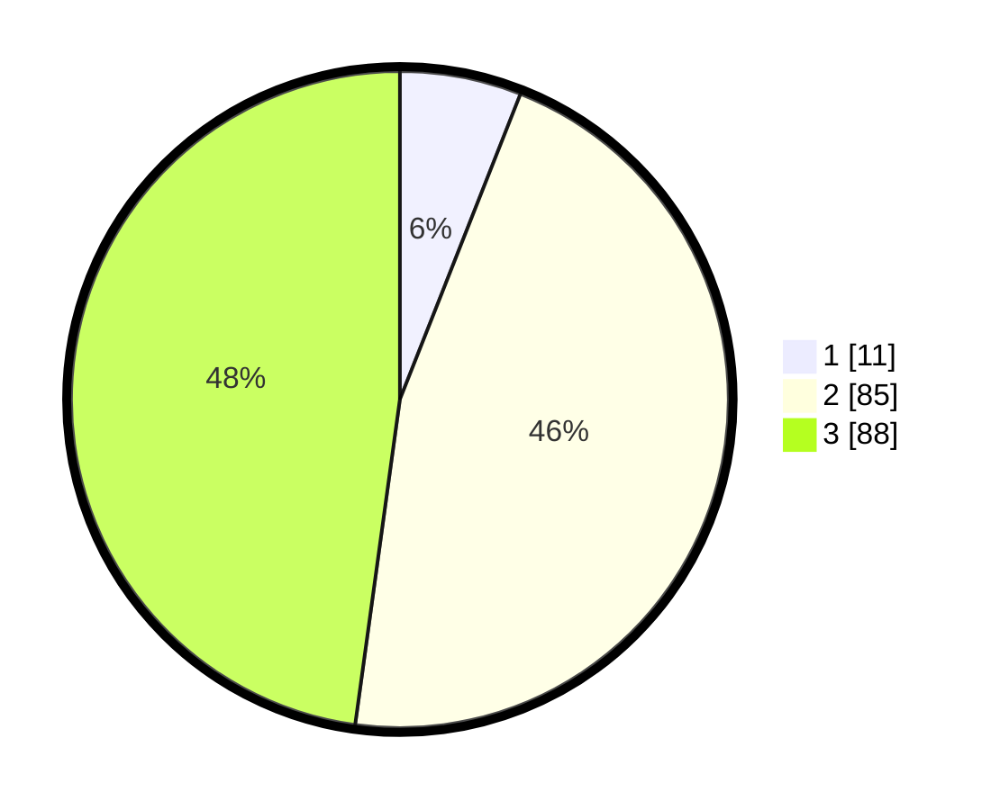

# Hasil

## Grafik

## Tabel

| No. | Nama Paslon    | Suara | Suara (raw) | Persentase |
|:--- |:-------------- | -----:| -----------:| ----------:|
| 1   | ANIES MUHAIMIN | 11    | [11][p-1]   | 5,98       |
| 2   | PRABOWO GIBRAN | 85    | [85][p-2]   | 46,20      |
| 3   | GANJAR MAHFUD  | 88    | [88][p-3]   | 47,83      |

[p-1]: https://github.com/gigit-pemilu/pemilu-2024/blob/main/pilpres/hitung-suara/sub/33-jawa-tengah/sub/24-kendal/sub/03-sukorejo/sub/2015-tampingwinarno/sub/002-tps/sub/paslon-1.txt
[p-2]: https://github.com/gigit-pemilu/pemilu-2024/blob/main/pilpres/hitung-suara/sub/33-jawa-tengah/sub/24-kendal/sub/03-sukorejo/sub/2015-tampingwinarno/sub/002-tps/sub/paslon-2.txt
[p-3]: https://github.com/gigit-pemilu/pemilu-2024/blob/main/pilpres/hitung-suara/sub/33-jawa-tengah/sub/24-kendal/sub/03-sukorejo/sub/2015-tampingwinarno/sub/002-tps/sub/paslon-3.txt

## Foto C Plano

https://sirekap-obj-formc.kpu.go.id/ca6c/pemilu/ppwp/33/24/03/20/15/3324032015002-20240214-215835--e3d55447-2371-4b89-8c9d-cfd04e040c70.jpg

https://sirekap-obj-formc.kpu.go.id/ca6c/pemilu/ppwp/33/24/03/20/15/3324032015002-20240214-215934--509a6a21-44b4-48b2-962b-2ef8c050c679.jpg

https://sirekap-obj-formc.kpu.go.id/ca6c/pemilu/ppwp/33/24/03/20/15/3324032015002-20240214-214748--6e844171-7d4d-43b1-89b0-f2dc557a049d.jpg

## Metadata

| Key        | Value               |
| ---------- | ------------------- |
| Time Stamp | 2024-02-15 18:30:25 |

