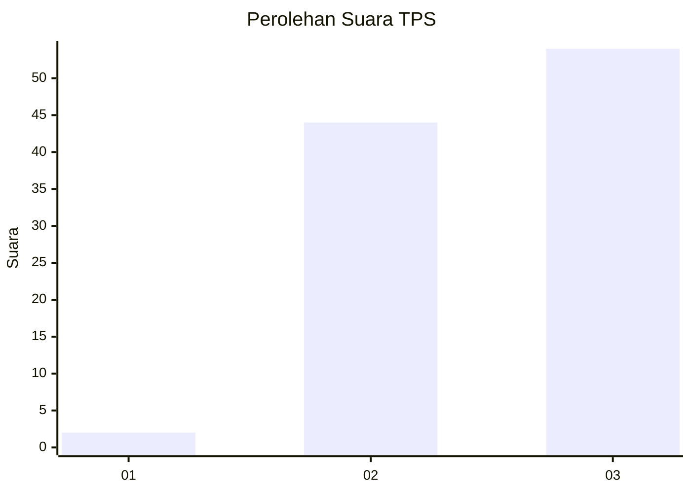
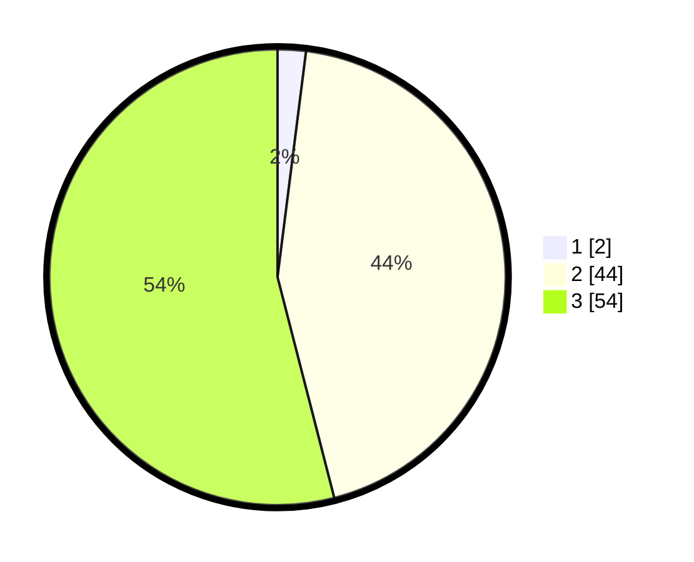

# Hasil

## Grafik

## Tabel

| No. | Nama Paslon    | Suara | Suara (raw) | Persentase |
|:--- |:-------------- | -----:| -----------:| ----------:|
| 1   | ANIES MUHAIMIN | 2     | [2][p-1]    | 2,00       |
| 2   | PRABOWO GIBRAN | 44    | [44][p-2]   | 44,00      |
| 3   | GANJAR MAHFUD  | 54    | [54][p-3]   | 54,00      |

[p-1]: https://github.com/gigit-pemilu/pemilu-2024/blob/main/pilpres/hitung-suara/sub/33-jawa-tengah/sub/24-kendal/sub/04-patean/sub/2006-selo/sub/005-tps/sub/paslon-1.txt
[p-2]: https://github.com/gigit-pemilu/pemilu-2024/blob/main/pilpres/hitung-suara/sub/33-jawa-tengah/sub/24-kendal/sub/04-patean/sub/2006-selo/sub/005-tps/sub/paslon-2.txt
[p-3]: https://github.com/gigit-pemilu/pemilu-2024/blob/main/pilpres/hitung-suara/sub/33-jawa-tengah/sub/24-kendal/sub/04-patean/sub/2006-selo/sub/005-tps/sub/paslon-3.txt

## Foto C Plano

https://sirekap-obj-formc.kpu.go.id/74fd/pemilu/ppwp/33/24/04/20/06/3324042006005-20240214-141648--1b4286a3-69e3-4e14-97fb-ad90e43ca7cf.jpg

https://sirekap-obj-formc.kpu.go.id/74fd/pemilu/ppwp/33/24/04/20/06/3324042006005-20240214-141140--07590443-0e77-4fa4-a361-d7d9e2618cfb.jpg

https://sirekap-obj-formc.kpu.go.id/74fd/pemilu/ppwp/33/24/04/20/06/3324042006005-20240215-004728--8a17c540-2a10-43b8-8877-efe49b0df6fa.jpg

## Metadata

| Key        | Value               |
| ---------- | ------------------- |
| Time Stamp | 2024-02-15 00:56:54 |

