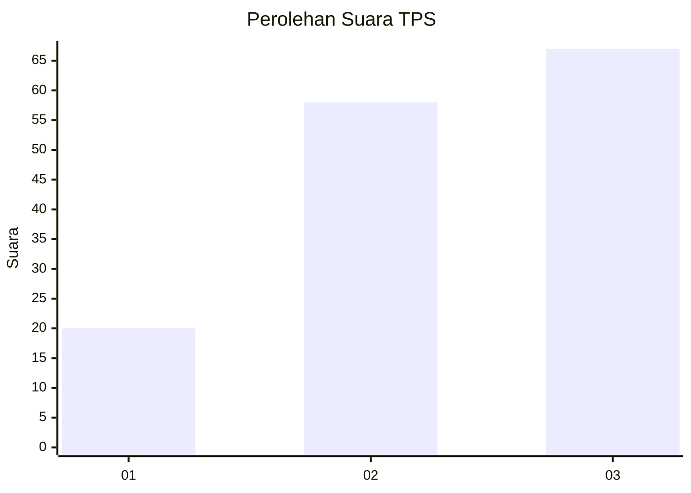
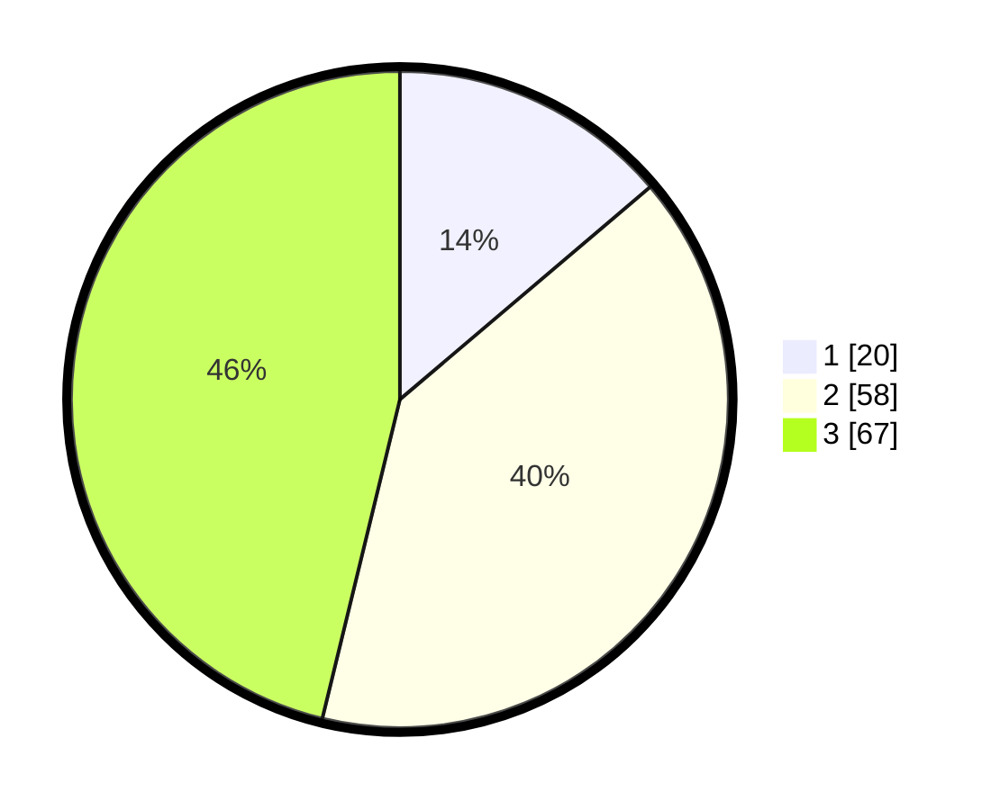

# Hasil

## Grafik

## Tabel

| No. | Nama Paslon    | Suara | Suara (raw) | Persentase |
|:--- |:-------------- | -----:| -----------:| ----------:|
| 1   | ANIES MUHAIMIN | 20    | [20][p-1]   | 13,79      |
| 2   | PRABOWO GIBRAN | 58    | [58][p-2]   | 40,00      |
| 3   | GANJAR MAHFUD  | 67    | [67][p-3]   | 46,21      |

[p-1]: https://github.com/gigit-pemilu/pemilu-2024/blob/main/pilpres/hitung-suara/sub/33-jawa-tengah/sub/24-kendal/sub/04-patean/sub/2007-curugsewu/sub/008-tps/sub/paslon-1.txt
[p-2]: https://github.com/gigit-pemilu/pemilu-2024/blob/main/pilpres/hitung-suara/sub/33-jawa-tengah/sub/24-kendal/sub/04-patean/sub/2007-curugsewu/sub/008-tps/sub/paslon-2.txt
[p-3]: https://github.com/gigit-pemilu/pemilu-2024/blob/main/pilpres/hitung-suara/sub/33-jawa-tengah/sub/24-kendal/sub/04-patean/sub/2007-curugsewu/sub/008-tps/sub/paslon-3.txt

## Foto C Plano

https://sirekap-obj-formc.kpu.go.id/2378/pemilu/ppwp/33/24/04/20/07/3324042007008-20240217-132829--ba98fd22-eb65-42d9-b0f9-9f6e9aa9e2ba.jpg

https://sirekap-obj-formc.kpu.go.id/2378/pemilu/ppwp/33/24/04/20/07/3324042007008-20240217-132832--c6f1e532-8b70-4966-a49e-39ddab02072e.jpg

https://sirekap-obj-formc.kpu.go.id/2378/pemilu/ppwp/33/24/04/20/07/3324042007008-20240216-180754--4d135991-0598-4bc9-95df-07f34fd171aa.jpg

## Metadata

| Key        | Value               |
| ---------- | ------------------- |
| Time Stamp | 2024-02-24 22:31:28 |

