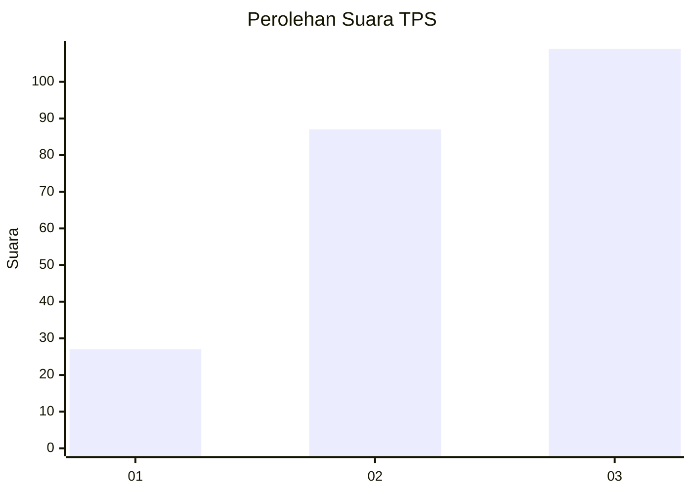
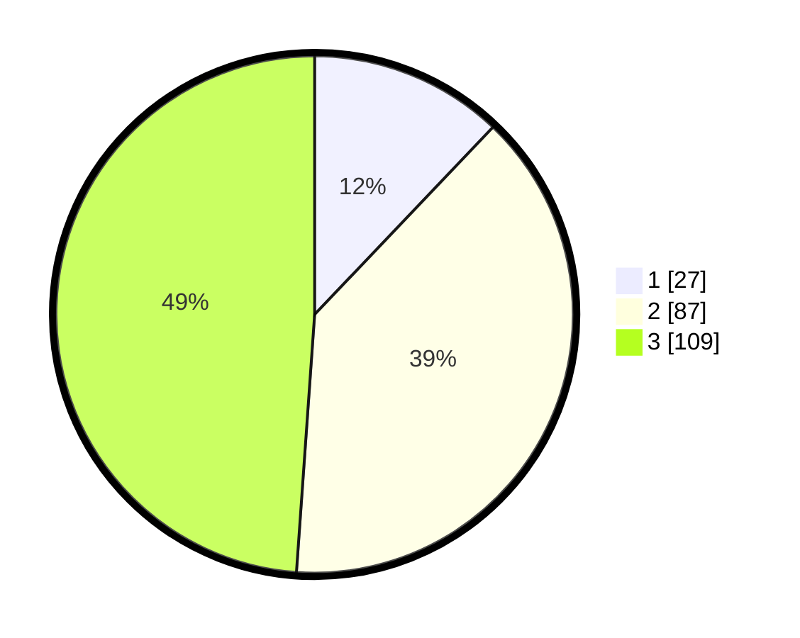

# Hasil

## Grafik

## Tabel

| No. | Nama Paslon    | Suara | Suara (raw) | Persentase |
|:--- |:-------------- | -----:| -----------:| ----------:|
| 1   | ANIES MUHAIMIN | 27    | [27][p-1]   | 12,11      |
| 2   | PRABOWO GIBRAN | 87    | [87][p-2]   | 39,01      |
| 3   | GANJAR MAHFUD  | 109   | [109][p-3]  | 48,88      |

[p-1]: https://github.com/gigit-pemilu/pemilu-2024-33-jawa-tengah/blob/main/pilpres/hitung-suara/sub/33-jawa-tengah/sub/24-kendal/sub/04-patean/sub/2010-kalibareng/sub/004-tps/sub/paslon-1.txt
[p-2]: https://github.com/gigit-pemilu/pemilu-2024-33-jawa-tengah/blob/main/pilpres/hitung-suara/sub/33-jawa-tengah/sub/24-kendal/sub/04-patean/sub/2010-kalibareng/sub/004-tps/sub/paslon-2.txt
[p-3]: https://github.com/gigit-pemilu/pemilu-2024-33-jawa-tengah/blob/main/pilpres/hitung-suara/sub/33-jawa-tengah/sub/24-kendal/sub/04-patean/sub/2010-kalibareng/sub/004-tps/sub/paslon-3.txt

## Foto C Plano

https://sirekap-obj-formc.kpu.go.id/1a33/pemilu/ppwp/33/24/04/20/10/3324042010004-20240214-234906--8fd0bc47-6cb7-471f-b690-ba44794db1d2.jpg

https://sirekap-obj-formc.kpu.go.id/1a33/pemilu/ppwp/33/24/04/20/10/3324042010004-20240214-155922--03ccf5e5-a27c-4eb0-9eae-159b0dbbe45c.jpg

https://sirekap-obj-formc.kpu.go.id/1a33/pemilu/ppwp/33/24/04/20/10/3324042010004-20240214-235008--53b89842-7db2-4c85-8c1c-15d723d8b08a.jpg

## Metadata

| Key        | Value               |
| ---------- | ------------------- |
| Time Stamp | 2024-02-15 12:00:28 |

